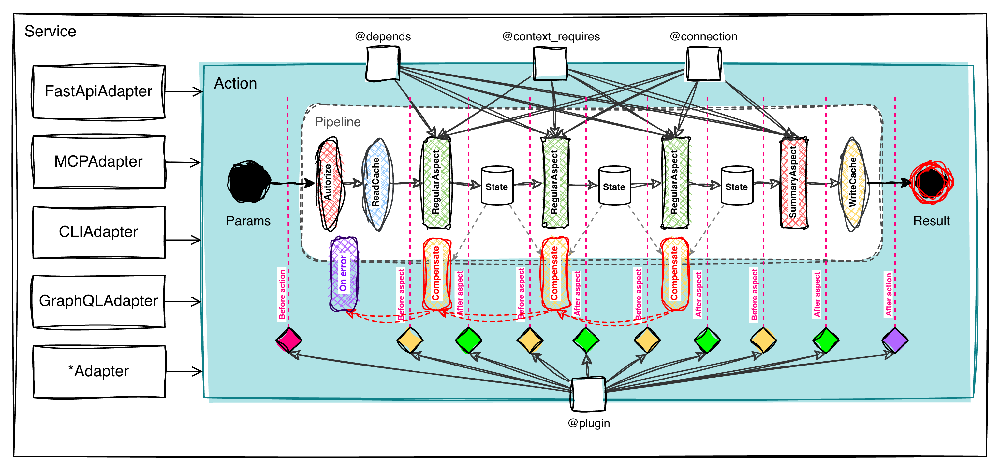
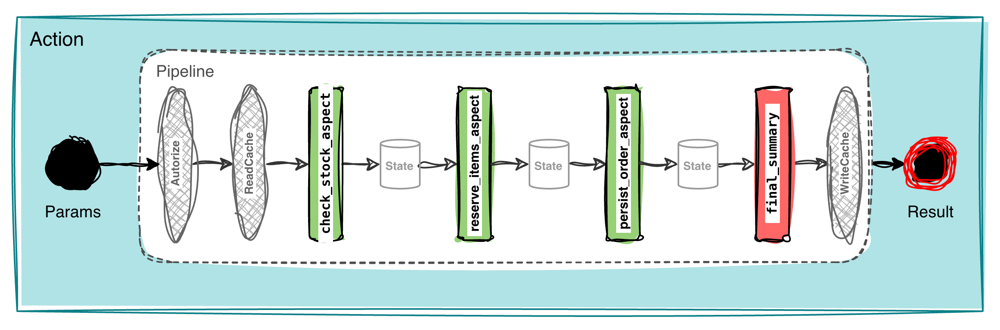
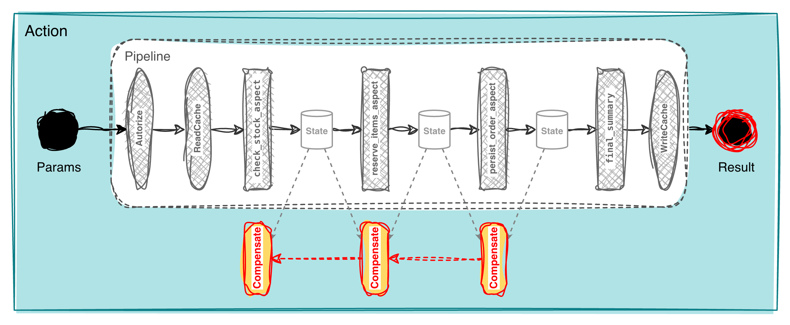
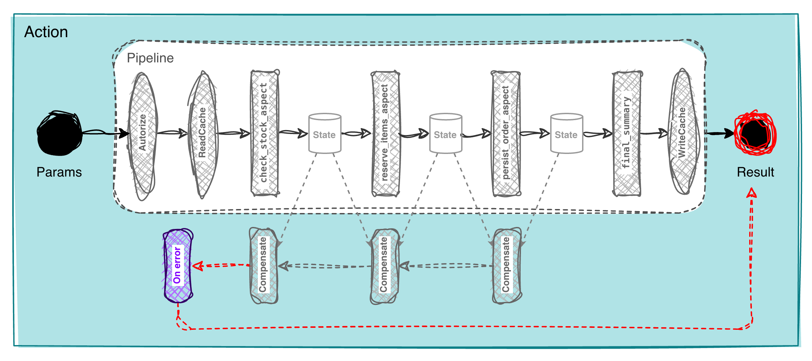

<!-- translated-from: README_draft.md @ 2026-06-18T22:35:50Z (filesystem mtime; draft is gitignored, no git history) · sha256:cf6abfcdb8a4 -->
<p align="center">
  <br><br>
  <a href="https://www.python.org/downloads/"></a>
  <a href="https://github.com/bystrovmaxim/aoa"></a>
  <a href="https://github.com/bystrovmaxim/aoa/actions/workflows/ci.yml"></a>
  
  
</p>

# AOA — Action-Oriented Architecture

## Table of Contents

- [What is AOA](#what-is-aoa)
- [Quick Start](#quick-start)
- [Packages](#packages)
- [Service Layer](#service-layer)
  - [The Machine: heart of the system](#the-machine-heart-of-the-system)
  - [Adapters](#adapters)
- [Business Logic: operation as a unit of meaning](#business-logic-operation-as-a-unit-of-meaning)
  - [Action and pipeline](#action-and-pipeline)
  - [State: X-ray of the operation](#state-x-ray-of-the-operation)
  - [Sagas and compensations](#distributed-transactions--sagas-and-compensations)
  - [Explicit error handling](#explicit-error-handling)
  - [Dependencies as a contract](#dependencies-as-a-contract)
  - [Context](#context-all-runtime-environment-in-one-explicit-object)
  - [Cache](#cache-a-wrapper-over-the-pipeline)
  - [Plugins](#plugins-observer-not-participant)
  - [Logs as business events](#logs-as-business-events)
  - [Testing](#world-substitution-testing--replace-the-world-not-the-internals)
- [Data Layer: external resources and domain model](#data-layer-external-resources-and-domain-model)
  - [Resource: boundary with the outside world](#resource-boundary-with-the-outside-world)
  - [Entity: domain object without storage coupling](#entity-domain-object-without-storage-coupling)
  - [Entity relationships](#entity-relationships)
  - [Lifecycle](#lifecycle)
- [AOA Philosophy: Intent-Oriented Programming](#aoa-philosophy-intent-oriented-programming)
- [How AOA Changes the Team](#how-aoa-changes-the-team)
- [AOA Alongside Other Frameworks](#aoa-alongside-other-frameworks)
- [When to Use AOA](#when-to-use-aoa)
- [License](#license)

---

## What is AOA

**AOA** is a Python framework for building reliable and complex projects: where simple CRUD is no longer enough, and architectural rules need to be embedded directly into the code — not kept in someone's head — so they can neither be forgotten nor violated.

In real applications, business logic rarely stays clean — transport, roles, IoC, error handling, context, and connections quietly seep into operations, and over time the only way to understand what the business logic does is to read everything from top to bottom. This isn't a problem while you're writing the code and the full context is in your head; the problem comes later — when it has faded, and the team has grown. Conventions and code reviews help, but unreliably: agreements get broken, and the people who remember the details become bottlenecks.

AOA works differently: each operation is a self-contained `Action` entity, where conventions become invariants that the system itself enforces. The whole idea fits in one picture:



AOA covers three architectural layers. Each level has its own specialized elements, and it is their combination that makes AOA a coherent architecture:

- **Service layer** — the outer boundary that keeps operations cleanly separated from their environment. Its elements — adapters (`FastApiAdapter`, `McpAdapter`, `CLIAdapter`, `GraphQLAdapter`, …) — publish the same Actions over different transports (HTTP, MCP, CLI, GraphQL) without mixing business logic with delivery details.
- **Business layer** — describes the system's operations. Its core element is `Action`: a self-contained unit of meaning with a clear interface (`Params` as input, `Result` as output), declarative ports `@depends` / `@connection` / `@context_requires`, and a direct pipeline of aspects. Inside the pipeline live `RegularAspect`, a shared `State` contract, `SummaryAspect` for assembling the result, and `Compensate` handlers for rollbacks on failure. At every step boundary the machine generates events for `@plugin`.
- **Data and domain model layer** — responsible for access to sources and description of the problem domain. Its elements are `Resource` and `Entity`: `Resource` abstracts an external source (PostgreSQL, MongoDB, ClickHouse, API, a test fixture), while `Entity` describes domain objects, their relationships, and lifecycle without coupling to tables or ORM mappings. Where an ORM model is a mirror of the DB schema, `Entity` is a domain object: the same `OrderEntity` can be assembled from different sources, and the business code never notices.

Each of these layers is covered in detail below. Code examples are in [aoa-action-machine](packages/aoa-action-machine/README.md) and [examples/](examples/), system visualization is in [aoa-maxitor](packages/aoa-maxitor/README.md).

Since intentions are expressed in a machine-readable form, the system can show itself in full. **Maxitor** builds an interactive graph of all `Action` operations, their dependencies, resources, and entities directly from code — without a single line of manual documentation:


→ [Maxitor: interactive graph, ERD, use cases and state machine diagrams](packages/aoa-maxitor/README.md)

---

## Quick Start

```bash
pip install aoa-action-machine
```

```python
import asyncio
from aoa.action_machine.model import BaseAction, BaseParams, BaseResult
from aoa.action_machine.intents.meta import meta
from aoa.action_machine.intents.aspects import summary_aspect
from aoa.action_machine.runtime.action_product_machine import ActionProductMachine
from aoa.action_machine.graph.node_graph_coordinator_factory import create_node_graph_coordinator
from aoa.action_machine.auth import NoAuthCoordinator

# 1. Params and result — regular Pydantic models
class HelloParams(BaseParams):
    name: str

class HelloResult(BaseResult):
    message: str

# 2. Action — business logic in an aspect method
@meta(description="Say hello")
class HelloAction(BaseAction[HelloParams, HelloResult]):

    @summary_aspect("Return greeting")
    async def greet(self, params, state, box, connections):
        return HelloResult(message=f"Hello, {params.name}!")

# 3. The machine handles the entire execution path
async def main():
    machine = ActionProductMachine(graph_coordinator=create_node_graph_coordinator())
    ctx = await NoAuthCoordinator(context=Context()).process(None)
    result = await machine.run(ctx, HelloAction(), HelloParams(name="World"))
    print(result.message)

asyncio.run(main())
```

```
Hello, World!
```

**What's next:**

- Hello World — [Try in Colab](https://colab.research.google.com/...) · [View in project](examples/step_01_Action_and_pipeline/01_hello_world.py)
- Full example — [Try in Colab](https://colab.research.google.com/...) · [View in project](examples/domain_model/01_domain_model.py)

## Packages

| Package                                                     | Contents                                                            |
| ----------------------------------------------------------- | ------------------------------------------------------------------- |
| [aoa-action-machine](packages/aoa-action-machine/README.md) | Core: Actions, pipeline, sagas, cache, plugins, entities, testing   |
| [aoa-maxitor](packages/aoa-maxitor/README.md)               | Visualizer: interactive graph, ERD, use cases, lifecycle from code  |

---

## Service Layer

Launching a service is three sequential steps: create the machine, connect authentication, choose the transports through which operations will be accessible from outside. Here is the full picture:

**FastAPI (HTTP/REST)**

```python
# app.py
from aoa.action_machine.runtime.action_product_machine import ActionProductMachine
from aoa.action_machine.graph.node_graph_coordinator_factory import create_node_graph_coordinator
from aoa.action_machine.plugins.otel import OpenTelemetryPlugin
from aoa.action_machine.loggers.console import ConsoleLogger
from aoa.action_machine.auth import NoAuthCoordinator
from aoa.adapters.fastapi import FastApiAdapter

# 1. Machine
machine = ActionProductMachine(
    graph_coordinator=create_node_graph_coordinator(),
    plugins=[OpenTelemetryPlugin()],
    loggers=[ConsoleLogger()],
)

# 2. Authentication
# The coordinator receives a FastAPI request object, extracts the Bearer token
# from the Authorization header, verifies the signature and builds a Context with roles.
auth = JwtAuthCoordinator(
    secret=os.environ["JWT_SECRET"],
    algorithm="HS256",
    role_claim="roles",
    extract=lambda request: request.headers.get("Authorization", "").removeprefix("Bearer "),
)

# 3. Transport
app = (
    FastApiAdapter(machine=machine, auth_coordinator=auth, title="Orders API")
    .post("/api/v1/orders", CreateOrderAction, tags=["orders"])
    .get("/api/v1/orders/{order_id}", GetOrderAction, tags=["orders"])
    .build()
)

# run: uvicorn app:app
```

**MCP (AI agents)**

```python
# mcp_server.py
from aoa.action_machine.runtime.action_product_machine import ActionProductMachine
from aoa.action_machine.graph.node_graph_coordinator_factory import create_node_graph_coordinator
from aoa.action_machine.auth import NoAuthCoordinator
from aoa.adapters.mcp import McpAdapter

# 1. Machine (same configuration, separate process)
machine = ActionProductMachine(
    graph_coordinator=create_node_graph_coordinator(),
)

# 2. Authentication
# MCP Streamable HTTP passes a Bearer token in a standard HTTP header —
# the client (Claude Desktop, AI agent) obtains it via OAuth 2.0 flow
# and attaches it to every request.
auth = JwtAuthCoordinator(
    secret=os.environ["JWT_SECRET"],
    algorithm="HS256",
    role_claim="roles",
    extract=lambda request: request.headers.get("Authorization", "").removeprefix("Bearer "),
)

# 3. Transport
server = (
    McpAdapter(machine=machine, auth_coordinator=auth, server_name="Orders MCP")
    .tool("orders.create", CreateOrderAction)
    .tool("orders.get", GetOrderAction)
    .build()
)

# run: python mcp_server.py
```

Let's break down each step in detail.

---

### The Machine: heart of the system

`ActionProductMachine` manages the entire system. Inside it, six built-in instruments operate — each acting in a cross-cutting manner for every `Action`. Let's examine each one.

#### Execution (`ActionProductMachine.run`)

The machine itself is responsible for execution. To run an `Action`, it must be passed to the machine's `run()` method:

```python
result = await machine.run(ctx, HelloAction(), HelloParams(name="World"))
```

It receives a specific `Action` with `Params` and guides it through the full path: authentication, cache, the aspect pipeline, compensations, the global error handler, and `Result` assembly. The developer describes the `Action` — the machine guarantees the execution order.

→ [Action and pipeline](#action-and-pipeline)

#### System graph (`graph_coordinator`)

At startup, a complete graph is built: all `Action` operations, their dependencies and calls. Here AOA forcibly validates the grammar of intentions: cycles, contracts, and incomplete declarations. This is the **fail fast** principle: if the graph is inconsistent, the service does not start — the error is discovered at launch, not in production.

→ [AOA Philosophy: Intent-Oriented Programming](#aoa-philosophy-intent-oriented-programming)

#### Authentication (`auth_coordinator`)

Receives the request object from the transport and builds a `Context` — a transport-independent representation of the runtime environment of the call: who is invoking the operation, with what roles, and what service fields.

```python
# JWT, OAuth2, API-key — expected in the next release:
# auth = JwtAuthCoordinator(secret=SECRET_KEY, role_claim="roles")
# auth = OAuth2Coordinator(introspect_url=INTROSPECT_URL)
# auth = ApiKeyCoordinator(header="X-Api-Key", resolver=lookup_key)
```

→ [Authentication and roles](docs/tutorials/step-12-authentication.md)

#### Observability (`plugin_coordinator`)

Pluggable plugins that observe the execution of each `Action`. The machine sends them events at every step boundary: start/finish, pipeline steps, errors, compensations, timings. A plugin is strictly an observer: it cannot interfere with the operation's execution, and its failure does not bring down the operation.

→ [Plugins: observer not participant](#plugins-observer-not-participant)

#### Business events (`logger_coordinator`)

Inside an `Action`, business-level events are recorded via `box.info/warning/critical()`: a login attempt, sending a notification to a client, a fraud rule firing. Each event is tagged with a severity level and a channel (`business`, `audit`, `client`, …) — the machine routes it to the registered loggers:

```python
machine = ActionProductMachine(
    graph_coordinator=create_node_graph_coordinator(),
    loggers=[
        ConsoleLogger(),                      # everything — to console
        TelegramLogger(                       # domain-critical — to the owner
            chat_id=STORE_OWNER_CHAT,
            channels=[Channel.business],
            min_level=Level.critical,
        ),
    ],
)
```

When an aspect calls `box.critical(Channel.business, "Campaign {%var.campaign_id} budget exhausted", ...)`, the event goes to both places: to the console — like everything else, and to the domain owner in Telegram — because it passed the channel and severity filter. The operation code knows nothing about Telegram or the console — it only records the fact.

→ [Logs as business events](#logs-as-business-events)

#### Cache (`cache_coordinator`)

The `Action` is only responsible for meaning: via `cache_key` it declares what to cache, via `on_cache_write` — whether to save a specific result. The policy — where to store, how long to live, local or distributed — is handled by the `cache_coordinator`. If it is not connected, there is no cache.

→ [Cache: a wrapper over the pipeline](#cache-a-wrapper-over-the-pipeline)

#### Dynamism and extensibility

All instruments can be connected, disconnected, and replaced depending on the environment — different configurations for production, development, and tests, including dynamic reconfiguration at runtime. They are all extensible: AOA ships a baseline set of implementations, but for a specific project you can write your own cache coordinator (e.g. Redis), your own logger (Kafka, Slack, PagerDuty), or plugin.

→ [ActionProductMachine](docs/tutorials/step-11-machine.md)

---

### Adapters

An adapter connects a transport to an `Action`: it receives an incoming request, turns it into `Params`, runs the operation, and returns the `Result` back out. The `Action` itself knows nothing about the transport — so an operation described once is available through any transport in the system.

#### One Action — many transports

`FastApiAdapter` publishes an operation as a REST endpoint with a ready-made OpenAPI schema, `McpAdapter` — as a tool for an AI agent. Both schemas are derived from the description of the same `Action`, `Params`, and `Result` — which keeps the `Action` transport-agnostic.

```python
# HTTP/REST
app = (
    FastApiAdapter(machine=machine, auth_coordinator=auth, title="Orders API")
    .post("/api/v1/orders", CreateOrderAction, tags=["orders"])
    .get("/api/v1/orders/{order_id}", GetOrderAction, tags=["orders"])
    .build()
)

# MCP
server = (
    McpAdapter(machine=machine, auth_coordinator=auth, server_name="Orders MCP")
    .tool("orders.create", CreateOrderAction)
    .tool("orders.get", GetOrderAction)
    .build()
)
```

#### When the transport schema diverges from the contract

The external schema does not always match the `Action` contract: a new API version shipped, the frontend renamed a field, a partner requires a different format. Changing the `Action` itself is not necessary.

The translation is therefore placed at the adapter boundary: `request_model` / `response_model` declare the external shapes, `params_mapper` brings the incoming request to `Params`, and `response_mapper` brings the `Result` to the required response model. The `Action` remains untouched.

```python
app = (
    FastApiAdapter(machine=machine, auth_coordinator=auth, title="Orders API")

    # v1 — original contract: Params and Result go through as-is
    .post("/api/v1/orders", CreateOrderAction, tags=["orders"])

    # v2 — different contract outside, same operation inside:
    #   • items renamed to line_items
    #   • region added (with default)
    #   • created_at added to the response
    .post(
        "/api/v2/orders",
        CreateOrderAction,
        tags=["orders"],
        request_model=CreateOrderV2Request,    # external request shape (line_items, region)
        response_model=CreateOrderV2Response,  # external response shape (adds created_at)
        params_mapper=lambda body: CreateOrderParams(
            items=body.line_items,
            region=body.region,
        ),
        response_mapper=lambda r: CreateOrderV2Response(
            order_id=r.order_id,
            status=r.status,
            created_at=r.created_at,
        ),
    )
    .build()
)
```

Two API versions work side by side, `CreateOrderAction` was never changed — all the difference between them lives at the adapter boundary, exactly where it belongs.

#### Transport extensibility

The transport layer in AOA is open: an adapter is an extension point, not a closed part of the framework. Currently two adapters ship — `FastApiAdapter` and `McpAdapter`. More will come in future releases, and for a specific project you can always write your own — gRPC or Kafka, for example — and connect it to the same system without changing any operations.

#### AI agents as first-class citizens

In AOA, AI agents are not an add-on but an equal consumer of the system. The same operation already running over HTTP for a human becomes a tool for an agent with the simple addition of `McpAdapter` — without duplicating logic and without rewriting for another protocol.

As an experimental feature, a `LangGraphAdapter` is planned — a smart transport that moves intelligence into the transport layer itself. Since in AOA an operation is described through intention and result — *what* needs to be obtained, not *how* to obtain it — such a transport only needs a goal, and it will decide which `Action` operations to call and in what order to achieve it. The service declares available results, the transport handles orchestration — and again without a single change to the operations themselves.

→ [Adapters: HTTP and MCP from one source](docs/tutorials/step-13-fastapi.md)

---

## Business Logic: operation as a unit of meaning

### Action and pipeline

AOA was designed around a single goal — **an operation must be understandable before you read the implementation of each step**.

An `Action` has one typed input (`Params`) and one output (`Result`) — this is its external contract. Between them is a direct pipeline of steps (aspects) with no branches or side exits: you read top to bottom and see the entire path. Each aspect is equally isolated and has its own contract, and `Action` operations can call each other, but without cycles — this is verified at startup.



```python
class CreateOrderAction(BaseAction[CreateOrderParams, CreateOrderResult]):

    @regular_aspect("Check stock availability")
    async def check_stock_aspect(self, params, state, box, connections): ...

    @regular_aspect("Reserve items")
    async def reserve_items_aspect(self, params, state, box, connections): ...

    @regular_aspect("Persist order to database")
    async def persist_order_aspect(self, params, state, box, connections): ...

    @summary_aspect("Assemble result")
    async def final_summary(self, params, state, box, connections):
        return CreateOrderResult(order_id=state.reservation_id)
```

→ [Action and pipeline](docs/tutorials/step-01-action-and-pipeline.md)

---

### State: X-ray of the operation

Each subsequent step in the pipeline depends on the results of the previous ones, and such intermediate data typically lives anywhere — in local variables, object fields, thread-locals — and either disappears with the call or persists and turns the object into a memory store between calls.

AOA moves this data into an explicit `state` object — shared memory for a single run, separate from `Params` and `Result`, while the `Action` itself remains stateless between calls. The `@result_*` decorators turn `state` into a contract: each step declares what it will put there, and AOA verifies this after execution. This makes `state` an **X-ray of the operation** — the entire data path is visible, not just the input and result, and plugins, compensations (`state_before`/`state_after`), and tests are built on top of it.

```python
@result_string("reservation_id", min_length=1)
@regular_aspect("Reserve items in warehouse")
async def reserve_items(self, params, state, box, connections):
    state.reservation_id = await connections.warehouse.reserve(params.items)

@summary_aspect("Create order")
async def create_order(self, params, state, box, connections):
    # AOA already verified: reservation_id is a non-empty string
    return CreateOrderResult(order_id=state.reservation_id)
```

`reserve_items` declares that it will put a non-empty string into `state.reservation_id` — and `create_order` receives an already-verified value without guessing what the previous step actually returned.

→ [State and four data surfaces](docs/tutorials/step-02-state-as-x-ray.md) · [Cache](#cache-a-wrapper-over-the-pipeline) · [logs](#logs-as-business-events) · [plugins](#plugins-observer-not-participant) · [Testing](#world-substitution-testing--replace-the-world-not-the-internals)

---

### Distributed Transactions — Sagas and Compensations

In distributed systems there are no shared transactions: a reservation was made, the payment failed — rollback must be done manually, and the rollback logic (sagas) is usually scattered through the main code with flags and `try/finally`, erasing the boundary between business logic and rollback.

In AOA the `Action` itself knows which steps have executed and in what order, so a compensation method is simply declared alongside each step — a visible part of the contract, not mixed with business code. On failure, `Action` calls compensations in reverse order, behaving like a transaction even across different services. `@compensate` is as fundamental a construct as `@regular_aspect`: the system builds and unwinds the stack; the developer only needs to describe how to roll back a step.



```python
@regular_aspect("Reserve items in warehouse")
async def reserve_items(self, params, state, box, connections):
    state.reservation_id = await connections.warehouse.reserve(params.items)

@compensate("reserve_items", "Release reservation if the pipeline fails further")
async def release_items(self, params, state, box, connections):
    await connections.warehouse.release(state.reservation_id)
```

→ [Sagas and compensations](docs/tutorials/step-04-saga-and-compensations.md)

---

### Explicit Error Handling

`try/except` is universal — and that is exactly the problem: a single block can simultaneously roll back steps, close connections, and replace an exception with a meaningful response, and behind a pile of such blocks the business logic becomes unreadable.

AOA separates these into layers: rollback is `@compensate`, and everything else (releasing resources, closing connections, deciding whether to rethrow the exception or return a meaningful result) is handled by the global `@on_error`, which fires at the end. Business logic, rollback, and error handling become three independent layers, and `try/except` virtually disappears from the main code.



```python
@on_error(PaymentDeclinedError, description="Return a meaningful status to the client")
async def handle_decline(self, params, state, box, connections, error):
    return CreateOrderResult(status="payment_declined")

@on_error(Exception, description="Everything else — rethrow")
async def handle_unexpected(self, params, state, box, connections, error):
    raise error
```

→ [Explicit errors](docs/tutorials/step-05-error-handling.md)

---

### Dependencies as a Contract

Dependencies are usually obtained through a constructor (gives the object state between calls), method parameters (bloats signatures), an IoC container (hides the actual composition in config), or a factory (what it creates is invisible from outside) — and each of these approaches pays in readability. AOA makes explicit contracts mandatory: an `Action` physically cannot use a dependency it has not declared in its header.

There are two kinds: `@depends` declares types and provides a factory for creating them via `box.resolve()`, while `@connection` describes already-open resources that the `Action` expects to receive — on mismatch the system immediately raises an exception. This way each `Action` remains self-contained and understandable in isolation from the rest of the system.

```python
@depends(PaymentService)
@connection(WarehouseConnection)
class CreateOrderAction(BaseAction[CreateOrderParams, CreateOrderResult]):

    @regular_aspect("Charge payment")
    async def charge(self, params, state, box, connections):
        payment_service = box.resolve(PaymentService)
        ...
```

→ [Dependencies](docs/tutorials/step-06-dependencies.md) and [Connections](docs/tutorials/step-17-connections.md)

---

### Context: all runtime environment in one explicit object

A call has an environment — the initiator, roles, `trace id`, request source — without which some steps cannot make a decision. If this is taken from thread-locals or global variables, the operation quietly becomes coupled to a specific transport.

In AOA the environment is packaged into a `Context`, but each aspect declares the fields it needs via `@context_requires` — just as strictly as it declares dependencies. This keeps `Action` transport-independent: HTTP, MCP, CLI, and tests all supply different environments, and the operation reads them the same way.

```python
@context_requires(Ctx.User.user_id, Ctx.Request.trace_id)
@regular_aspect("Check personal limit")
async def check_limit(self, params, state, box, connections, context):
    state.limit = await get_limit_for(context.user_id)
```

→ [Context](docs/tutorials/step-07-context.md)

---

### Cache: a wrapper over the pipeline

Cache does not change business behavior, but it does change the execution path — a result can be returned without running the pipeline, so it is neither part of the business logic nor passive infrastructure, but a separate layer with its own place in the contract.

In AOA that place is two methods: `cache_key(params)` builds the key (returns `None` — cache is bypassed and the pipeline runs normally; returns a string — the coordinator looks for the entry and on a hit returns the ready result without running the pipeline), and `on_cache_write(result, params, duration_ms)` decides whether to save the result. The `Action` is only responsible for meaning — which key to build and what to cache; storage, TTL, and invalidation are handled by the cache coordinator.

```python
class GetPriceAction(BaseAction[GetPriceParams, GetPriceResult]):

    def cache_key(self, params):
        return f"price:{params.product_id}:{params.region}"

    async def on_cache_write(self, result, params, duration_ms):
        return duration_ms > 50  # only cache what took non-trivial time to compute
```

→ [Cache](docs/tutorials/step-08-cache.md)

---

### Plugins: observer not participant

Observation splits into two tasks — seeing the execution mechanics and recording business events — and usually both are handled with a single `logger.info()`, which causes logging to start dictating the architecture and its failure turns the observer into a participant. AOA separates them: plugins observe the mechanics, logs record business events.

At every step of the pipeline AOA generates events (start/finish, before/after aspect, rollback, errors) with the full environment — `params`, `state`, context, timings — and the plugin decides what to do with them: send to telemetry, build an execution tree. The business code contains not a single line of observation, a plugin failure does not bring down the process, and the plugins themselves can be switched on and off at runtime — for the application, a domain, or a single `Action`. Out of the box there is OpenTelemetry and [OCEL](https://www.ocel-standard.org/) for process mining.

```python
class AuditPlugin(BasePlugin):

    async def on_after_regular_aspect(self, event: AfterRegularAspectEvent):
        await self.storage.write(action=event.action_name, aspect=event.aspect_name, state=event.state)
```

→ [Plugins](docs/tutorials/step-09-plugins.md) · [OpenTelemetry](docs/extensions/opentelemetry.md) · [Object-Centric Event Log 2.0](docs/extensions/ocel.md)

---

### Logs as Business Events

"Payment declined due to limit" is a business event that plugins cannot see: they only observe the mechanics. For such cases AOA provides `box`:

```python
@regular_aspect("Process payment")
async def charge_aspect(self, params, state, box, connections):
    await box.info(
        Channel.business,
        "Payment declined: order={%var.order_id}, reason={%var.reason}",
        order_id=params.order_id,
        reason=state.rejection_reason,
    )
```

Unlike `logger.info()`, `box.info/warning/critical()` carries a severity level and is addressed to a specific **channel** — `business`, `audit`, `debug`, or `client`. The call itself merely produces a structured event with full context; who delivers it and how — DB, queue, SMS, push — is decided by subscribed loggers, not the operation code.

→ [Logs](docs/tutorials/step-10-logs.md)

---

### World-Substitution Testing — replace the world, not the internals

Ordinary tests are written when layers in the code have already mixed — and turn into tunneling: patching imports, mocking methods, replacing singletons. The test ends up verifying the current shape of the implementation, not the scenario, and refactoring breaks it.

In AOA an `Action` holds no state and receives everything external only through explicit contracts, so it cannot tell a test call from a production call: roles, pipeline, checkers, compensations all work exactly as in prod. The test does not open up the operation; instead it assembles the "outside world" — for example, a payment gateway that always declines:

```python
gateway = AsyncMock(spec=PaymentService)
gateway.charge.side_effect = ValueError("payment declined: limit exceeded")

bench = (
    TestBench()
    .with_user(user_id="mgr_1", roles=(ManagerRole,))
    .with_request(trace_id="trace-001", request_path="/api/orders")
    .with_runtime(hostname="prod-node-3", service_name="order-service")
    .with_mocks({
        PaymentServiceResource: PaymentServiceResource(gateway),
        GetClientInfoAction: ClientInfo(client_id="clt-001", name="Ivan Petrov"),
    })
)

result = await bench.run(CreateOrderAction(), params, rollup=False)
assert result.status == "payment_declined"
```

The same idea applies to access control: simply substitute a user without the required role and the machine will reject the call before any aspects run, without looking at the business logic. Substitution works at any level: the full `Action` — `bench.run()`, a single step — `bench.run_aspect()`, only result assembly — `bench.run_summary()`.

→ [Testing](docs/tutorials/step-23-testbench.md)

---

## Data Layer: external resources and domain model

### Resource: boundary with the outside world

`Action` makes decisions — which step to execute, when to reserve items, what to do on payment error. `Resource` performs access — fetching data from the outside world or writing to it.

A resource is any object with long-lived state or an external connection: PostgreSQL, MongoDB, ClickHouse, S3, REST API, a payment gateway, a message queue, an email service, an LLM provider, an AI agent, a test fixture. The rule is simple: if the object holds a connection, session, token, SDK client, or pool — it is a `Resource`, not an `Action`.

Business rules live in `Action`. Transport lives in `Resource`.

A resource can be a thin adapter over a standard protocol. The `PostgresResource` ships in the box — it manages the connection and transaction, and `Action` writes SQL directly through `execute()`. The second approach is a domain-oriented resource that hides transport behind project-level methods:

```python
class OrderResource(BaseResource):
    def __init__(self, postgres: PostgresResource) -> None:
        self._postgres = postgres

    async def load_customer(self, customer_id: str) -> CustomerEntity:
        row = await self._postgres.execute(
            "SELECT * FROM customers WHERE id = $1", params=(customer_id,)
        )
        return build(row, CustomerEntity)

    async def save_order(self, order_id: str, customer_id: str, total: float) -> None:
        await self._postgres.execute(
            "INSERT INTO orders (id, customer_id, total) VALUES ($1, $2, $3)",
            params=(order_id, customer_id, total),
        )
```

`save_order` does not decide whether an order may be created — that is the `Action`'s job. The resource only executes the operation and returns control. The same principle applies to any external executor — a payment gateway, email service, or AI agent:

```python
class SupportAgentResource(BaseResource):
    def __init__(self, client: AgentClient) -> None:
        self._client = client

    async def classify_ticket(self, text: str) -> TicketCategory:
        response = await self._client.run("classify support ticket", input=text)
        return TicketCategory(response.category)
```

### Entity: domain object without storage coupling

`Entity` describes domain objects — fields, relationships, and lifecycle. There are no tables, collections, or ORM mappings here. The same `OrderEntity` is assembled from PostgreSQL, MongoDB, an external API response, or a test fixture — the source changes, the model stays the same.

Every field must have a `description` — this is not a comment but structured metadata: it goes into the system graph, ArchiMate diagrams, and auto-generated documentation. A missing description is a build error.

```python
@entity(description="Customer order", domain=StoreDomain)
class OrderEntity(BaseEntity):
    id: str = Field(description="Order identifier")
    total: float = Field(description="Order total", ge=0)
    currency: str = Field(description="Currency code", default="RUB")
    comment: str | None = Field(description="Optional order comment", default=None)
    lifecycle: OrderLifecycle = Field(description="Order lifecycle state")
```

### Entity Relationships

As the model grows, entities reference each other. AOA describes these relationships explicitly — not as bare `customer_id` fields, but as relations with semantics and cardinality.

Three relationship types:

- **Association** (`AssociationOne` / `AssociationMany`) — equal-peer relationships between core entities. Neither owns the other: `OrderEntity` references `CustomerEntity`, `CustomerEntity` references its orders — both exist independently.
- **Aggregation** (`AggregateOne` / `AggregateMany`) — weak ownership. The object is part of a whole but exists independently: a catalog product is aggregated into an order line item but lives outside any specific order.
- **Composition** (`CompositeOne` / `CompositeMany`) — strict ownership. The child object belongs exclusively to the parent and has no meaning without it: order line items (`OrderLineEntity`) do not exist outside a specific order.

Cardinality is set by the suffix: `One` — a single object, `Many` — a collection.

```python
@entity(description="Customer account", domain=StoreDomain)
class CustomerEntity(BaseEntity):
    id: str = Field(description="Customer identifier")
    name: str = Field(description="Display name")
    email: str = Field(description="Contact email")

    orders: Annotated[
        AssociationMany[OrderEntity],
        Inverse(OrderEntity, "customer"),
    ] = Rel(description="Orders placed by this customer")


@entity(description="Customer order", domain=StoreDomain)
class OrderEntity(BaseEntity):
    id: str = Field(description="Order identifier")
    total: float = Field(description="Order total", ge=0)
    lifecycle: OrderLifecycle = Field(description="Order lifecycle state")

    # equal peers — both exist independently
    customer: Annotated[
        AssociationOne[CustomerEntity],
        Inverse(CustomerEntity, "orders"),
    ] = Rel(description="Customer who placed the order")

    # strict ownership — lines cannot exist without this order
    lines: Annotated[
        CompositeMany[OrderLineEntity],
        Inverse(OrderLineEntity, "order"),
    ] = Rel(description="Line items of the order")


@entity(description="Single line item within an order", domain=StoreDomain)
class OrderLineEntity(BaseEntity):
    id: str = Field(description="Line item identifier")
    product_name: str = Field(description="Product display name")
    quantity: int = Field(description="Quantity ordered", ge=1)
    unit_price: float = Field(description="Unit price at time of order", ge=0)

    order: Annotated[
        AssociationOne[OrderEntity],
        Inverse(OrderEntity, "lines"),
    ] = Rel(description="Parent order")
```

Every relationship must have a mirror on the other side — declared via `Inverse(TargetClass, "field_name")`. The coordinator at startup verifies that both sides are consistent in type and cardinality. A mismatch is a build error before the first request.

`NoInverse()` is an explicit exception: the entity references an object from another domain or external source that has no mirror side in the current model.

### Lifecycle

If an object has states, they are described via `Lifecycle` — a specialized class with a graph of allowed transitions, declared once at class definition:

```python
class OrderLifecycle(Lifecycle):
    _template = (
        Lifecycle()
        .state("new", "New").to("confirmed", "cancelled").initial()
        .state("confirmed", "Confirmed").to("shipped", "cancelled").intermediate()
        .state("shipped", "Shipped").to("delivered").intermediate()
        .state("delivered", "Delivered").final()
        .state("cancelled", "Cancelled").final()
    )
```

The coordinator validates the graph at startup: whether there are initial and final states, whether there are transitions to non-existent nodes, whether final states are reachable from the initial one. If the graph is inconsistent — the service does not start.

`Entity` is immutable, so a transition does not mutate the object — it returns a new instance:

```python
new_lifecycle = order.lifecycle.transition("confirmed")
confirmed_order = order.model_copy(update={"lifecycle": new_lifecycle})
```

The current state, available transitions, and flags are read directly:

```python
order.lifecycle.current_state          # → "new"
order.lifecycle.available_transitions  # → {"confirmed", "cancelled"}
order.lifecycle.is_initial             # → True
```

→ [Full example: Entity, Resource, Action](examples/domain_model/01_domain_model.py)
→ [Advanced domain modeling](docs/tutorials/step-20-entity.md)

---

## AOA Philosophy: Intent-Oriented Programming

AOA grew from a desire for code to remain understandable a year later and for a new team member — without an onboarding ritual. Over time it became clear: not only the form of code changes, but the very way of thinking about it — not from classes and infrastructure, but from operations and system intentions. Three principles of **Intent-Oriented Programming** emerged from this.

**Intent Explicit.** An operation is an object with one entry point and one exit point, not a service method with a dozen public entries and implicit outputs via `return`, exceptions, and side effects. It can then be read as a black box with an unambiguous contract and observed as a sequence of named steps — but only if the intention is expressed in the very structure of the code, not hidden in framework magic or nearby documentation. This pays off because code is written once and read dozens of times.

**Intent Enforced.** The more intentions — roles, steps, errors, compensations — become explicit, the more expensive it is to maintain them through conventions and code reviews alone: explicitness is not enough, enforcement of a unified form is needed. AOA is built as a hexagonal architecture where transport, authorization, the pipeline, errors, cache, and compensations are separated in a way that makes violating this separation more inconvenient than adhering to it. Trust in automatically verified contracts also gave rise to **World-substitution testing**: since the contract is guaranteed by the system, a test can simply substitute the world around the operation.

**Intent Accumulative.** When operations started calling each other, the framework had to build a system graph to exclude call cycles — and it turned out that from the same graph you can assemble documentation that always matches the code, because intentions are already expressed in a machine-readable form. This is especially important with the arrival of AI agents: a strict grammar leaves less room for hallucinations, the system can describe itself, and an agent can write tests the same way a human would — substituting the world around the operation rather than figuring out its implementation.

---

## How AOA Changes the Team

The earlier sections were about the system. This one is about the people inside it. When a system acquires a formal grammar of intentions, not only the code changes — so does how a new person onboards, what happens in reviews, and what role the architect plays.

### Onboarding: reading instead of investigating

When joining a new project, a developer usually conducts an investigation: reads code, jumps between files, asks colleagues, studies commit history. The picture forms over weeks and lives in heads, not in the system.

In AOA the first thing a new person sees is a list of operations. Not a list of files or classes, but an enumeration of what the system knows how to do: `CreateOrderAction`, `RefundOrderAction`, `ExportOrdersReportAction` with declared roles. This is a table of contents: each operation is a chapter, each step is a paragraph, each checker is a rule that cannot be broken. Opening an operation reveals who can call it, what is verified on input, which steps it passes through, and how it ends — before reading the implementation.

Onboarding stops being an investigation and becomes reading. And it stops depending on whose head is free today.

### Knowledge moves from heads into code

In most teams there are people who "know the system." They are hard to let go on vacation and painful to move to another project — not because they work poorly, but because knowledge is stored in them, not in the system.

AOA does not devalue experienced developers — it removes the forced dependency on their presence. The system map is materialized: the dependency graph is built at startup, the list of operations is read from code, the "operation × role" matrix is derived statically. The architect stops being living documentation and becomes the team's linguist — the person who designs the grammar: which operations exist as separate entities, where the boundary between an operation and a step is, what the role matrix of a new module looks like.

### Review: from "what does it do" to "is the intention expressed correctly"

A classical review answers the question "what does this code do and does it have bugs." In AOA a different, more important question appears: is the intention expressed correctly? Are the right roles permitted for this operation? Do the checkers cover the required fields? Is there a `check_permission` where the operation works with an object belonging to a specific user? Does validation happen before the database call?

This is a less personal and more concrete conversation: not "you did the wrong thing," but "there's no `check_permission` here — is that intentional?" Part of this verification is handled by structural tests — if an operation violates the grammar, the test fails before the review.

### Safe environment and collective ownership

Steps are isolated, errors are localized, structural tests protect invariants. A junior can add a step between validation and payment, understanding exactly that step and not the entire operation — and be confident they haven't broken something invisible three call levels away. This is why "collective code ownership" becomes real rather than declarative: a developer who has never touched `CreateOrderAction` enters it, understands the structure in ten minutes, and makes a change. "Module owners" whom you need permission from disappear.

### AI as a junior with perfect memory

AI tools are good at completing code but poor at understanding the overall intention of the system: they see a file, not the system, because the system has no vocabulary. AOA provides that vocabulary — operations become the nouns of the language, steps the verbs, roles and checkers the grammar rules, the dependency graph the syntax.

With such a vocabulary, AI behaves like a junior with perfect memory: adds steps following the pattern of neighboring operations, notices the absence of `check_permission`, generates structural tests, explains an unfamiliar operation from its declaration. What it does not do — decide whether a new operation is needed or whether a step in an existing one is enough: that decision about meaning stays with the human.

---

## AOA Alongside Other Frameworks

AOA does not compete with FastAPI, Django, or Temporal and does not replace them — it often works on top of them. Each of these frameworks solves its own task excellently; AOA simply organizes code around a different center, and this feels different on a short and on a long timeline.

The common pattern is one. Many frameworks optimize **day one**: quick start, minimal ceremony, code appears in minutes. AOA adds structure from the very beginning and optimizes **day one hundred** — the moment when context has faded, the team has grown, and there are many operations. These are different emphases, not better and worse: often the most convenient approach is to take both together.

### FastAPI

FastAPI is organized around **endpoints**: path, method, request and response model. This is excellent for web APIs and delivers immediate results — a function with a decorator already works.

AOA is organized around **operations**: what the system knows how to do, regardless of how it is called. FastAPI answers "what HTTP routes do we have," AOA answers "what business operations do we have." That is why in AOA transport is moved into an adapter: the same operation is published via HTTP, CLI, or MCP. On a short timeline FastAPI reaches a working endpoint faster; on a long timeline AOA keeps business logic from dissolving into the transport layer as the project grows. These approaches complement each other: `FastApiAdapter` uses FastAPI as the transport underneath the operations.

### Django

Django thinks in **models and applications**: the ORM model at the center, views, forms, and admin around it. For applications where the data structure is the product structure, this is a huge accelerant, especially thanks to the ready ecosystem.

AOA separates the domain model (`Entity`) from storage and puts the operation, not the table, at the center. Where a Django model is a mirror of the DB schema, `Entity` describes a domain object that can be assembled from different sources. The difference is in thinking: Django asks "what data do we have and how to display it," AOA asks "what operations do we have and what do they guarantee."

### Clean Architecture and DDD frameworks

Conceptually AOA is closest to Clean Architecture and DDD: the same aspirations — separate business logic from infrastructure, make intention explicit. The difference is that in the classical implementation these principles depend on **team discipline**: layers, ports, and adapters are described in conventions, and compliance is verified in reviews.

AOA translates the same principles into **verifiable grammar**: the boundary between layers is not a convention but a construct that is more inconvenient to violate than to comply with, and graph integrity is verified at startup. Less freedom in how to organize code — more assurance that the organization will not erode over time.

### Temporal, Celery and workflow engines

Orchestrators like Temporal or Celery solve primarily the **execution problem**: reliability, retries, distribution, long-running processes. Their compensations and sagas are about execution durability over time and across machines.

AOA's sagas and compensations live at a different level — they are about **readability of intention within a single operation**, not a distributed executor. AOA answers the question "how is this operation structured and what rolls back on failure," not "how to guarantee execution a week from now on a cluster." They are therefore not mutually exclusive: an AOA operation can be launched from a Temporal workflow while remaining a readable unit of meaning.

### Summary

In all these pairs AOA answers not the question "what to execute with," but "how to express intention so that it remains readable and verifiable." It therefore rarely stands *instead of* another framework — more often it stands *alongside*: transport is handled by FastAPI, storage by Django ORM, reliable execution by Temporal, and AOA keeps business logic assembled and understandable. Choosing AOA is not a choice against something — it is a decision to make the structure of operations the center of the system. When that decision is justified — in the next section.

---

## When to Use AOA

**AOA is justified when:**

- The team is growing and new people are entering the code: AOA removes the onboarding ritual
- Business operations are complex: sagas, compensations, distributed transactions
- Observability without polluting code is important: plugins, semantic logs
- You need confidence that architectural rules are followed without constant code reviews
- AI agents are planned for code or test generation
- Prototype or MVP: most "temporary" solutions live for years. Structure from day one is cheaper than maintaining code written in a hurry
- From 3+ people — starts paying off

**AOA is excessive when:**

- Simple CRUD without business logic: form arrives → write to DB → respond
- Solo or pair — arguably excessive, though not harmful

---

## License

[MIT](LICENSE)