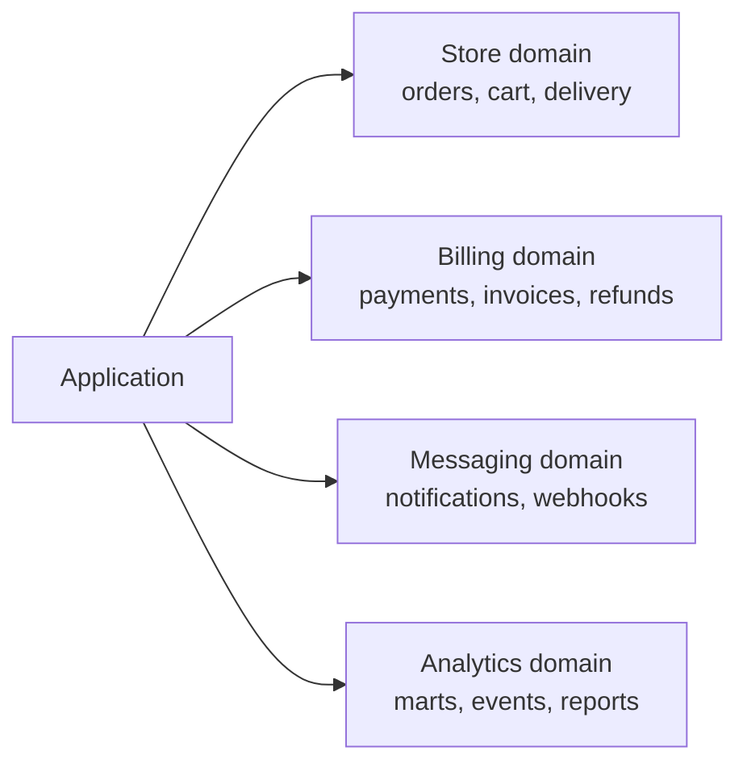
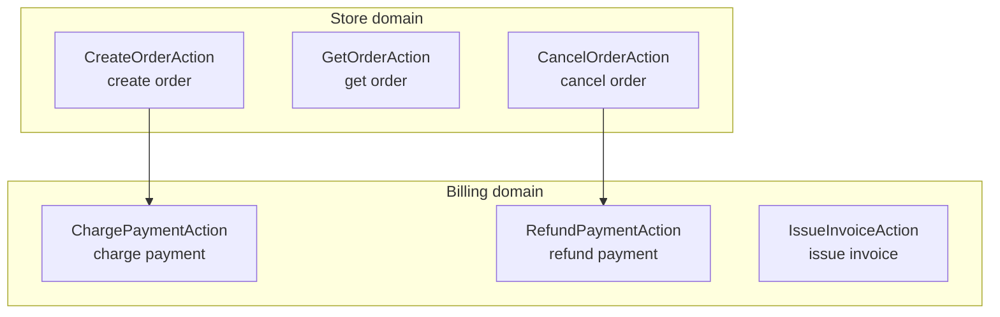
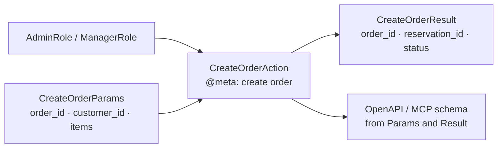
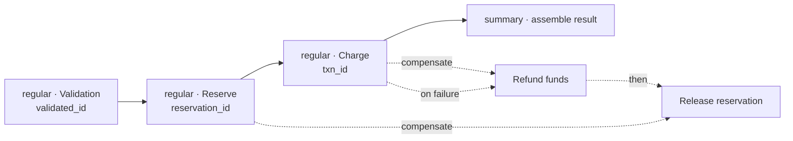

<!-- translated-from: system-altitudes_draft.md @ 2026-06-17T15:29:11Z · sha256:f5efd644bd79 -->
<p align="center">
  
</p>

# The system from different altitudes

<table width="100%"><tr>
  <td align="left"></td>
  <td align="center"><a href="../index.md">Contents</a></td>
  <td align="right"></td>
</tr></table>

---

To understand what a system can do and where the boundaries of responsibility run, you do not have to dive straight into the implementation. AOA lets you look at the system from different altitudes — from the product map to the body of a single step — and at each altitude its own layer of the answer is visible. These are not five different representations but one and the same code seen from different distances; the first four levels **Maxitor** builds from the code automatically, the fifth is the code itself.

The value of such a view is practical. An architect discusses the system at the first or second level, an API designer at the third, a scenario author at the fourth, and only then someone opens the fifth. An argument about implementation begun straight at the fifth level almost always means the upper ones were skipped.

---

## Level 1. The domain catalog

Answers the question: **what meaningful parts is the system made of?**



Classes and functions do not matter here. Visible only are which areas of responsibility exist in the product and where to look for the needed scenario. This is the first thing a new person meets: not a list of files, but an inventory of what the system does.

---

## Level 2. The operation catalog within domains

Answers the question: **what can the system actually do?**



Here it is not "modules" that are visible but business capabilities. If an operation made it into the Action catalog, it can be called, documented, role-checked, exposed over HTTP or MCP, and shown on the graph. The arrows between operations are the declared dependencies (`@depends`), and they are also what keeps the graph from closing into a cycle.

---

## Level 3. The contract of one operation

Answers the question: **what is needed on input, who can call, and what comes back?**



At this level the external contract is discussed without reading the implementation. Especially useful for APIs, AI-agent tools, tests, and requirement acceptance: roles, input, output, and the schema generated from them are all you need to agree on the boundary.

---

## Level 4. The operation pipeline

Answers the question: **what steps is the scenario made of and where are the rollbacks?**



Now the business process itself is visible: the order of steps, the data in `state`, the point where the result is assembled, the `regular` → `compensate` pairs, and the order of compensators on failure — the rollback runs in reverse. This is the level at which the scenario logic is discussed before a single method is opened.

---

## Level 5. The body of a step

Answers the question: **how exactly is a concrete piece of the scenario executed?**

```python
@regular_aspect("Reserve")
@result_string("validated_id", required=True, min_length=1)
@result_string("reservation_id", required=True, min_length=1)
async def reserve_aspect(self, params, state, box, connections):
    await box.info(
        Channel.business,
        "reserve validated_id={%var.validated_id}",
        validated_id=state["validated_id"],
    )
    return {
        "validated_id": state["validated_id"],
        "reservation_id": f"res-{state['validated_id']}",
    }
```

Only here is the Python implementation read. But by this moment it is already known why the step exists, where it is in the scenario, what it must return, and which level of the system it serves. The implementation stops being the single source of truth about behavior — it becomes the last detail, not the first.

---

<table width="100%"><tr>
  <td align="left"></td>
  <td align="center"><a href="../index.md">Contents</a></td>
  <td align="right"></td>
</tr></table>
