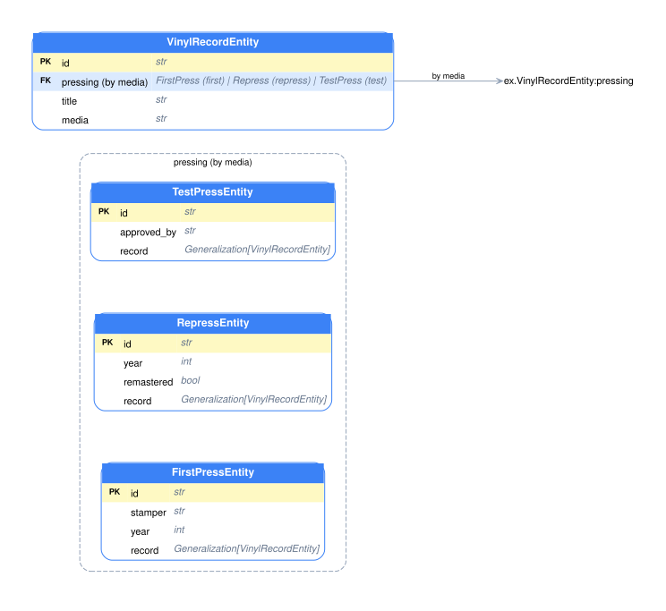

<!-- translated-from: step-26-maxitor_draft.md @ 2026-06-17T17:53:37Z · sha256:07a023a2b3e7 -->
<p align="center">
  
</p>

# Step 26 — Maxitor: a system you can see

<table width="100%"><tr>
  <td align="left"><a href="step-25-context.md">← Step 25 — Context</a></td>
  <td align="center"><a href="../index.md">Contents</a></td>
  <td align="right"><a href="../index.md#ready-extensions">Ready extensions →</a></td>
</tr></table>

- [Four projections of one system](#four-projections-of-one-system)
- [The full graph](#the-full-graph)
- [ERD, use case, and lifecycle](#erd-use-case-and-lifecycle)
- [It's the same graph the machine builds](#its-the-same-graph-the-machine-builds)
- [Specialization: the variants in one frame](#specialization-the-variants-in-one-frame)
- [Maxitor as an AOA application](#maxitor-as-an-aoa-application)
- [How to run it](#how-to-run-it)
- [Invariants](#invariants)
- [Review questions](#review-questions)

---

Architecture diagrams usually live in Confluence or Miro and go stale faster than they are drawn: a month after release new domains appeared, steps were renamed, dependencies changed — and the diagram stayed the same. The gap between what is written and what runs is a familiar trouble.

**Maxitor** breaks this cycle: the diagrams are not drawn by hand — they are **generated by the same code that runs**. Everything you declared through intents throughout this guide (`@meta`, `@check_roles`, `@depends`, aspects, `@entity`, relations, `Lifecycle`) automatically lands in the graph. The code changes — the diagram changes; open the browser — you see the current system.

[▶ Try in Colab](https://drive.google.com/file/d/1CjkB2PVUmm95VFpSELBP88a1m5SBbKSm/view?usp=drive_link) · [Open in project](../../examples/step_26_maxitor/01_graph.py)

---

## Four projections of one system

Maxitor shows the system from four sides — and all of them are built from the same code:

| Projection | What it shows |
|------------|---------------|
| **Full graph** | everything: domains, Actions, pipeline steps, resources, dependencies, relations |
| **ERD** | entities, fields, relations, and cardinality by domain |
| **Use case** | roles and the Actions available to each role |
| **Lifecycle** | the finite-state machine of a specific entity |

This echoes [The system from different altitudes](../explanation/system-altitudes.md): Maxitor builds the first projections from code automatically.

## The full graph

The full graph is an interactive network of all the system's elements. Nodes of different types, each with its own color: **Domain** (groups Actions), **Action**, **RegularAspect/SummaryAspect** (pipeline steps), **Compensator** (saga rollbacks), **ErrorHandler**, **Resource** (`@depends`), **Entity/EntityField** (the data model), **Lifecycle**, **Role**, **Params/Result/Field** (the operation's contract). The left panel filters by group, the graph can be zoomed, a cluster isolated.

The effect is simple: a new developer understands the system's structure in five minutes without reading code, and a reviewer sees what changed without diffs across dozens of files.

## ERD, use case, and lifecycle

- **ERD** (entity–relationship diagram) is built from [`BaseEntity`](step-20-entity.md) classes and [relations](step-21-relations.md): which entities are in a domain, their fields and types, how they connect (`AssociationOne/Many`, `Aggregate…`, `Composite…`), direction and cardinality. No YAML — you write code, you get the schema.
- **Use case** is read straight from the [`@check_roles`](step-03-authorization-and-roles.md) annotations: who can call which operations. This is a ready access audit — an answer to "can a manager do this?" without opening the code.
- **Lifecycle** for each entity with a [`Lifecycle`](step-22-lifecycle.md) field draws a finite-state machine: states, transitions, initial and final vertices. Especially useful when there are a dozen statuses.

## It's the same graph the machine builds

Maxitor invents nothing: it displays the graph the [machine](step-11-machine.md) assembles from code via `NodeGraphCoordinator` — the very one that checks [relations](step-21-relations.md) and [automata](step-22-lifecycle.md) at startup and feeds the access matrix. The graph is available from code right now, without a browser:

**Run:**

```bash
uv run python examples/step_26_maxitor/01_graph.py
```

**Output:**

```text
Graph assembled from code: 28 nodes, 35 edges

Node types (what the Full-graph view shows):
  Action           1
  Application      1
  Checker          1
  Domain           1
  Entity           2
  EntityField      5
  Field            2
  Lifecycle        1
  Params           2
  RegularAspect    1
  Resource         1
  Result           2
  Role             3
  StateFinal       2
  StateInitial     1
  StateIntermediate 1
  SummaryAspect    1

Edge types (relations Maxitor draws between them):
  @check_roles     1
  @depends         1
  @regular_aspect  1
  @result_checker  1
  @summary_aspect  1
  application      4
  domain           4
  entity_field     5
  entity_relation  2
  field            2
  generic:params   1
  generic:result   1
  lifecycle        1
  lifecycle_contains_state 4
  lifecycle_transition 6

No diagram was drawn by hand — this is the running system's own graph.
```

You can see how each declared intent became a node or an edge: the domain and the role, the `@depends` resource, both aspects and the checker, two entities with five fields and a relation, the order automaton with states and transitions. This is exactly what Maxitor unfolds into four projections.

## Specialization: the variants in one frame

### Read the entity diagram before interpreting its arrows

An **entity–relationship diagram**, abbreviated **ERD**, shows the declared data model. Each table-shaped box represents an entity class. Its header names the class, and the rows beneath it name fields and their types. AOA's entities are not database mappings, so a table-shaped box does not establish that a physical database table exists. The `PK` and `FK` decorations are diagram hints for identifiers and references, not proof of database constraints.

The [record example](step-21-relations.md#generalization-and-specialization) separates an album title and a pressing code from the details of each kind of pressing. `VinylRecordEntity` is the common class, or head. `FirstPressEntity`, `RepressEntity`, and `TestPressEntity` are the possible detail classes, or alternatives. The head's `pressing` field and its `media` classifier form one specialization axis: one declared choice among those alternatives.

In the head's box, Maxitor gives that field one row named `pressing (by media)`. The name tells us both where the reference is stored in the model and which ordinary field carries its code. The type text lists `FirstPress (first) | Repress (repress) | TestPress (test)`. Read each pair as a class display name followed by its declared code. The `Entity` suffix is omitted in this type text to reduce repetition; the class names in the table headers retain it.

There is one row because `pressing` is one field. Listing three alternatives does not add three simultaneous references to every record. It tells us which kinds of object this field can refer to. The diagram describes the declaration; it does not show which alternative a particular stored record currently has.

### Generate the diagram data from the working model

This experiment answers one question: how does Maxitor turn the three declared alternatives into its ERD data? The [script](../../examples/step_21_relations/13_specialization_erd.py) and [notebook](../../examples/step_21_relations/13_specialization_erd.ipynb) repeat the complete four-class preparation from [Step 21](step-21-relations.md#declare-the-complete-model). Keep that preparation unchanged and replace its final experiment with the block below.

`machine.graph_coordinator.to_json()` exports the class graph built by AOA. `DuckDBGraphResource.build_from_json` loads that graph into Maxitor's queryable store; these are diagram metadata, not music-catalogue rows. The selected domain identifier comes from the built graph. `ListEntitiesAction._slice_payload` is the actual ERD query used here to reproduce the diagram without starting the HTTP service. Its leading underscore matters: this example inspects Maxitor's current implementation, rather than introducing a public API for application business logic.


```python
import json
from pathlib import Path

from aoa.maxitor.model.diagrams.actions.list_entities_action import ListEntitiesAction
from aoa.maxitor.model.diagrams.resources.duckdb_graph_resource import DuckDBGraphResource

machine = ActionProductMachine(loggers=[])
graph = json.loads(machine.graph_coordinator.to_json())
store = DuckDBGraphResource.build_from_json(graph)
domain_id = next(node.node_id for node in machine.graph_coordinator.get_all_nodes() if node.label == "MusicDomain")
diagram = ListEntitiesAction._slice_payload(store, domain_id, include_neighbors=False)
head = next(item for item in diagram["entities"] if item["label"] == "VinylRecordEntity")
field = next(item for item in head["fields"] if item["name"] == "pressing (by media)")
print(field["name"])
print(field["type"])
print("Groups:", len(diagram["groups"]))
print("Alternatives:", len(diagram["groups"][0]["members"]))
print("Group links:", sum(item.get("relationship_kind") == "specialization" for item in diagram["relations"]))
output = Path("examples/step_21_relations/02_specialization_erd.json")
output.write_text(json.dumps(diagram, indent=2) + "\n")
print("Saved:", output.as_posix())
```

`entities` contains the table-shaped boxes and their fields. `groups` contains display groups, each with member entity identifiers. `relations` contains the connections to draw. The last part of the example saves this actual payload next to the scripts so the image can be reproduced from the same data.


```bash
uv run python examples/step_21_relations/13_specialization_erd.py
```

Actual output:

```text
pressing (by media)
FirstPress (first) | Repress (repress) | TestPress (test)
Groups: 1
Alternatives: 3
Group links: 1
Saved: examples/step_21_relations/02_specialization_erd.json
```

Three forward edges in the logical model have produced one combined field row, one group containing three alternatives, and one group-directed relation. The group identifier is derived from the head and field, but it does not create another entity. The alternatives retain their own boxes and fields.

### Inspect the actual rendered picture

The following image was generated from the saved payload with the repository's `buildDotSource` function and the Graphviz renderer used by Maxitor. Graphviz is the layout program that positions the boxes and arrows; its input format is called DOT.



The dashed frame is labelled `pressing (by media)` and contains the three detail classes. `VinylRecordEntity` sits outside it. You can read each detail class independently: `stamper`, `year`, and `approved_by` remain on their respective classes. The frame is a visual grouping of possible details, not a fourth kind of detail object.

**Current rendering limitation:** the outgoing line ends at a separate `VinylRecordEntity:pressing` label instead of meeting the dashed frame. The ERD payload targets the group's identifier, but the current DOT builder emits that identifier as an ordinary edge endpoint rather than attaching the edge to the Graphviz cluster boundary. The separate label is not another entity or database table. This image records the actual renderer output, so it should not be read as evidence that the arrow-to-frame layout is already correct.

To reproduce the image, first run the Python experiment above. Then, with the Maxitor client's dependencies installed, run:


```bash
node examples/step_21_relations/render_specialization_erd.mjs
```

Output:


```text
Saved: examples/step_21_relations/02_specialization_erd.dot
Saved: examples/step_21_relations/02_specialization_erd.svg
```

The [JSON payload](../../examples/step_21_relations/02_specialization_erd.json), [complete DOT source](../../examples/step_21_relations/02_specialization_erd.dot), and [SVG image](../../examples/step_21_relations/02_specialization_erd.svg) are saved together. The renderer helper uses the client's installed tooling and current source. After editing a model, rerun the data-producing Python script and then the renderer; editing another example does not automatically refresh this saved image.

### What happens when there is only one alternative?

A model may declare `Specialization[FirstPressEntity]` with the single code `first`. There is then no choice to group. For this experiment, remove `RepressEntity` and `TestPressEntity` from the model, remove their entries from the head's union and code list, and rebuild only the remaining head and alternative. The complete two-class preparation is below. It replaces the four-class preparation for this experiment.

```python
from __future__ import annotations

from typing import Annotated, Literal

from pydantic import Field

from aoa.action_machine.domain import BaseEntity, Classifier, Generalization, Inverse, Rel, Specialization
from aoa.action_machine.domain.base_domain import BaseDomain
from aoa.action_machine.intents.entity import entity
from aoa.action_machine.runtime.action_product_machine import ActionProductMachine


class MusicDomain(BaseDomain):
    """Group the music catalogue declarations."""

    name = "music"
    description = "A music catalogue"


@entity(description="Vinyl record", domain=MusicDomain)
class VinylRecordEntity(BaseEntity):
    """Describe the information shared by all pressings."""

    id: str = Field(description="Record identifier")
    title: str = Field(description="Album title")
    media: str = Field(description="Pressing code")
    pressing: Annotated[
        Specialization[FirstPressEntity],
        Classifier(field="media", codes=Literal["first"]),
        Inverse(field_name="record"),
    ] = Rel(description="Details of this pressing")


@entity(description="First pressing", domain=MusicDomain)
class FirstPressEntity(BaseEntity):
    """Describe the stamper used for a first pressing."""

    id: str = Field(description="Pressing identifier")
    stamper: str = Field(description="Stamper code")
    record: Annotated[
        Generalization[VinylRecordEntity],
        Classifier("record", Literal["first"]),
        Inverse(VinylRecordEntity, "pressing"),
    ] = Rel(description="Record described by this pressing")


VinylRecordEntity.model_rebuild()
FirstPressEntity.model_rebuild()
```

[Script](../../examples/step_21_relations/14_specialization_single_alternative.py) · [Notebook](../../examples/step_21_relations/14_specialization_single_alternative.ipynb)


```python
import json

from aoa.maxitor.model.diagrams.actions.list_entities_action import ListEntitiesAction
from aoa.maxitor.model.diagrams.resources.duckdb_graph_resource import DuckDBGraphResource

machine = ActionProductMachine(loggers=[])
store = DuckDBGraphResource.build_from_json(json.loads(machine.graph_coordinator.to_json()))
domain_id = next(node.node_id for node in machine.graph_coordinator.get_all_nodes() if node.label == "MusicDomain")
diagram = ListEntitiesAction._slice_payload(store, domain_id, include_neighbors=False)
print("Groups:", len(diagram["groups"]))
print("Relation lines:", len(diagram["relations"]))
```


```bash
uv run python examples/step_21_relations/14_specialization_single_alternative.py
```

Actual output:

```text
Groups: 0
Relation lines: 0
```

The current ERD emits no frame for that declaration. It also emits no ordinary replacement relation line; the raw specialization field remains in the head's table. Therefore the absence of a drawn line is not evidence that the model lacks a relationship. This limitation is separate from whether the model builds successfully.

The viewer's entity filter also removes a multi-alternative display group when fewer than two of its members remain visible. The model declaration has not changed; only the selected view has changed. Likewise, `NoGraphEdge` on a head's specialization field removes the forward edges needed to produce the group, while preserving the field itself.

### Why the full graph looks different

The **logical graph** contains entity and field nodes and the declared edges between them. The ERD is one presentation built from those data, with additional grouping instructions for its drawing. The full-graph view has no such display groups. It retains the forward `entity_specialization` edges as associations and filters out edges whose relationship is `Generalization`, including the reverse `parent_entity` edges.

Thus three visible forward edges in the full graph and one alternatives group in the ERD describe the same declaration at different levels. Neither view loads a record, chooses its variant or checks its stored data. To check those behaviours, use the value-construction experiments in [Step 21](step-21-relations.md#generalization-and-specialization).

## Maxitor as an AOA application

A nice detail: Maxitor itself is written in AOA. Its backend is operations exposed through [`FastApiAdapter`](step-13-fastapi.md), and it keeps the graph as a snapshot in DuckDB:

```text
AOA code (domains, Actions, entities)
        ↓
NodeGraphCoordinator — walks all elements
        ↓
snapshot in DuckDB
        ↓
FastAPI Action → JSON endpoints
        ↓
React SPA (G6 + Graphviz WASM)
```

The diagram endpoints (`GET /api/v1/full-graph`, `…/list-entities`, `…/domain-use-case-diagram`, `…/lifecycle-finite-automaton`) are ordinary AOA operations. Their JSON can be embedded into your own portal, CI pipeline, or documentation generator. The React SPA is a separate process, and in production the static assets can be served from a CDN while the API stays next to the service.

## How to run it

```bash
# backend (FastAPI, :8000)
uv run task maxitor-api

# frontend (Vite SPA, :5173; proxies /api to :8000)
cd packages/aoa-maxitor/client && npm install && npm run dev
```

The package dependencies are `aoa-action-machine`, `fastapi`, `uvicorn`, `duckdb`. Details — in the [`aoa-maxitor` package README](../../packages/aoa-maxitor/README.md).

## Invariants

- **Diagrams are not drawn by hand.** They are generated by the same code; the code changes — the graph changes.
- **The source is intents.** Everything declared (`@meta`/`@check_roles`/`@depends`/aspects/`@entity`/relations/`Lifecycle`) automatically becomes nodes and edges.
- **The same graph as the machine's.** Maxitor displays the `NodeGraphCoordinator` graph, which is checked at startup and feeds access.
- **Four projections.** Full graph, ERD, use case, lifecycle — from one code.
- **Maxitor is AOA.** The backend is operations through `FastApiAdapter`; the JSON endpoints are embeddable.

The full list is in [Intents and invariants](../reference/intents-and-invariants.md); the terms are in the [Glossary](../reference/glossary.md).

## Summary

Maxitor shows the system as it is in the code: four projections — the full graph, ERD, use case, and lifecycle — are built from the same `NodeGraphCoordinator` graph the machine assembles from declared intents and checks at startup. The diagrams do not go stale, because no one draws them — they are the current system. And Maxitor itself is written in AOA, with its graph available as JSON endpoints.

With this the tutorial walks the whole path: an operation and its pipeline → the service layer and transports → the data model → testing → visibility of the whole system. Next — the reference materials and the extension catalog: **[Ready extensions](../index.md#ready-extensions)** and **[how to write your own](../index.md#how-to-write-your-own-extension)**.

---

## Review questions

1. Why do Maxitor's diagrams not go stale, unlike schemas in Confluence/Miro?
2. Which four projections does Maxitor show, and what is each built from?
3. What source do the ERD and use case come from — and why is this not separate documentation?
4. What does Maxitor's graph have in common with the checks the machine does at startup?
5. In what sense is Maxitor an AOA application? What are its diagram endpoints?
6. Where in the full graph do a `@depends` resource, a `@check_roles` role, and `Lifecycle` states end up?

7. Why does `pressing (by media)` occupy one field row even though the declaration lists three alternatives?
8. What is the dashed frame, and why does it not imply an additional entity or database table?
9. What does the current arrow endpoint show, and what limitation does it expose?
10. Why can a valid one-alternative relationship have no relation line in this ERD?

> **Exercise.** In [01_graph.py](../../examples/step_26_maxitor/01_graph.py) add a second `Action` with a compensator (`@compensate`) and a handler (`@on_error`) and print the node-type breakdown again — find `Compensator` and `ErrorHandler` among them. Then add a new relation to the entities and confirm the number of `entity_relation` edges grew.

---

<table width="100%"><tr>
  <td align="left"><a href="step-25-context.md">← Step 25 — Context</a></td>
  <td align="center"><a href="../index.md">Contents</a></td>
  <td align="right"><a href="../index.md#ready-extensions">Ready extensions →</a></td>
</tr></table>
