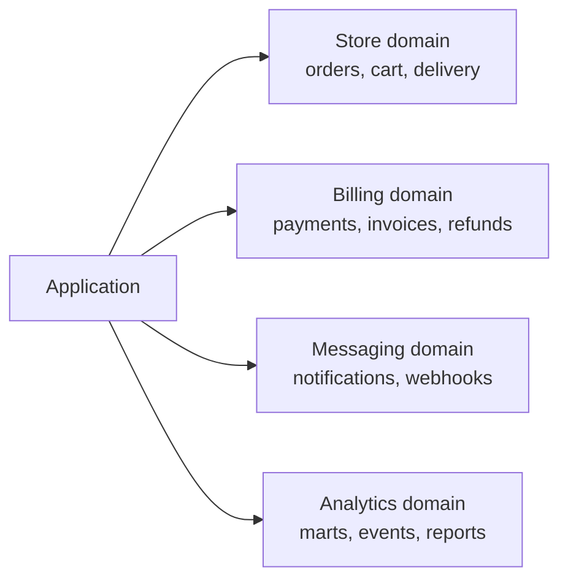
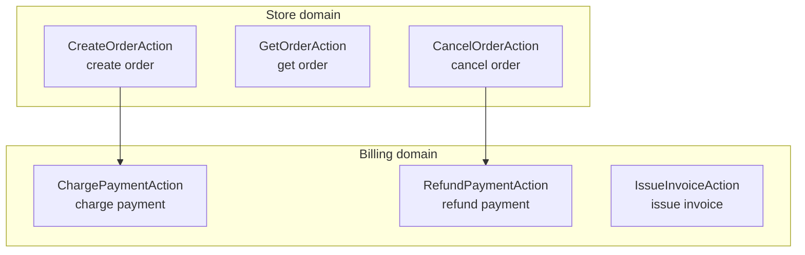
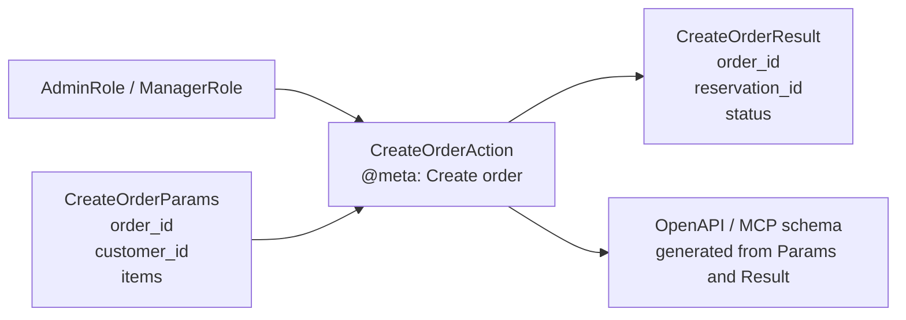
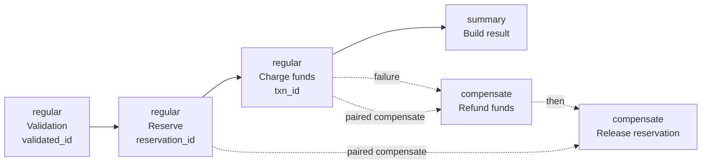
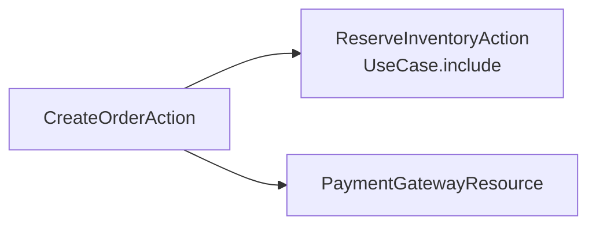

<p align="center">
  <br><br>
  <a href="https://www.python.org/downloads/"></a>
  <a href="https://github.com/bystrovmaxim/aoa"></a>
  <a href="https://github.com/bystrovmaxim/aoa/actions/workflows/ci.yml"></a>
  
  <a href="#3-quick-start"></a>
  
  
</p>

# AOA — Action-Oriented Architecture

**AOA** is a Python framework where business logic becomes an **executable specification**.

In a real application, operations almost never stay pure business logic. Decisions from neighboring layers start leaking in: transport brings the request shape, security brings roles, the database brings transactions, observability brings logs and trace ids, integrations bring retries, and errors bring rollbacks.

At the same time, hidden dependencies appear: a resource is pulled from an IoC container in the middle of a method, context comes from thread-local, a connection goes through a global singleton. What an operation actually uses is clear only after reading the entire body. At some point you stop understanding where business meaning ends and the infrastructure that serves it begins.

AOA solves this differently: **every system operation becomes a standalone entity** — an `Action`. Open one class and you see its entire contract:

```python
@meta(description="Create order", domain=StoreDomain)
@check_roles(AdminRole)
class CreateOrderAction(BaseAction[CreateOrderParams, CreateOrderResult]):

    @regular_aspect("Validation")
    @result_string("validated_id", required=True)
    async def validate_aspect(self, params, state, box, connections):
        return {"validated_id": params.order_id}

    @regular_aspect("Reserve")
    @result_string("reservation_id", required=True)
    async def reserve_aspect(self, params, state, box, connections):
        return {"reservation_id": f"res-{state['validated_id']}"}

    @compensate("reserve_aspect", "Release reservation")
    async def reserve_compensate(self, params, state_before, state_after, box, connections, error):
        ...

    @summary_aspect("Create")
    async def create_summary(self, params, state, box, connections):
        return CreateOrderResult(
            order_id=state["validated_id"],
            reservation_id=state["reservation_id"],
        )
```

← [Full example with all features](examples/full_example.py)

This is not comments and not documentation next to the code. This is the code.

AOA does something important: intent stops being text about code and becomes part of execution. A step with `@regular_aspect` actually enters the pipeline. `@compensate` actually changes behavior on failure. `@on_error` actually turns an exception into a controlled result. A field description in `Params` lands in Swagger and the MCP schema.

What used to live in Confluence, the author's head, or a README nobody updated becomes code that runs, is validated, and reads like a specification.

## Two Paths

AOA solves two big problems. The first is **business operation orchestration**: Actions, pipeline, roles, state, logs, sagas, errors, dependencies, cache, plugins, adapters, and testing. This is the main route: it is enough to start writing production Actions.

The second is **domain modeling**: Entity, Lifecycle, relations, partial loading, and outward projections. This is the extended route: it is needed when the system describes a rich problem domain, not just a sequence of actions.

**If you need to get started quickly:** read `Core Idea` → `What Becomes Possible` → `Quick Start` → `First Action` → the entire `Core: Actions And Pipeline` block.

**If you are designing a data model:** read the core through to the end first, then move on to the `Extended Domain Modeling` block.

## 1. Core Idea

AOA is built around a simple invariant:

**a business operation should be understandable before reading the internal implementation of each step.**

Therefore `Action` describes not only Python code, but also intent:

- `@meta` — what this operation is and which domain it belongs to.
- `@check_roles` — who is allowed to invoke it.
- `@regular_aspect` — which intermediate steps must run.
- `@summary_aspect` — where the final result is assembled.
- `@result_string`, `@result_int`, `@result_bool` — what contract a step leaves in `state`.
- `@compensate` — how to roll back an already executed step.
- `@on_error` — how to explicitly turn an error into a controlled result.
- `cache_key` / `on_cache_write` — what can be cached and when.
- `box.info(...)` — which business events happen, without tying them to log delivery.

As a result, the system starts knowing itself: OpenAPI, MCP tools, action graphs, ERD, Use Case diagrams, OCEL 2.0 event logs, and structural run traces are built from these intents.

## 2. What Becomes Possible

### One Action — Any Channel

The same `CreateOrderAction` can be invoked directly, published as an HTTP endpoint, and exposed to an AI agent as an MCP tool:

```python
# HTTP API
app = (
    FastApiAdapter(machine=machine, auth_coordinator=auth, title="Orders API")
    .post("/api/v1/orders", CreateOrderAction, tags=["orders"])
    .get("/api/v1/orders/{order_id}", GetOrderAction, tags=["orders"])
    .build()
)

# MCP tools for Cursor, Claude Desktop, MCP Inspector
server = (
    McpAdapter(machine=machine, auth_coordinator=auth, server_name="Orders MCP")
    .tool("orders.create", CreateOrderAction)
    .tool("orders.get", GetOrderAction)
    .build()
)
```

Business code knows nothing about FastAPI, MCP, CLI, queues, or bots. Transport is thin. The Action is the same.

### Documentation Stops Falling Behind

`Params`, `Result`, `@meta`, and `Field(description=..., examples=...)` become the source of schemas:

```python
class CreateOrderParams(BaseParams):
    order_id: str = Field(
        description="Unique client-side order ID",
        examples=["ord-001", "ord-2026-05-27-42"],
        min_length=1,
        max_length=64,
    )
```

The same description appears in Swagger UI, the MCP client, Maxitor that builds diagrams, and for a person reading the code.

### Errors And Rollbacks Visible In The Contract

A saga is no longer hidden in an `except` block 80 lines below:

```python
@regular_aspect("Charge funds")
@result_string("txn_id", required=True)
async def charge_aspect(self, params, state, box, connections):
    return {"txn_id": f"txn-{params.order_id}"}

@compensate("charge_aspect", "Refund funds")
async def charge_compensate(self, params, state_before, state_after, box, connections, error):
    ...
```

If `summary` or the next step fails, the machine invokes compensators in reverse order. That behavior is declared next to the step it applies to.

### The System Can Be Viewed At Different Altitudes

You do not have to dive into implementation immediately to understand what the system can do and where responsibility boundaries lie. AOA provides several overview levels: from a product map down to the body of a single step.

**Level 1. Domain catalog.** Answers the question: “what meaningful parts does the system consist of?”




At this level, classes and functions do not matter. You only see which areas of responsibility exist in the product and where to find the scenario you need.

**Level 2. Action catalog within domains.** Answers the question: “what operations can the system actually perform?”




Here you see not “modules” but business capabilities. If an operation is in the Action catalog, it can be invoked, documented, checked by roles, exposed over HTTP/MCP, and shown on a graph.

**Level 3. Contract of one Action.** Answers the question: “what is required as input, who can invoke it, and what is returned?”




At this level you can discuss the external contract without reading implementation. This is especially useful for APIs, AI tools, tests, and requirements review.

**Level 4. Action pipeline.** Answers the question: “what steps make up the scenario and where are rollbacks?”




Now the business process itself is visible: step order, data in `state`, the final result point, `regular` → `compensate` pairs, and compensator order on failure.

**Level 5. Step body.** Answers the question: “how exactly is a specific piece of the scenario executed?”

```python
@regular_aspect("Reserve")
@result_string("validated_id", required=True, min_length=1)
@result_string("reservation_id", required=True, min_length=1)
async def reserve_aspect(self, params, state, box, connections):
    await box.info(
        Channel.business,
        "[2] regular: reserve validated_id={%var.validated_id}",
        validated_id=state["validated_id"],
    )
    return {
        "validated_id": state["validated_id"],
        "reservation_id": f"res-{state['validated_id']}",
    }
```

Only here do we read the Python implementation. Before that, it is already clear why the step exists, where it sits in the scenario, what data it must return, and which system level it serves.

## 3. Quick Start

```bash
git clone https://github.com/bystrovmaxim/aoa
cd aoa
uv sync --all-extras
```

Work through the examples in order. They are deliberately arranged as a ladder: each next file adds one capability and does not require holding the entire framework in your head.

```bash
uv run python examples/01_hello_world.py
uv run python examples/02_pipeline.py
uv run python examples/03_logging_sensitive.py
uv run python examples/04_saga_compensate.py
uv run python examples/05_on_error.py
uv run python examples/06_cache.py
uv run python examples/07_ocel.py
```

## 4. First Action

File: `[examples/01_hello_world.py](examples/01_hello_world.py)`

```python
import asyncio
import uuid

from pydantic import Field

from aoa.action_machine.auth import NoneRole
from aoa.action_machine.context import Context
from aoa.action_machine.domain.base_domain import BaseDomain
from aoa.action_machine.intents.aspects import summary_aspect
from aoa.action_machine.intents.check_roles import check_roles
from aoa.action_machine.intents.meta import meta
from aoa.action_machine.model import BaseAction, BaseResult, ParamsStub
from aoa.action_machine.runtime.action_product_machine import ActionProductMachine


class StoreDomain(BaseDomain):
    name = "store"
    description = "Store domain"


class CreateOrderResult(BaseResult):
    order_id: str = Field(description="Order identifier")


@meta(description="Create order", domain=StoreDomain)
@check_roles(NoneRole)
class CreateOrderAction(BaseAction[ParamsStub, CreateOrderResult]):

    @summary_aspect("Build action result")
    async def create_summary(self, params, state, box, connections):
        return CreateOrderResult(order_id=f"ord-{uuid.uuid4().hex[:8]}")


async def main() -> None:
    machine = ActionProductMachine()
    order_result = await machine.run(Context(), CreateOrderAction(), ParamsStub())
    print(order_result.order_id)


asyncio.run(main())
```

Run:

```bash
uv run python examples/01_hello_world.py
```

Output:

```text
ord-a3f91b2c
```

Even in the minimal example, important things are already present:

- `CreateOrderAction` — a unit of business behavior.
- `CreateOrderResult` — a typed result.
- `@meta` — description for catalog, schemas, and documentation.
- `@check_roles(NoneRole)` — the action is explicitly allowed without a user role.
- `@summary_aspect` — the final step that returns `Result`.

## 5. Core: Actions And Pipeline

From here the main route begins. Mechanics needed by almost every Action are collected here: pipeline, state, logs, rollbacks, errors, dependencies, connections, context, cache, plugins, adapters, and testing.

### 5.1. Pipeline: When A Scenario Becomes Visible

File: `[examples/02_pipeline.py](examples/02_pipeline.py)`

The pipeline runs top to bottom: first all `@regular_aspect` steps, then one `@summary_aspect`.

```python
@regular_aspect("Validation")
@result_string("validated_id", required=True, min_length=1)
async def validate_aspect(self, params, state, box, connections):
    return {"validated_id": params.order_id}

@regular_aspect("Reserve")
@result_string("validated_id", required=True, min_length=1)
@result_string("reservation_id", required=True, min_length=1)
async def reserve_aspect(self, params, state, box, connections):
    return {
        "validated_id": state["validated_id"],
        "reservation_id": f"res-{state['validated_id']}",
    }

@summary_aspect("Create")
async def create_summary(self, params, state, box, connections):
    return CreateOrderResult(
        order_id=state["validated_id"],
        reservation_id=state["reservation_id"],
    )
```

Run:

```bash
uv run python examples/02_pipeline.py
```

Output:

```text
Sample 02 pipeline

  [1] regular: validate order=ord-001
  [2] regular: reserve validated_id=ord-001
  [3] summary: order=ord-001, reservation=res-ord-001

Result: order_id=ord-001, reservation_id=res-ord-001
```

Note `@result_string`. It is not decoration. It is the `state` contract after the step. The next step does not guess what the previous one left behind. The machine validates the data shape.

### 5.3. Saga: Rollback Without Hidden Magic

File: `[examples/04_saga_compensate.py](examples/04_saga_compensate.py)`

```python
@regular_aspect("Reserve inventory")
@result_string("reservation_id", required=True)
async def reserve_aspect(self, params, state, box, connections):
    await box.info(Channel.business, "regular: reserve order={%var.order_id}", order_id=params.order_id)
    return {"reservation_id": f"res-{params.order_id}"}

@compensate("reserve_aspect", "Release reservation")
async def reserve_compensate(self, params, state_before, state_after, box, connections, error):
    rid = state_after["reservation_id"] if state_after else "?"
    await box.info(Channel.business, "compensate: release reservation {%var.rid}", rid=rid)

@regular_aspect("Charge payment")
@result_string("txn_id", required=True)
async def charge_aspect(self, params, state, box, connections):
    await box.info(Channel.business, "regular: charge order={%var.order_id}", order_id=params.order_id)
    return {"txn_id": f"txn-{params.order_id}"}

@compensate("charge_aspect", "Refund payment")
async def charge_compensate(self, params, state_before, state_after, box, connections, error):
    txn = state_after["txn_id"] if state_after else "?"
    await box.info(Channel.business, "compensate: refund {%var.txn}", txn=txn)

@summary_aspect("Confirm order")
async def confirm_summary(self, params, state, box, connections):
    raise ValueError("order service unavailable")
```

Run:

```bash
uv run python examples/04_saga_compensate.py
```

Output:

```text
Sample 04 saga compensate

  regular: reserve order=ord-001
  regular: charge order=ord-001
  compensate: refund txn-ord-001
  compensate: release reservation res-ord-001

order service unavailable
```

Here the first real “hook” appears: rollback order does not need to be hunted down visually. It follows from the pipeline and declared `@compensate` handlers.

### 5.4. Explicit Errors: `@on_error`

File: `[examples/05_on_error.py](examples/05_on_error.py)`

When an exception is part of the business scenario, it can be described as intent. And this is not necessarily one fallback for all cases: an Action can have several handlers, from specific errors to a general fallback scenario.

```python
@summary_aspect("Validate credentials")
async def login_summary(self, params, state, box, connections):
    if params.username == "bad":
        raise ValueError("invalid credentials")
    return LoginResult(username=params.username, status="ok")

@on_error(ValueError, description="Invalid credentials")
async def validation_error_on_error(self, params, state, box, connections, error):
    await box.info(Channel.business, "on_error: {%var.msg}", msg=str(error))
    return LoginResult(username=params.username, status="login_failed")
```

The machine picks a handler top to bottom in declaration order and invokes the first one for which `isinstance(error, exception_types)` holds.

```python
class InsufficientFundsError(Exception):
    pass


class PaymentGatewayError(Exception):
    pass


@on_error(InsufficientFundsError, description="Insufficient funds")
async def insufficient_funds_on_error(self, params, state, box, connections, error):
    return PaymentResult(status="insufficient_funds")


@on_error(PaymentGatewayError, description="Payment gateway unavailable")
async def gateway_on_error(self, params, state, box, connections, error):
    return PaymentResult(status="gateway_error")


@on_error(Exception, description="Unexpected payment error")
async def fallback_on_error(self, params, state, box, connections, error):
    return PaymentResult(status="unknown_error")
```

Order matters: specific types first, then the general fallback. For `PaymentGatewayError`, the selection chain looks like this:

```text
InsufficientFundsError? no
PaymentGatewayError?    yes -> gateway_on_error
Exception?              not checked anymore
```

Illogical order is visible immediately:

```python
@on_error(Exception, description="Catch all")
async def fallback_on_error(self, params, state, box, connections, error):
    ...

@on_error(ValueError, description="Validation error")
async def validation_on_error(self, params, state, box, connections, error):
    ...
```

Such order raises an exception at startup: `ValueError` would never reach the second handler because the first `Exception` already matches any error. AOA will not let you run an Action with illogical error routing. The contract reads like a table: specific cases above, general fallback below.

Run:

```bash
uv run python examples/05_on_error.py
```

Output:

```text
Sample 05 on error

  on_error: invalid credentials

Result: username=bad, status=login_failed
```

If an Action has both a saga and `@on_error`, the machine first rolls back executed steps, then invokes the matching error handler.

Up to this point we looked at the internal shape of one business scenario: steps, `state`, rollbacks, and errors. The next level is all external dependencies of an Action. They too must be visible before reading method bodies.

### 5.5. `@depends`: All Dependencies Visible In The Header

An `Action` must not secretly pull services, resources, or nested scenarios from a global container. If an action needs another Action or resource, that is declared in the header via `@depends`.

```python
@meta(description="Create order", domain=StoreDomain)
@check_roles(NoneRole)
@depends(PaymentGatewayResource, description="Payment gateway")
@depends(ReserveInventoryAction, mode=UseCase.include, description="Reserve inventory")
class CreateOrderAction(BaseAction[CreateOrderParams, CreateOrderResult]):

    @regular_aspect("Reserve")
    async def reserve_aspect(self, params, state, box, connections):
        reserve_result = await box.run(
            ReserveInventoryAction,
            ReserveInventoryParams(order_id=params.order_id),
        )
        return {"reservation_id": reserve_result.reservation_id}

    @regular_aspect("Payment")
    async def charge_aspect(self, params, state, box, connections):
        gateway = await box.resolve(PaymentGatewayResource)
        txn = await gateway.charge(params.order_id)
        return {"txn_id": txn.id}
```

Reading only the `CreateOrderAction` header, you already see all external dependencies: which nested Actions it can run and which resources it can obtain through the factory.

The dependency factory works as a contract gateway:

```python
gateway = await box.resolve(PaymentGatewayResource)  # ok: declared in @depends

mailer = await box.resolve(MailerResource)           # error: not declared
```

If a dependency is not declared, `DependencyFactory` raises an error. This is intentional: you cannot “accidentally” smuggle a new resource into an Action so that it does not appear in the graph and is not visible in review.

For nested Actions the same idea applies: the official launch path is `box.run(...)`, and the link is declared upfront via `@depends(SomeAction, mode=...)`. `UseCase.include` means a mandatory nested scenario: after a successful root run the machine verifies that the include dependency was actually executed. `UseCase.extend` suits an optional scenario.

From `@depends` a graph is built:




This removes another pain of reading code: to understand external links of an Action, you do not need to hunt for `container.get(...)`, imports, factories, and hidden calls across method bodies. Look at the header first, then the graph. The system can verify the dependency graph for acyclicity: cycles like `CreateOrderAction -> ReserveInventoryAction -> CreateOrderAction` should not reach runtime because they make the scenario hard to understand and dangerous to execute.

### 5.6. `@connection`: Pass An Already Open Resource

`@depends` answers “which dependencies an Action is allowed to create or run through the factory”. `@connection` covers another scenario: the Action must receive an already ready connection or resource created externally.

This is needed in two common cases.

First — a nested Action must work in the same connection or transaction as the parent scenario. For example, the root Action opened `db`, started a transaction, and passes the same resource to the child Action:

```python
@connection(PostgresResource, key="db", description="Primary database")
class CreateOrderAction(BaseAction[CreateOrderParams, CreateOrderResult]):

    @regular_aspect("Create order")
    async def create_aspect(self, params, state, box, connections):
        db = connections["db"]
        await db.execute("insert into orders ...")

        await box.run(
            ReserveInventoryAction,
            ReserveInventoryParams(order_id=params.order_id),
            connections={"db": db},
        )
        return {"order_id": params.order_id}
```

If the resource can create a wrapper for nested Actions, the machine passes the child Action a proxy: queries can run, but lifecycle management (`open`, `begin`, `commit`, `rollback`) cannot. Thus the transaction owner stays one, and nested scenarios do not break boundaries.

Second case — the resource lives at application level: connection pool, HTTP client, object store, cache client, OCEL store. Then the adapter passes it into the Action on every HTTP/MCP call:

```python
db_pool = PostgresResource(...)
search = SearchClientResource(...)

app = (
    FastApiAdapter(machine=machine, auth_coordinator=auth, title="Orders API")
    .post(
        "/api/v1/orders",
        CreateOrderAction,
        connections={
            "db": db_pool,      # application-level singleton
            "search": search,
        },
    )
    .build()
)
```

There is also a per-call form: the factory creates a resource on each request/tool call.

```python
from aoa.action_machine.resources import PerCallConnection

server = (
    McpAdapter(machine=machine, auth_coordinator=auth, server_name="Orders MCP")
    .tool(
        "orders.create",
        CreateOrderAction,
        connections={
            "db": PerCallConnection(lambda: PostgresResource(...)),
        },
    )
    .build()
)
```

The machine validates the contract: if an Action declared `@connection(..., key="db")`, the `db` key must be passed; if an extra key was passed or the value is not a `BaseResource`, the run fails. Therefore connections are also visible in the Action header and appear in the system graph.

### 5.7. `@context_requires`: Context Only On Explicit Request

Context is the infrastructural reality of a call: who the user is, which trace id, which request path, which runtime. If you give an Action free access to all of context, invisible infrastructure dependencies appear quickly: an aspect starts reading `user_id`, `trace_id`, or `request_path`, but that is not visible in the header.

AOA solves this through `@context_requires`: an aspect receives `ctx` only if it explicitly listed the needed fields.

```python
from aoa.action_machine.intents.context_requires import Ctx, context_requires


@regular_aspect("Verify order owner")
@context_requires(Ctx.User.user_id, Ctx.Request.trace_id)
@result_string("checked_by", required=True)
async def check_owner_aspect(self, params, state, box, connections, ctx):
    user_id = ctx.get(Ctx.User.user_id)
    trace_id = ctx.get(Ctx.Request.trace_id)

    await box.info(
        Channel.business,
        "Owner check: user={%var.user_id}, trace={%var.trace_id}",
        user_id=user_id,
        trace_id=trace_id,
    )
    return {"checked_by": user_id}
```

If there is no `@context_requires`, the aspect has no `ctx` parameter and no access to `Context` through `box`. If an aspect tries to read through `ctx.get(...)` a field it did not declare, `ContextView` raises an access error.

This gives two effects:

- invisible infrastructure dependencies are not created;
- reading the aspect header, you immediately see what it consumes from external context.

```python
@context_requires(Ctx.User.user_id, Ctx.Request.trace_id)
@result_string("checked_by", required=True)
async def check_owner_aspect(..., ctx):
    ...
```

One look at the signature and decorators answers the question: this step depends on the user and trace id. Not on the entire request object, not on global context, not on hidden thread-local — exactly on two declared keys.

### 5.8. Logs That Do Not Clutter Business Code

File: `[examples/03_logging_sensitive.py](examples/03_logging_sensitive.py)`

An Action writes an event to the `box` port: the event has a **channel** (`Channel.business`, `Channel.technical`, ...), a **severity level** (`info`, `warning`, `critical`), the Action domain, and execution scope. Routing is decided externally through `LogCoordinator`.

```python
await box.info(
    Channel.business,
    "Login: user={%var.username}, amount={%var.amount}",
    username=params.username,
    amount=params.amount,
)

await box.warning(
    Channel.business,
    "Warning: amount {%var.amount|red} requires review",
    amount=params.amount,
)

await box.info(Channel.business, "Token: {%params.api_token}")
```

Sensitive fields are masked at the model level:

```python
class LoginParams(BaseParams):
    username: str = Field(description="Username")
    amount: float = Field(description="Transaction amount")

    _api_token: str = PrivateAttr(default="")

    @property
    @sensitive(True, max_chars=3, char="*", max_percent=50)
    def api_token(self) -> str:
        return self._api_token
```

Routes are wired once. Within one subscription, conditions combine as `AND`: channel matched, level matched, domain matched. Several subscriptions of one logger work as `OR`.

```python
console = ConsoleLogger().subscribe("dev-everything")

business_audit = JsonlAuditLogger("audit.jsonl").subscribe(
    "business-audit",
    channels=Channel.business,
    levels=Level.info | Level.warning | Level.critical,
    domains=StoreDomain,
)

on_call = ChatAlertLogger(webhook="https://chat/...").subscribe(
    "on-call-critical",
    channels=Channel.business | Channel.technical,
    levels=Level.warning | Level.critical,
)

machine = ActionProductMachine(
    log_coordinator=LogCoordinator(loggers=[console, business_audit, on_call]),
)
```

One signal can go to several places at once:

```text
business + info     -> console + audit
business + critical -> console + audit + on-call
technical + warning -> console + on-call
technical + info    -> console
```

Business code does not know whether an event goes to console, audit, chat, OTel, or several places at once. It only honestly reports: “this is a business event”, “this is a warning”, “this happened inside such-and-such Action”. Routes can change without editing the scenario.

### 5.9. Cache: Intent, Not An Infrastructure Patch

File: `[examples/06_cache.py](examples/06_cache.py)`

In AOA, caching is described at the Action level: how to build a key and under what conditions the result is worth saving. The Action itself does not prepare a separate cache payload — if caching triggers, the machine takes the final `Result` of the entire Action and stores it under the key.

```python
class GetConfigAction(BaseAction[ConfigParams, ConfigResult]):

    def cache_key(self, params: ConfigParams) -> str | None:
        return f"{params.tenant_id}:{params.name}"

    async def on_cache_write(self, result, params: ConfigParams, duration_ms: float) -> bool:
        return duration_ms >= HEAVY_MIN_MS

    @summary_aspect("Load config")
    async def load_summary(self, params, state, box, connections):
        heavy = params.name != "ping"
        if heavy:
            await asyncio.sleep(0.08)
        return ConfigResult(value=f"{params.tenant_id}:{params.name}:value")
```

`on_cache_write` is called after pipeline execution and receives `result`, `params`, and `duration_ms`. Therefore the decision need not be blind: cache only heavy calls, large responses, expensive calculations, specific tenants, or only results that passed business conditions.

Cache is enabled only if the machine is created with `CacheCoordinator`:

```python
machine = ActionProductMachine(
    cache_coordinator=CacheCoordinator(max_size=10_000),
)
```

`CacheCoordinator` is responsible for storage policy, not the Action. It can be replaced with your own implementation: local in-memory cache for dev, shared Redis/Postgres cache for multiple processes, TTL, size limits, eviction policy, invalidation by domain or external event. The Action contract does not change: `cache_key` decides “how to find”, `on_cache_write` decides “whether to save”, the coordinator decides “where and how to store”.

Run:

```bash
uv run python examples/06_cache.py
```

The point of the example: heavy `feature-flags` is written to cache, a repeat call comes from cache, light `ping` is intentionally not cached.

### 5.10. Plugins: Infrastructure Between Steps

In AOA the pipeline is not executed by the Action itself but by the machine. This is an important detail: because the machine controls transitions between steps, “empty spaces” appear before and after each aspect. That is exactly where infrastructure code can be embedded: metrics, audit, tracing, process mining, alerts, state snapshots, saga control.

The Action stays a business scenario. A plugin observes scenario execution from the outside.

```python
from aoa.action_machine.intents.on import on
from aoa.action_machine.logging import Channel
from aoa.action_machine.plugin.core import Plugin
from aoa.action_machine.plugin.core.events import (
    AfterRegularAspectEvent,
    CompensateFailedEvent,
    GlobalFinishEvent,
)


class PipelineAuditPlugin(Plugin):

    async def get_initial_state(self) -> dict:
        return {"steps": []}

    @on(AfterRegularAspectEvent)
    async def on_regular_done(self, state, event: AfterRegularAspectEvent, log):
        state["steps"].append(
            {
                "aspect": event.aspect_name,
                "state": event.state_snapshot,
                "duration_ms": event.duration_ms,
            }
        )
        return state

    @on(CompensateFailedEvent)
    async def on_compensate_failed(self, state, event: CompensateFailedEvent, log):
        await log.critical(
            Channel.technical,
            "Compensator {%var.name} failed: {%var.error}",
            name=event.compensator_name,
            error=str(event.compensator_error),
        )
        return state

    @on(GlobalFinishEvent)
    async def on_finish(self, state, event: GlobalFinishEvent, log):
        await log.info(
            Channel.business,
            "Pipeline finished in {%var.ms}ms, steps={%var.count}",
            ms=event.duration_ms,
            count=len(state["steps"]),
        )
        return state
```

Wiring:

```python
machine = ActionProductMachine(
    plugins=[PipelineAuditPlugin()],
)
```

Events are typed, so you can subscribe at the needed altitude:

```text
GlobalStartEvent / GlobalFinishEvent       entire Action run
BeforeRegularAspectEvent / AfterRegular... pipeline steps
BeforeSummaryAspectEvent / AfterSummary... final Result
BeforeOnErrorAspectEvent / AfterOnError... @on_error handlers
BeforeCompensateAspectEvent / After...     saga compensators
SagaRollbackStartedEvent / Completed       entire rollback
UnhandledErrorEvent                        error without @on_error
```

And here a very strong AOA effect appears: because each `regular` aspect returns data through a strict `state` contract, the machine can give plugins **snapshots of intermediate pipeline state**.

```text
validate_aspect -> state = {"validated_id": "ord-001"}
reserve_aspect  -> state = {"validated_id": "ord-001", "reservation_id": "res-ord-001"}
charge_aspect   -> state = {"validated_id": "ord-001", "reservation_id": "res-ord-001", "txn_id": "txn-ord-001"}
```

Usually intermediate business-process state dissolves into local variables. In AOA it becomes an observable artifact: it can be logged, sent to audit, used to build timelines, find slow steps, analyze frequent failure points, and recover exactly which state the scenario broke on.

### 5.11. OCEL: Process Mining Out Of The Box

File: `[examples/07_ocel.py](examples/07_ocel.py)`

AOA can write Action runs to [OCEL 2.0](https://ocel-standard.org/) — an event log format for process mining. On each run, `OcelPlugin` (on `GlobalFinishEvent`) reads `OcelFrame` rows from pipeline `state` and appends one event to the store. No frames → no event.

```python
from pathlib import Path

from aoa.action_machine.plugin.ocel import (
    InMemoryOcelStoreResource,
    OCEL_FRAMES_KEY,
    OcelFrame,
    OcelPlugin,
)

store = InMemoryOcelStoreResource(output_file=Path("ocel_log.json"))

machine = ActionProductMachine(
    log_coordinator=LogCoordinator(loggers=[ConsoleLogger()]),
    plugins=[OcelPlugin(store=store, short_names=True)],
)

# In an aspect — declare which domain objects participate in the event:
return {
    OCEL_FRAMES_KEY: [OcelFrame(object=order, qualifier="Create order")],
}

await machine.run(Context(), CreateOrderAction(), params=...)
await store.close()  # writes ocel_log.json
```

Business aspects return `OcelFrame` when they want process-mining participation; the plugin handles serialization. See `[examples/07_ocel.py](examples/07_ocel.py)`.

Testing in AOA becomes a continuation of the same idea: we do not create a separate test version of the scenario, but run the same Action through the same machine, changing only the environment.

### 5.12. Testing: The Same Machine, A Different Reality

AOA tests run the same Action, with the same pipeline, checkers, roles, `@depends`, logging, plugins, and infrastructure rules as production. In a test, not the scenario code changes but the surrounding reality: user, request/runtime context, dependencies, resources, nested Actions.

In the classic approach, a test often assembles a separate world from mocks: mock the service, mock the repository, mock authorization, mock part of the transaction, guess which methods will be called and in what order. Such a test can become brittle: it verifies an agreement with mocks, not real scenario behavior. Worse, a mock can over time stop reflecting the real resource, and the test keeps passing.

AOA does not require replacing the scenario itself. `TestBench` replaces the environment around it: dependencies, context, user, connections, nested Actions. Therefore the test runs the same Action through the same machine, but in a controlled reality.

Key principle: **an Action does not hold state between invocations**. Everything that affects execution comes from outside: `Params`, `Context`, pipeline `state`, `connections`, `@depends` dependencies, and machine plugins. From this follows an important testing simplicity: to verify a scenario, you do not need to “warm up” an object to the right internal state. You need to assemble the right input and environment.

```python
from unittest.mock import AsyncMock

from aoa.action_machine.testing import TestBench, StubTesterRole


payment_gateway = AsyncMock(spec=PaymentGatewayResource)
payment_gateway.charge.return_value = PaymentTxn(id="txn-001")

bench = (
    TestBench()
    .with_user(user_id="admin", roles=(StubTesterRole,))
    .with_request(trace_id="test-trace-001", request_path="/test/orders")
    .with_mocks({
        PaymentGatewayResource: payment_gateway,
        ReserveInventoryAction: ReserveInventoryResult(reservation_id="res-001"),
    })
)

result = await bench.run(
    CreateOrderAction(),
    CreateOrderParams(order_id="ord-001"),
    rollup=False,
)
```

The point is that `CreateOrderAction` stays real. If inside it calls `await box.resolve(PaymentGatewayResource)`, TestBench returns the mock only because that resource is declared in `@depends`. If the Action calls `await box.run(ReserveInventoryAction, ...)`, you can substitute a mock result for the nested Action. If a dependency is not declared, the test cannot smuggle it into the scenario unnoticed.

The same with context: through `.with_user(...)`, `.with_request(...)`, `.with_runtime(...)` the test creates the needed virtual reality. The Action receives exactly the context data allowed by its `@context_requires`; there is no extra access to `Context` through `box`.

You can test at different altitudes:

```python
# Entire Action: production-like run through the machine.
result = await bench.run(CreateOrderAction(), params, rollup=False)

# One regular aspect: verify input state and step result.
state_after = await bench.run_aspect(
    CreateOrderAction(),
    "reserve_aspect",
    params=params,
    state={"validated_id": "ord-001"},
    rollup=False,
)

# Summary only: verify Result assembly from ready state.
result = await bench.run_summary(
    CreateOrderAction(),
    params=params,
    state={"validated_id": "ord-001", "reservation_id": "res-001"},
    rollup=False,
)

# Compensator as unit: pass state_before/state_after/error directly.
await bench.run_compensator(
    CreateOrderAction(),
    "reserve_compensate",
    params=params,
    state_before=BaseState(),
    state_after=BaseState(reservation_id="res-001"),
    error=RuntimeError("payment failed"),
)
```

A separate strong capability is `rollup=True` for transactional resources. If a resource supports rollup, for example an SQL/Postgres resource, the test can run against a production-like database: the Action performs real `INSERT`/`UPDATE`, goes through the real pipeline, but on `commit()` the resource performs rollback instead of persisting.

```python
result = await bench.run(
    CreateOrderAction(),
    params,
    rollup=True,
)
```

This verifies integration on a real schema and real database constraints without persisting changes. If a resource does not support rollup, the machine fails fast through `check_rollup_support()`, instead of pretending the test is safe.

After this, the Action can be exposed outward. Importantly, transport does not become part of business logic: HTTP, MCP, and visual graphs are built from the already declared contract.

### 5.13. Adapters: HTTP And MCP From One Source

Full examples live here: `[packages/aoa-examples/src/aoa/examples/fastapi_mcp_services/](packages/aoa-examples/src/aoa/examples/fastapi_mcp_services/)`

Shared infrastructure:

```python
from aoa.action_machine.auth import NoAuthCoordinator
from aoa.action_machine.logging import ConsoleLogger
from aoa.action_machine.logging.log_coordinator import LogCoordinator
from aoa.action_machine.runtime.action_product_machine import ActionProductMachine

machine = ActionProductMachine(
    log_coordinator=LogCoordinator(loggers=[ConsoleLogger()]),
)
auth = NoAuthCoordinator()
```

FastAPI:

```python
from aoa.action_machine.adapters.fastapi import FastApiAdapter

app = (
    FastApiAdapter(
        machine=machine,
        auth_coordinator=auth,
        title="Orders API",
        version="0.1.0",
    )
    .get("/api/v1/ping", PingAction, tags=["system"])
    .post("/api/v1/orders", CreateOrderAction, tags=["orders"])
    .get("/api/v1/orders/{order_id}", GetOrderAction, tags=["orders"])
    .build()
)
```

MCP:

```python
from aoa.action_machine.adapters.mcp import McpAdapter

server = (
    McpAdapter(
        machine=machine,
        auth_coordinator=auth,
        server_name="Orders MCP",
        server_version="0.1.0",
    )
    .tool("system.ping", PingAction)
    .tool("orders.create", CreateOrderAction)
    .tool("orders.get", GetOrderAction)
    .build()
)

if __name__ == "__main__":
    server.run(transport="stdio")
```

OpenAPI and MCP tool schema are built from the same `Action`, the same `Params`, the same `Result`, the same `Field(description=...)`.

Now the Action Machine core is assembled into one path: scenario, state, dependencies, context, logs, cache, plugins, adapters, and tests. The next block is not needed for every Action, but becomes important when the project needs a unified data model on top of different storage sources.

Before entering the second path, a bridge between Actions and Entities is needed: an Action itself must not turn into an ORM or repository. It uses resources, and a resource returns an Entity or another domain object.

```python
@meta(description="Load order", domain=StoreDomain)
@connection(OrderReaderResource, key="reader")
class GetOrderAction(BaseAction[GetOrderParams, GetOrderResult]):

    @summary_aspect("Return order")
    async def load_order_summary(self, params, state, box, connections):
        reader = connections["reader"]
        order = await reader.get_order(params.order_id)
        return GetOrderResult(order_id=order.id, total=order.total)
```

The Action sees the scenario and result contract. The Resource knows where to get data. The Entity describes the data model without binding to a specific database. Therefore the Entities block is not a replacement for Actions, but an extension of the model Actions can work with through resources.

## 6. Extended Domain Modeling

You can skip this block on first acquaintance with AOA. Actions do not require a rich domain model: you can work with only `Params`, `Result`, resources, and ordinary Pydantic types. But if the project needs a unified data model on top of different storage sources, a second path appears here.

### 6.1. Entities: Data Model Without Database Binding

AOA describes not only operations but also the domain model. `BaseEntity` is the internal data model: fields, relations, lifecycle, partial-load rules. It does not know where data came from: PostgreSQL, ClickHouse, S3, API, in-memory fixture. A concrete resource loads data and assembles an entity, but the entity itself does not depend on a specific database.

```python
from typing import Annotated
from pydantic import Field

from aoa.action_machine.domain import (
    AggregateMany,
    AssociationOne,
    BaseEntity,
    Lifecycle,
    NoInverse,
    Rel,
    build,
)
from aoa.action_machine.intents.entity import entity


class OrderLifecycle(Lifecycle):
    _template = (
        Lifecycle()
        .state("draft", "Draft").to("paid", "cancelled").initial()
        .state("paid", "Paid").to("shipped").intermediate()
        .state("shipped", "Shipped").final()
        .state("cancelled", "Cancelled").final()
    )


@entity(description="Customer order", domain=StoreDomain)
class OrderEntity(BaseEntity):
    id: str = Field(description="Order id")
    total: float = Field(description="Order total", ge=0)
    lifecycle: OrderLifecycle = Field(description="Order lifecycle")

    customer: Annotated[
        AssociationOne[CustomerEntity],
        NoInverse(),
    ] = Rel(description="Customer that placed the order")

    lines: Annotated[
        AggregateMany[OrderLineEntity],
        NoInverse(),
    ] = Rel(description="Order lines")
```

This is a hexagonal approach at the data level: the consumer works with `OrderEntity`, not with the `orders` table, SQL join, or JSON response of a specific API. One resource can assemble `OrderEntity` from PostgreSQL, another from an analytics mart, a third from a test fixture. The contract for the Action stays the same.

```python
class OrderReaderResource(BaseResource):
    async def get_order(self, order_id: str) -> OrderEntity:
        ...

    def get_wrapper_class(self):
        return None


class PostgresOrderReader(OrderReaderResource):
    async def get_order(self, order_id: str) -> OrderEntity:
        row = await self.db.fetchrow("select ...")
        return build(row, OrderEntity, lambda e, r: {
            e.id: r["order_id"],
            e.total: r["total_amount"],
            e.lifecycle: OrderLifecycle(r["status"]),
        })


class InMemoryOrderReader(OrderReaderResource):
    async def get_order(self, order_id: str) -> OrderEntity:
        return self.orders[order_id]
```

The resource does not know who called it. The Action does not know which database is underneath. They meet at the domain model level.

### 6.2. Entity In Result: Explicit Outward Projection

An Entity can be part of an Action result, but the external contract is better set explicitly. For this, `BaseEntity.schema(schema=...)` describes projection: which entity fields may be returned outward and which JSON Schema OpenAPI/MCP will see.

```python
class GetOrderResult(BaseResult):
    order: OrderEntity.schema(
        schema={
            "type": "object",
            "required": ["id", "total", "status"],
            "properties": {
                "id": {"type": "string", "description": "Order id"},
                "total": {"type": "number", "description": "Order total"},
                "status": {"type": "string", "description": "Lifecycle state"},
            },
        }
    ) = Field(description="Public order projection")
```

Now `GetOrderAction` can work internally with the full `OrderEntity`, relations, and lifecycle, but return only the public form outward:

```python
@summary_aspect("Return order")
async def get_order_summary(self, params, state, box, connections):
    order = state["order"]
    return GetOrderResult(
        order={
            "id": order.id,
            "total": order.total,
            "status": order.lifecycle.current_state,
        }
    )
```

This is an important separation: the domain model can be richer than the external response. The API need not expose all fields, relations, internal lifecycle details, or partial-load mechanics. The response contract is described next to `Result`, and the graph still knows the projection relates to `OrderEntity`.

### 6.3. Complex JSON In Result Without Entity

Not every complex response is an entity. Sometimes an Action must return composite JSON for an API: a graph, report, grouped summary, layout, aggregated mart. To avoid spawning dozens of small Pydantic classes only for response shape, you can set JSON Schema for one field through `JsonSchemaValue`.

```python
from aoa.action_machine.model import JsonSchemaValue


ORDER_REPORT_SCHEMA = {
    "type": "object",
    "required": ["totals", "segments"],
    "properties": {
        "totals": {
            "type": "object",
            "required": ["orders", "amount"],
            "properties": {
                "orders": {"type": "integer"},
                "amount": {"type": "number"},
            },
            "additionalProperties": False,
        },
        "segments": {
            "type": "array",
            "items": {
                "type": "object",
                "required": ["name", "amount"],
                "properties": {
                    "name": {"type": "string"},
                    "amount": {"type": "number"},
                },
                "additionalProperties": False,
            },
        },
    },
    "additionalProperties": False,
}

OrderReportJson = JsonSchemaValue.define(
    name="OrderReportJson",
    schema=ORDER_REPORT_SCHEMA,
)


class BuildOrderReportResult(BaseResult):
    report: OrderReportJson = Field(description="Aggregated order report")
```

Thus `Result` stays short, but the API contract does not become “any dict”. The value is validated against JSON Schema, and the same schema goes to OpenAPI/MCP. The difference from `OrderEntity.schema(...)` is simple: entity projection links the response to a domain entity, while `JsonSchemaValue` describes a standalone JSON object that is not an entity.

### 6.4. Relations And Cardinality

Links between entities are set through relation container types:

```text
CompositeOne / CompositeMany       strong ownership
AggregateOne / AggregateMany       weak ownership
AssociationOne / AssociationMany   link without ownership
```

`One` / `Many` set cardinality, and `composition` / `aggregation` / `association` set ownership meaning. These relations appear in the graph and ERD. If a link has a reverse side through `Inverse(...)`, the coordinator can verify mirroring: types, target entity, and cardinality must be compatible. An error in the relation model should surface when building the graph, not half a year later in a report.

### 6.5. Partial Read Without Different Models Per Query

Usually different SQL queries spawn different DTOs: `OrderListRow`, `OrderDetailsRow`, `OrderWithCustomerRow`. In AOA you can return the same `OrderEntity`, but in a partially loaded state.

```python
order = OrderEntity.partial(id="ord-001", total=1200.0)

order.total      # ok
order.lifecycle  # FieldNotLoadedError
```

For relations the rule is the same: the container always knows the id, but the full entity may not be loaded.

```python
order = OrderEntity(
    id="ord-001",
    total=1200.0,
    lifecycle=OrderLifecycle("paid"),
    customer=AssociationOne[CustomerEntity](id="cust-001"),
    lines=AggregateMany[OrderLineEntity](ids=("line-1", "line-2")),
)

order.customer.id    # ok
order.customer.name  # RelationNotLoadedError, customer row not hydrated
```

This is an important feature: different database queries need not create different data models. They return one domain type with a different load level, and the system controls accidental access to unloaded fields. No silent `None`, no hidden lazy queries.

### 6.6. Lifecycle As An Entity Field

Lifecycle is not a string `status` field without rules. It is a finite automaton next to the entity:

```python
order = OrderEntity(
    id="ord-001",
    total=1200.0,
    lifecycle=OrderLifecycle("draft"),
    customer=AssociationOne[CustomerEntity](id="cust-001"),
    lines=AggregateMany[OrderLineEntity](ids=()),
)

order.lifecycle.can_transition("paid")      # True
paid = order.lifecycle.transition("paid")   # new lifecycle value
order = order.model_copy(update={"lifecycle": paid})
```

The lifecycle template is built in the class; the instance stores only the current state. When building the graph, the system verifies automaton structure: states, transitions, initial/intermediate/final semantics. Maxitor can show lifecycle as a separate diagram because it is declared not in a comment and not in a database migration, but in the domain model.

When a scenario and its dependencies are declared explicitly, the machine gains the ability to observe execution without interfering in business code. Logs, cache, plugins, and OCEL work precisely because the machine drives the pipeline.

## 7. Maxitor: A System You Can See

Everything declared through intents in AOA code automatically lands in the graph. [aoa-maxitor](../aoa-maxitor/README.md) — FastAPI backend + React SPA — turns this into live interactive diagrams: full domain and dependency graph, entity ERD, Use Case by roles, lifecycle finite automata.

Diagrams are not drawn by hand — they are assembled from code that actually runs.

→ [Detailed aoa-maxitor documentation](../aoa-maxitor/README.md)

## 8. When To Use AOA

AOA is especially useful where a business operation no longer fits in “one function did one thing”. The signs are simple:

- the scenario has several steps, and order matters;
- there are roles, audit, tracing, or different log levels;
- there are external services, database, transactions, sagas, or compensations;
- the same scenario must be exposed over HTTP API, MCP tool, CLI, queue, or to an AI agent;
- a new developer must understand an operation without a tour from the author;
- review must check not only code but intent: roles, dependencies, errors, rollbacks, context.

For a small team, AOA provides a shared language before the system grows implicit agreements. For a large team — it lowers onboarding and review cost: domains, Actions, pipeline, and dependencies are visible in code and graph. For a team with AI agents — it gives the agent an operation catalog and strict schemas, not a set of random functions.

AOA also suits an MVP. Usually an MVP suffers not from lack of speed but from fast decisions becoming a foundation that is scary to change later. An Action can be minimal: `@meta`, `@check_roles`, one `@summary_aspect`, Pydantic `Params`/`Result`. But from day one the operation has a contract, a test entry point, a future OpenAPI/MCP schema, and a place to add pipeline, saga, cache, and plugins without rewriting.

Not every function needs to become an Action. Low-level pure helpers, string formatting, local calculations, and small algorithms can remain ordinary functions. An Action is the boundary of a business capability worth invoking, verifying, showing, documenting, and observing.

## 9. Monorepo Packages

```text
aoa-run                 meta package workspace root
aoa-action-machine      core: Action, aspects, roles, graph, adapters, plugin/core + plugin/ocel ([ocel] extra)
aoa-maxitor             visualizer: FastAPI backend + React SPA
aoa-examples            domain examples and adapter demos
```

Packages use the shared namespace `aoa.*`:

- `aoa.action_machine` (including `aoa.action_machine.plugin.core` and `aoa.action_machine.plugin.ocel`)
- `aoa.maxitor`
- `aoa.examples`

## 10. Where To Read Next

- `[examples/](examples/)` — short runnable examples from hello world to OCEL.
- `[packages/aoa-action-machine/README.md](packages/aoa-action-machine/README.md)` — Action Machine core.
- `[packages/aoa-action-machine/src/aoa/action_machine/plugin/ocel/README.md](packages/aoa-action-machine/src/aoa/action_machine/plugin/ocel/README.md)` — OCEL export policy.
- `[packages/aoa-maxitor/README.md](packages/aoa-maxitor/README.md)` — visualizer and API.
- `[packages/aoa-examples/README.md](packages/aoa-examples/README.md)` — domain examples.
- `[docs/CHANGELOG.md](docs/CHANGELOG.md)` — change history.

## 11. FAQ

### Is This A Library, Framework, Or Architectural Style?

AOA is an architectural style, and `aoa-action-machine` is its Python runtime. You can use only the Action Machine core, connect FastAPI/MCP adapters, add OCEL and Maxitor. What matters is not packaging but the principle: a business operation is described as an executable contract.

### When Is AOA Not Needed?

If code is local, short, and has no external contract, an ordinary function is simpler. AOA starts paying off when an operation gains roles, steps, dependencies, rollbacks, audit, cache, transport adapters, domain model, scenario tests, and the need to explain behavior to another person or agent.

### There Really Are Many Decorators. Is That Not Noise?

Noise is what does not affect behavior. AOA decorators affect behavior: `@check_roles` checks access, `@result_string` validates `state`, `@compensate` triggers rollback, `@depends` restricts the dependency factory, `@context_requires` issues `ContextView`. These are not comments about intent but intent in executable form.

### Where Is The Boundary Between Business Code And The Machine?

Business code lives inside aspects: validation, calculation, domain service call, result assembly. The machine is responsible for uniform mechanics around it: step order, state, checks, roles, dependencies, context, compensation, plugins, cache, events. That boundary is needed so a business scenario does not turn into a mix of logic and infrastructure.

### Why Not Just Agree To Write Careful Services?

Agreements work while the team is small and everyone remembers context. AOA moves agreement into the grammar of code. You cannot forget to declare context and then secretly read it from `box`. You cannot obtain a dependency that is not in `@depends`. You cannot hide a mandatory rollback in a verbal agreement. The system verifies what used to rely on discipline.

### Why Are A Single Entry Point And Single Result So Important?

An operation is understandable if it is clear where it starts and where it ends. In AOA, launch goes through the machine, and the result is returned as `Result` or through explicit `@on_error`. This turns the execution graph from a web of calls into a path that can be traced, tested, and shown on a diagram.

### Why Is Zero Action State A Principle, Not An Implementation Detail?

An Action must not remember a past invocation. Everything that affects execution comes from outside: `Params`, `Context`, pipeline `state`, `connections`, `@depends`, machine plugins. Therefore a test does not “prepare an object” but assembles input and environment. This lowers the risk of flaky bugs where yesterday's invocation affects today's.

### How Does `state` Differ From Object Internal State?

`state` lives only inside one pipeline run. Regular aspects create it, the machine validates it with checkers and passes it onward. After the run completes it does not become Action memory. Therefore intermediate data is observable but does not pollute subsequent invocations.

### Why Must Dependencies Be Declared Upfront?

Because a hidden dependency is a hidden reason for behavior change. `@depends` makes external Actions and resources part of the Action header. Reader, reviewer, test, and graph see what the operation uses. If a dependency is not declared, `box.resolve(...)` will not let you obtain it.

### Are Entities An ORM?

No. An Entity does not know about tables, sessions, query builders, or a specific database. It is a domain model: fields, relations, partial-load semantics, and lifecycle. A resource decides where to get data and how to assemble an entity: PostgreSQL, ClickHouse, S3, HTTP API, fixture. Therefore one Action can work with one model while resource implementations change.

### Why Partial Entity Instead Of Separate DTOs Per Query?

Separate DTOs diverge quickly: order list returns one shape, order details another, a report a third. AOA lets you return the same domain type with a different load level. If code accidentally accesses an unloaded field, it gets `FieldNotLoadedError` or `RelationNotLoadedError`, not silent `None` and not a hidden lazy query.

### Why `@connection` Separately?

Not all resources need to be created through the factory. Sometimes a resource is already open: transaction, connection pool, HTTP client, object store, OCEL store. `@connection` declares a slot for such a resource, and the machine verifies that exactly the needed keys are passed on run. For nested Actions, a connection can be passed onward as a wrapper so the child does not manage someone else's transaction.

### Why Must Context Be Requested Through `@context_requires`?

Context is the easiest source of hidden dependencies. Today an aspect reads `user_id`, tomorrow `trace_id`, the day after `request_path`, and nowhere is that visible. `@context_requires` makes consumption explicit: from the aspect header it is clear which fields are needed, and `ContextView` will not let you read extra ones.

### What Happens With Errors: Can Exceptions No Longer Be Raised?

You can. But if an error is part of the business scenario, it is better declared through `@on_error`. Then handler order, error types, and fallback become a visible contract. If a handler is too general and makes the next specific handler unreachable, that is a declaration error, not a surprise under load.

### How To Test This Without Huge Integration Tests?

`TestBench` runs the same Action through the same machines but lets you assemble the needed reality: user/request/runtime context, mocks for `@depends`, connections, rollup. You can test the entire Action, one regular aspect, summary, or compensator separately. Tests scale with risk.

### What Does Rollup Give And Why Does It Matter?

For transactional resources, rollup lets you run a real scenario against a production-like database: perform `INSERT`/`UPDATE`, go through the real pipeline, but on `commit()` do rollback. This is not a mock and not a dry run; it is verification on a real schema without persisting changes.

### Will This Be Slow?

AOA adds an orchestration layer: checks, events, plugins, adapters. That is a conscious price for explicitness and observability. For most business operations the cost of external services, database, and network is higher. Where micro-performance matters, you need not turn a low-level hot path into an Action.

### How To Adopt AOA In An Existing Project?

Do not rewrite everything. Pick one operation that already hurts: many roles, side effects, rollbacks, external API, complex testing. Shape it as an Action, connect one adapter or one test scenario. If value does not appear on one operation, scaling is premature. If it appears — the next operation will already be easier.

### What Does A Reviewer Get?

A reviewer sees not only Python bodies but changes in intent: roles, dependencies, context, pipeline, compensators, error handlers, cache policy, connections. This shifts the question from “does the code look fine?” to “is the operation contract declared correctly?”.

### What Does An AI Agent Get?

The agent gets a dictionary of the system: Action catalog, descriptions, Pydantic schemas, MCP tools, dependency graph, pipeline, and documentation from code. It does not need to guess from random functions what can be invoked and which parameters to pass.

### What Is The Main Tradeoff?

AOA takes away the freedom of implicitness. You cannot quietly take context, unobtrusively pull a dependency, hide rollback in a random `except`, or hold state in an Action. In exchange the system becomes predictable, verifiable, observable, and understandable for people and tools.
