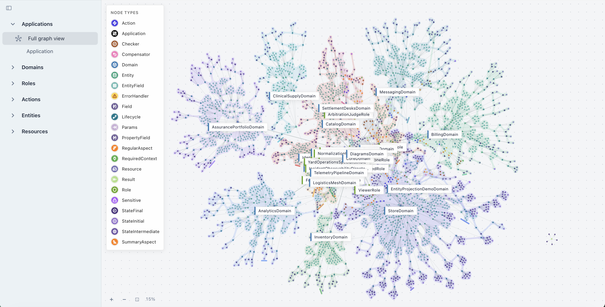
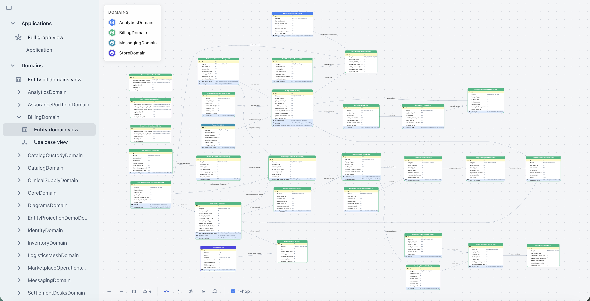
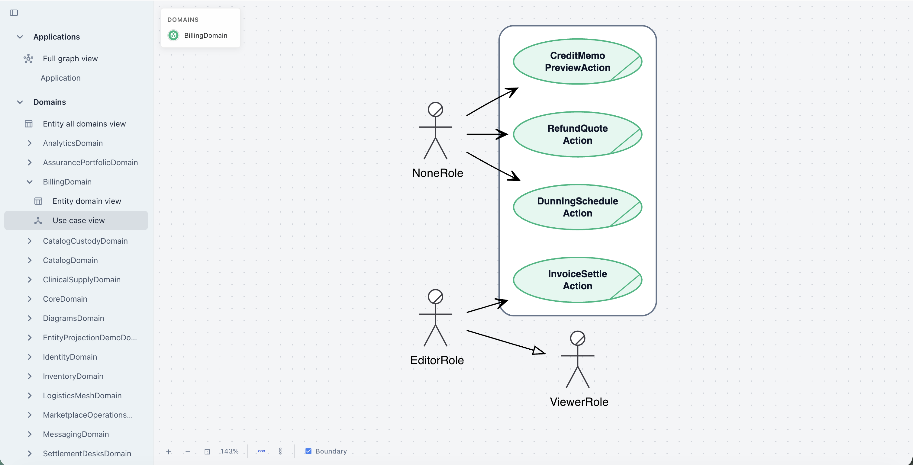
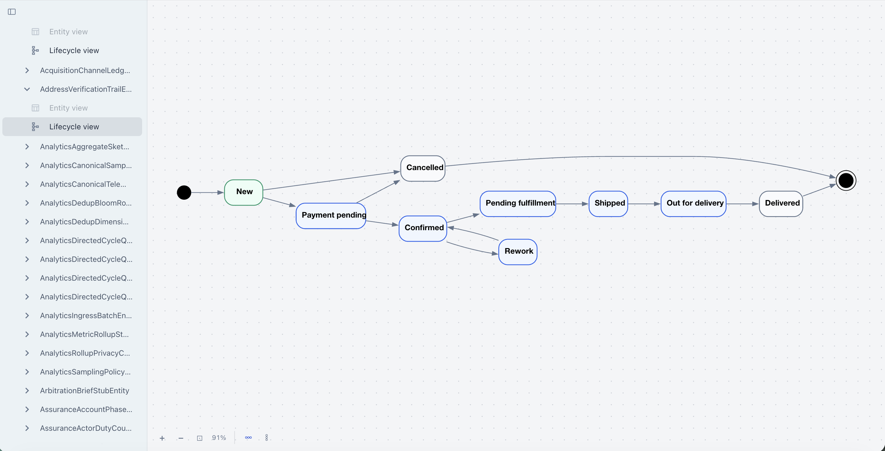

<p align="center">
  <br><br>
  <a href="https://www.python.org/downloads/"></a>
  <a href="https://github.com/bystrovmaxim/aoa"></a>
  <a href="https://github.com/bystrovmaxim/aoa/actions/workflows/ci.yml"></a>
  
  <a href="client/README.md"></a>
  
  
</p>

# aoa-maxitor: A System You Can See

Most architecture diagrams live in Confluence or Miro and go stale faster than they are drawn. A month after release the schema no longer matches reality: new domains appear, operation steps are renamed, dependencies change. The gap between what is written and what runs is a familiar problem.

**Maxitor** breaks that cycle: diagrams are not drawn by hand. They are generated from the same code that actually runs. Code changes — the diagram changes. Open a browser — see the current system. Diagrams stay current because they are built from the same intents that execute in code. Intent changes — the diagram reflects it.

## What Is Maxitor

Maxitor is a React SPA that turns AOA project code into live interactive diagrams. The data source is not YAML or Confluence annotations — it is the code itself: domains, actions, dependencies, entities, lifecycle state machines. Everything declared in code via intents automatically appears in the graph.

Maxitor can show four views of the system:


| View            | Shows                                                                       |
| --------------- | --------------------------------------------------------------------------- |
| **Full graph**  | Everything: domains, Actions, pipeline steps, resources, dependencies, links |
| **ERD**         | Entities, fields, relations, and cardinality by domain                      |
| **Use case**    | Roles and Actions each role can access                                      |
| **Lifecycle**   | Finite state machine for a specific entity                                  |


---

## 1. Full Graph: The Whole System as One Map

The full graph is an interactive network of all elements in an AOA system. One view shows what used to take days of onboarding.

<p align="center">
  
</p>

The graph shows nodes of different types, each with a color label:

- **Domain** — groups Actions by business area
- **Action** — business operation with name and description
- **RegularAspect / SummaryAspect** — pipeline steps inside an Action
- **Compensator** — rollback steps (saga)
- **ErrorHandler** — error handlers
- **Resource** — dependencies via `@depends`
- **Entity / EntityField** — data model
- **Lifecycle** — state machine
- **Role** — access roles
- **Params / Result / Field** — contract of each Action

The left panel filters by groups: Applications, Domains, Roles, Actions, Entities, Resources. The graph is interactive — zoom, pan, isolate a cluster.

**Key effect**: a new developer understands system structure in five minutes without reading code. A reviewer sees what changed without diffs across dozens of files.

---

## 2. ERD: Data Model From Code

The ERD tab shows entity schemas by domain: fields, types, relations, cardinality.

<p align="center">
  
</p>

The left panel navigates domains. For each domain:

- **Entity domain view** — ERD for that domain only
- **Use case view** — roles and Actions in the domain

On the diagram you see:

- Which entities belong to the domain
- Their fields and types
- How entities are linked (`AssociationOne/Many`, `AggregateOne/Many`, `CompositeOne/Many`)
- Bold lines — relation direction
- Header color — domain membership

The ERD is built from `BaseEntity` classes and `Relation` fields. No YAML schema, no separate description. Write code — get a diagram.

---

## 3. Use Case: Who Can Do What

The use case view shows roles and Actions they can access via `@check_roles`. This is not hand-written documentation — it is read directly from `@check_roles` annotations in code.

<p align="center">
  
</p>

Useful for:

- Access audits — see who can run which operations
- Business discussions — answer “can a manager do this?” without opening code
- Reviewing role changes

---

## 4. Lifecycle: State Machine

For each entity with a `Lifecycle` field, Maxitor builds a finite automaton graph: states, transitions, initial and final vertices.

<p align="center">
  
</p>

Especially valuable when an entity lifecycle is non-trivial — e.g. an order with a dozen states. Instead of reading automaton code line by line, you see the full transition graph.

Endpoint: `GET /api/v1/lifecycle-finite-automaton?entity_qualname=...`

---

## 5. How It Works Inside

Maxitor itself is an AOA application. Its backend is written with Actions, wired through `FastApiAdapter`, and uses DuckDB to store a graph snapshot.

```
AOA code (domains, Actions, entities)
        ↓
NodeGraphCoordinator — walks all elements
        ↓
DuckDB snapshot — graph in memory
        ↓
FastAPI Actions → JSON endpoints
        ↓
React SPA (G6 + Graphviz WASM)
```

On backend startup, `NodeGraphCoordinator` scans all registered AOA code and builds the graph. DuckDB stores it as `nodes` / `edges` tables. Each HTTP request for a diagram queries DuckDB and returns JSON for the client.

**Important**: the React SPA is fully separate from the backend. Two independent processes. In production you can build static SPA assets and serve them from a CDN, with the API hosted separately.

---

## 6. API Endpoints

All diagram endpoints are AOA Actions exposed via `FastApiAdapter`:

```
GET /api/health                          — health check
GET /api/sidebar                         — navigation: domains, entities

GET /api/v1/full-graph                   — full graph (G6 payload)
GET /api/v1/list-domains                 — domain list with colors
GET /api/v1/list-entities                — ERD slice by domain
GET /api/v1/list-node-types              — graph node types
GET /api/v1/domain-use-case-diagram      — use case by domain and roles
GET /api/v1/lifecycle-finite-automaton   — entity state machine
```

Swagger UI: `http://127.0.0.1:8000/docs`

JSON from endpoints can be embedded in your portal, CI pipeline, or documentation tooling.

---

## 7. How to Run

### Backend

```bash
uv run task maxitor-api
```

Starts FastAPI at `http://127.0.0.1:8000`. Environment: `MAXITOR_API_HOST` (default `127.0.0.1`), `MAXITOR_API_PORT` (default `8000`).

### Frontend (dev)

```bash
cd packages/aoa-maxitor/client
npm install
npm run dev
```

SPA at `http://127.0.0.1:5173`. Vite proxies `/api` to `http://127.0.0.1:8000`.

### Production

```bash
VITE_MAXITOR_API_BASE_URL=https://api.example.com npm run build
```

Builds static SPA assets. Deploy: SPA on CDN or nginx, API in a separate container.

---

## 8. Client Architecture (`client/src`)

The React SPA is layered:


| Layer                  | Contents                                                          |
| ---------------------- | ----------------------------------------------------------------- |
| `app/`                 | Entry: `App.tsx`, `AppProviders.tsx`. No business logic           |
| `components/`          | All UI: `layout/`, `pages/`, `navigation/`, `diagrams/`          |
| `components/diagrams/` | `FullGraphViewer/` (G6), `ErdViewer/` (Graphviz WASM)             |
| `api/`                 | HTTP clients mirroring FastAPI routes                             |
| `model/`               | TypeScript contracts between UI and API                           |
| `lib/`                 | Pure helpers, layout constants                                    |
| `styles/`              | MUI theme                                                         |


Graph rendering:

- **G6** (`@antv/g6`) — full graph, force-directed layout
- **`@hpcc-js/wasm-graphviz`** — ERD, deterministic Graphviz layout

---

## 9. Installation

```bash
pip install aoa-maxitor
# or in the monorepo
uv sync
```

Dependencies: `aoa-action-machine`, `fastapi`, `uvicorn`, `duckdb`.
