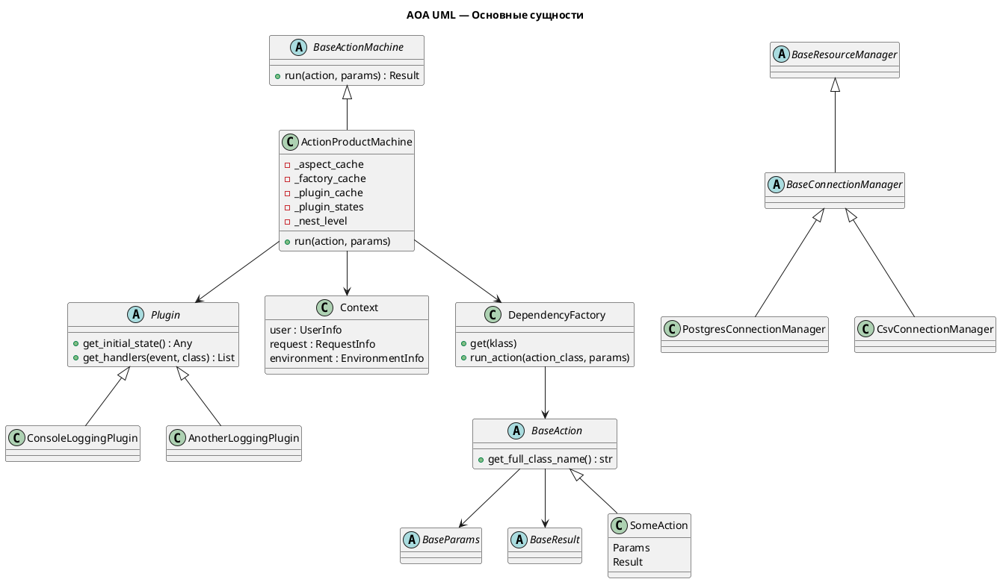
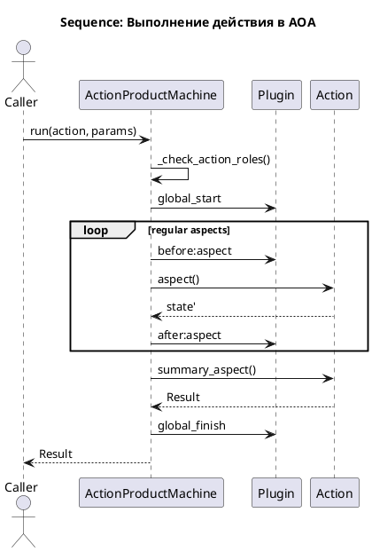

```markdown
20. aoa_uml.md

# UML‑диаграмма архитектуры AOA

Этот документ описывает архитектуру ActionEngine (AOA) через UML‑диаграммы.  
Диаграмма фиксирует ключевые сущности: действия, аспекты, машину действий, ресурсные менеджеры, DI‑фабрику и плагины.  
Все связи и элементы отражены исходя из реальной структуры кода в ActionMachine, включая ActionProductMachine, DependencyFactory, BaseAction, плагины и менеджеры ресурсов.  

---

# Диаграмма высокого уровня (архитектурные слои)

```plaintext
                          ┌────────────────────────────┐
                          │        Transport Layer      │
                          │   (FastAPI / CLI / MCP)     │
                          └──────────────┬──────────────┘
                                         │
                                         ▼
                          ┌────────────────────────────┐
                          │      ActionMachine          │
                          │  • Запуск действия          │
                          │  • Аспекты (pipeline)       │
                          │  • Плагины                  │
                          │  • Роли                     │
                          │  • DI (DependencyFactory)   │
                          └──────────────┬──────────────┘
                                         │
                                         ▼
                       ┌────────────────────────────────────┐
                       │               Action                │
                       │        Атом бизнес‑логики           │
                       │ Params → Aspects → Summary → Result │
                       └──────────────┬──────────────────────┘
                                      │
                                      ▼
                     ┌──────────────────────────────────────────┐
                     │               Resources (Adapters)        │
                     │   Доступ к API/БД/файлам/очередям        │
                     │   Состояние: соединения, сессии          │
                     └──────────────────────────────────────────┘
```

---

# UML‑диаграмма основных классов (структурная)



---

# Диаграмма последовательности (Sequence Diagram) выполнения действия

Показывает жизненный цикл `machine.run(action, params)`.



---

# Диаграмма компонентов (Component Diagram)

```plaintext
┌──────────────────────────┐       ┌──────────────────────────────┐
│       Business Core       │       │       Infrastructure         │
│ ┌──────────────────────┐ │       │ ┌──────────────────────────┐ │
│ │       Actions         │◄────────┤ │     Resource Managers    │ │
│ │  Aspects + Summary    │ │ DI    │ │   (Adapters, Repos, API) │ │
│ └──────────┬───────────┘ │       │ └──────────────────────────┘ │
│            │             │       └──────────────────────────────┘
│     ActionMachine        │
│ (pipeline, roles, DI,    │
│  plugins, nesting)       │
└───────────┬──────────────┘
            │
      ┌─────▼───────┐
      │   Plugins   │  ← Observability, Audit, Metrics
      └─────────────┘
```

---

# Пояснения к диаграммам

## ActionMachine — сердце архитектуры
ActionProductMachine выполняет действие шаг за шагом, строго в порядке определения аспектов.  
Она отвечает за:

- вызов аспектов,
- вызов плагинов,
- ролевую модель,
- DI через DependencyFactory,
- вложенные действия (`run_action`),
- валидацию результатов через чекеры [1],
- обработку ошибок и типов [1],
- кэширование аспектов [1].

Код ActionProductMachine имеет высокий рейтинг качества (A по radon) [1].

## DependencyFactory — адаптация инфраструктуры
DependencyFactory:

- создаёт зависимости по декларациям `@depends`,
- кеширует их,
- управляет вложенными действиями.

Её методы (`get`, `run_action`) получили оценки A [1].

## Plugins — чистое наблюдение
Плагины:

- подписываются через `@on`,
- вызываются ActionMachine на этапах pipeline,
- не могут менять выполнение,
- безопасны даже при ошибках (`ignore_exceptions=True`) [1].

## Resources — адаптеры внешнего мира
Resource Managers:

- PostgresConnectionManager [1],
- CsvConnectionManager [1],
- BaseConnectionManager [1],

инкапсулируют соединения, транзакции и работу с внешними системами.

## Actions — доменная логика
Все действия stateless, используют Params/Result, аспекты и summary.  
Все аспекты и методы BaseAction, BaseParams, BaseResult имеют рейтинг A [1].

---

# Итог

Эта UML‑диаграмма отражает реальные классы и связи внутри ActionEngine,  
показывает чистое разделение домена и инфраструктуры и демонстрирует поток исполнения ActionMachine.

Если нужно — могу:

- создать PNG/SVG версии диаграмм,
- сделать постер для документации,
- сгенерировать PlantUML с цветами бренд‑стиля,
- добавить диаграмму для многослойных ресурсов и действий.

```