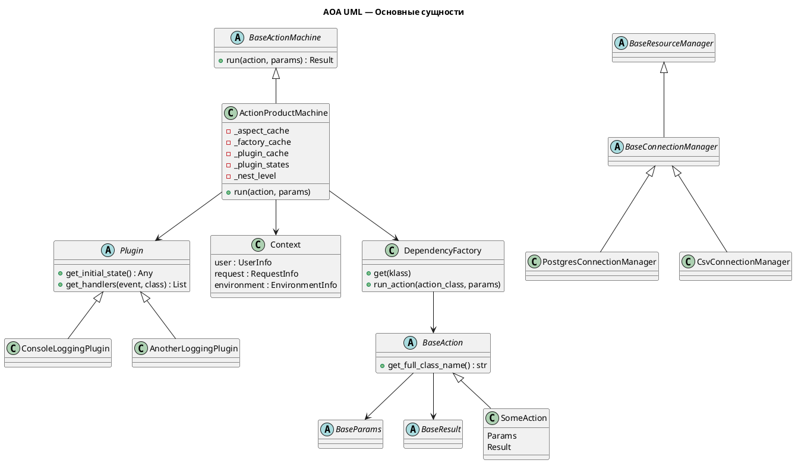
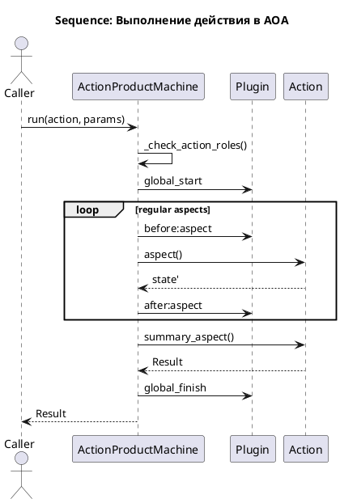

################################################################################
# Файл: /Users/bystrovmaxim/PythonDev/kanban_assistant/z/readme_2/0. structure.md
################################################################################

index.md  
Общее введение в ActionEngine и AOA. Проблема размазывания логики, зачем нужны действия, что такое архитектура на действиях, какие боли она решает.

getting_started.md  
Минимальный практический старт: установка, первое действие, запуск машины, подключение плагинов, первые Params/Result.

concepts.md  
Базовые концепции: Action, Aspect, Params, Result, Plugin, DependencyFactory, Context, ResourceManager. Простые примеры каждой сущности.

architecture_overview.md  
Целостная архитектура AOA: слои, поток данных, роль машины, плагинов и DI, место ресурсов и действий в системе. Диаграмма.

machine.md  
ActionMachine: анализ жизненного цикла действия, пайплайн before/aspect/after/summary, обработка ролей, вложенность, кэширование аспектов и плагинов.

actions.md  
Конструкция действия: Params/Result, аспекты, summary, best practices. Как писать actions правильно. Где границы ответственности.

aspects_vs_actions.md  
Критерии выбора: когда логика остаётся аспектом, когда выделяется в отдельное действие. Алгоритм принятия решения. Примеры: аспект → action, action → набор actions.

action_vs_resource.md  
Когда логика должна быть action, а когда ресурсный менеджер: критерии долгоживущего состояния, признаки транспорта, признаки бизнес‑логики. Правило: “если логика работает каждый раз заново — action; если хранит долгоживущее состояние — ресурс”.

resource_managers.md  
Ресурсы: порты и адаптеры. Как строить слоистую структуру ресурсов, где определять интерфейсы, где модели домена, как подменять адаптеры. Примеры: user repo, payment gateway, issue tracker.

choosing_action_aspect_resource.md  
Алгоритм из трёх пунктов:  
1. Это долгоживущий ресурс? → ресурсный менеджер.  
2. Это шаг внутри одного сценария? → аспект.  
3. Это самостоятельная бизнес‑операция? → действие.  
Примеры принятия решения.

migrating_legacy.md  
Пошаговая миграция легаси‑кода:  
1. Изоляция монстра через порт/ресурс.  
2. Обёртка‑action c одним аспектом.  
3. Постепенное извлечение логики в аспекты.  
4. Выделение повторяемой логики в отдельные actions.  
5. Удаление монстра.

legacy_transform_examples.md  
Подробные примеры трансформации:  
– монстр → ресурс;  
– монстр → действие;  
– монстр → ресурс + набор действий;  
– вызов монстра через первый аспект → вытеснение логики;  
Реальные пошаговые сценарии.

di.md  
DI в AOA: @depends, DependencyFactory, фабрика ресурсов, вложенные действия, подмена зависимостей в тестах.

plugins.md  
Плагинная система: события, подписи, вложенность, обработка ошибок, типичные плагины (логирование, телеметрия, аудит). Принцип read‑only.

testing.md  
Как тестировать действия, аспекты и ресурсы. ActionTestMachine, MockAction. Практические примеры юнит‑ и интеграционных тестов.

examples.md  
Подборка законченных рабочих примеров: простые действия, составные действия, ресурсы, миграция легаси, пример спагетти → AOA.

aoa_philosophy.md  
Философия AOA: действие как атом, ресурсы как адаптеры, аспекты как линейный конвейер. Почему архитектура естественна и простая.

aoa_guarantees.md  
Гарантии AOA: неизменяемость данных, отсутствие скрытого состояния, линейность пайплайна, детерминизм, тестируемость, чистота зависимостей.

aoa_specification.md  
Полная формальная спецификация AOA v1.0: модель исполнения, аксиомы, параметры, действия, аспекты, ресурсы, DI, плагины, контекст.

aoa_uml.md  
UML‑диаграммы: структура классов, пайплайн машины, взаимодействие actions и ресурсов, модель событий плагинов.

aoa_comparison.md  
Сравнение AOA с MVC, Clean Architecture, CQRS. Где AOA проще, где строже, где сильнее, в каких сценариях применять.


################################################################################
# Файл: /Users/bystrovmaxim/PythonDev/kanban_assistant/z/readme_2/1. index.md
################################################################################

```markdown
1. index.md

# ActionEngine и AOA: Введение

ActionEngine — это архитектура и фреймворк, которые позволяют строить бизнес‑логику как последовательность предсказуемых, изолированных и тестируемых шагов. Она основана на концепции AOA — Action‑Oriented Architecture, архитектурной парадигме, в которой **действия (Actions)** становятся ядром системы, а вся инфраструктура работает вокруг них, не вмешиваясь в бизнес‑решения.

Этот документ — отправная точка для понимания ActionEngine. Он объясняет, почему действия — это удобный способ организации логики, зачем нужны аспекты, плагины и ресурсные менеджеры, и как они складываются в целостную модель.

## Что такое AOA?

AOA — это подход, в котором:

- бизнес‑логика оформлена в виде действий (Actions)
- каждое действие выполняется через линейный пайплайн аспектов
- входные и выходные данные неизменяемы
- зависимости объявляются декларативно
- внешние системы доступны через ресурсные менеджеры
- инфраструктура расширяется через плагины
- все эффекты контролируются ActionMachine

AOA формирует пространство, где разработчик пишет только бизнес‑логику, а всё остальное — получение зависимостей, вызов аспектов, порядок выполнения, наблюдение, логирование — выполняется автоматически.

## Зачем нужны Actions?

Action — это атомарная бизнес‑операция. Он:

- определяет чёткие входные данные (Params)
- определяет ожидаемый результат (Result)
- состоит из аспеков — небольших шагов выполнения
- не хранит состояние
- не знает про HTTP, БД, API или контекст запроса
- получает зависимости только через декларативный DI

Это позволяет:

- легко тестировать логику без инфраструктуры
- видеть весь сценарий целиком
- переиспользовать действия в других действиях
- избегать скрытых связей и побочных эффектов

## Что такое аспекты?

Аспект — это этап бизнес‑операции:

- валидация
- подготовка данных
- вычисления
- взаимодействие с внешним миром
- обработка результата

Они вызываются линейно: сверху вниз, в порядке объявления.  
Это делает поведение действия предсказуемым: каждый шаг можно увидеть и протестировать отдельно.

## Что такое ресурсные менеджеры?

Ресурсные менеджеры — это адаптеры внешних систем:

- БД
- сторонние API
- файловые хранилища
- очереди
- сервисы отправки писем

Они управляют состоянием, соединениями, сессиями, ошибками транспорта.  
Actions используют их через интерфейсы, не зная деталей реализации.

Так достигается разделение домена и инфраструктуры: бизнес‑логика не знает, как именно хранятся данные.

## Что такое ActionMachine?

ActionMachine — исполнитель действий. Она:

- запускает аспекты по очереди
- вызывает плагины
- обеспечивает вложенность вызовов
- применяет чекеры и ролевые требования
- собирает зависимости
- измеряет время выполнения

Благодаря ActionMachine у всех действий единая точка входа — `machine.run(action, params)`.

## Плагины

Плагины — это наблюдатели за исполнением действий. Они:

- получают события
- могут логировать
- собирать метрики
- строить трассировки
- создавать аудит

Они **никогда не влияют на результат выполнения**.

Это создаёт безопасный слой расширений, не нарушающий чистоту бизнес‑логики.

## Почему это проще, чем традиционный подход?

Потому что:

- нет смешивания инфраструктуры и логики
- нет сервисных монолитов
- нет непредсказуемых побочных эффектов
- нет дублирования логики по контроллерам
- есть единый шаблон для всех бизнес‑операций
- тестируемость встроена в архитектуру
- поведение действий видно как на ладони

AOA заставляет писать код структурированно и держать бизнес‑логику отдельно от всего остального.

## Что изучать дальше?

- **getting_started.md** — первые шаги
- **concepts.md** — ключевые понятия AOA
- **actions.md** — как писать действия
- **aspects_vs_actions.md** — когда аспект, когда action
- **action_vs_resource.md** — различие бизнес‑логики и ресурсов
- **migrating_legacy.md** — как переносить легаси на AOA
- **aoa_specification.md** — полная формальная модель
- **aoa_philosophy.md** — философия подхода

Эти разделы постепенно проведут тебя по всей архитектуре и дадут полное понимание того, как строить приложения на ActionEngine.

```


################################################################################
# Файл: /Users/bystrovmaxim/PythonDev/kanban_assistant/z/readme_2/10. choosing_action_aspect_resource.md
################################################################################

```markdown
10. choosing_action_aspect_resource.md

# Как выбирать: аспект, действие или ресурсный менеджер

В AOA разработчик постоянно принимает одно из трёх решений:
- оформить логику **аспектом** внутри действия,
- вынести её в отдельное **действие**,
- или изолировать как **ресурсный менеджер**.

Этот документ даёт понятный, практический и рабочий алгоритм выбора.  
Он написан на основе реальных сценариев миграции легаси и структуры ActionMachine.

---

# Общая идея

В AOA есть три разных типа логики:

**1. Временная логика процесса → аспект**  
Логика шага, живущая внутри одного сценария.

**2. Самостоятельная бизнес‑операция → действие**  
Логика, которая может вызываться из нескольких мест или требовать собственных правил.

**3. Работа с внешним миром → ресурсный менеджер**  
Логика, завязанная на состояние, соединения и транспорт.

Если мыслить через этот критерий, практически всё раскладывается автоматически.

---

# Когда выбирать аспект

Аспект — это часть конвейера одного конкретного действия.

Выбирай аспект, если логика:

• относится только к этому сценарию,  
• не будет использоваться повторно,  
• является простым шагом в последовательности,  
• не живёт сама по себе вне контекста действия,  
• может использовать state предыдущих аспектов,  
• не зависит от других действий напрямую.

Аспект должен быть таким, что если выпилить всё действие, этот кусок логики исчезнет вместе с ним.

Примеры:

- проверка входных данных заказа перед расчётом,  
- загрузка связанных сущностей для текущего процесса,  
- подготовка временных данных в state,  
- дополнительная фильтрация или вычисления для одного сценария.

**Практика AOA:**  
Всегда начинай с аспекта. Если логика начинает повторяться — выделяй в действие.

---

# Когда выбирать действие

Действие — это бизнес‑логика, которая:

• имеет ценность вне одного сценария,  
• должна вызываться из нескольких мест,  
• может меняться независимо от других частей процесса,  
• имеет собственные правила, ролей, валидации,  
• пригодна для unit‑тестов отдельно,  
• может иметь свою цепочку аспектов.

Действие — это самостоятельная бизнес‑операция.

Примеры:

- CalculateDiscountAction (расчёт скидки),  
- ValidateCardAction (валидация карты),  
- LoadUserAction,  
- EstimateOrderAction,  
- NormalizeDataAction.

Если логика может жить сама по себе и вызываться из других действий — это действие.

**Признак:**  
Если аспект начинает повторяться в двух местах — это отдельное действие.

---

# Когда выбирать ресурс (Resource Manager)

Ресурсный менеджер — это адаптер внешней системы.

Выбирается, если:

• класс содержит **долгоживущее состояние**,  
• хранит соединения, сессии, пула, кэши,  
• управляет вводом/выводом, файлами, сетью,  
• сама логика — транспортная: запрос туда, ответ обратно,  
• бизнес‑правила ему не принадлежат,  
• его нельзя пересоздавать на каждый вызов.

Ресурс = адаптер / порт в смысле гексагональной архитектуры.

Примеры:

- PostgresConnectionManager [1],  
- CsvConnectionManager [1],  
- API‑клиент внешнего сервиса,  
- легаси‑монстр, который хранит статистику и соединения,  
- репозиторий данных без бизнес‑правил.

**Главный критерий:**  
Если состояние ценное и должно жить дольше одного вызова — это ресурс.

---

# Когда монстра упаковывать в ресурс

Если старый класс:

• глобальный,  
• синглтон [3],  
• содержит долгоживущее состояние,  
• управляет соединениями, кэшами или файлами,  
• к нему привязан большой кусок инфраструктуры,

— его нужно **изолировать как ресурс‑адаптер** на первом шаге.

Это обеспечивает:

- сохранение состояния,  
- отсутствие смешивания с Actions,  
- возможность подмены в тестах,  
- безопасные шаги миграции легаси.

Примеры адаптеров‑обёрток:  
LegacyPaymentAdapter, LegacyStatsAdapter, LegacyUserRepository.

---

# Когда монстра разбивать на набор Actions

Если старый класс:

• не хранит состояния,  
• выполняет бизнес‑правила,  
• содержит сложные ветвления,  
• делает 3–7 разных операций в одном методе,  
• имеет несколько точек входа,

— это кандидат на разбиение в набор действий.

Каждое действие получает одну точку входа, прозрачный конвейер аспектов и DI.

Пример преобразования:

Исходный класс:

- validate_user()  
- validate_cart()  
- calculate_total()  
- charge_card()  
- save_order()  
- send_email()

Переход:

- ValidateUserAction  
- ValidateCartAction  
- CalculateTotalAction  
- ChargeCardAction  
- CreateOrderAction  
- SendOrderEmailAction

А из них — составной ProcessOrderAction с аспектами и run_action вызовами.

---

# Алгоритм выбора (чёткий и практический)

1. **Есть долгоживущее состояние?**  
   Да → ресурс.  
   Нет → переход к шагу 2.

2. **Логика живёт в рамках одного процесса?**  
   Да → аспект.  
   Нет → переход к шагу 3.

3. **Будет использоваться повторно в других процессах?**  
   Да → действие.  
   Нет → аспект.

4. **Логика — транспорт или бизнес‑правило?**  
   Транспорт (БД/API/файлы) → ресурс.  
   Бизнес‑правило → действие/аспект.

5. **Нужно тестировать отдельно без окружения?**  
   Да → действие.  
   Нет → аспект.

6. **Часть логики должна быть заменяемой?**  
   Да → действие или ресурс (если транспорт).  
   Нет → аспект.

7. **Нужен отдельный Result/Params?**  
   Да → действие.

8. **Появилось повторение?**  
   Аспект → действие.

---

# Как делать в реальном рефакторинге легаси

1. Оборачиваем монстра ресурсным адаптером.  
2. Создаём действие с одним summary‑аспектом, которое вызывает адаптер.  
3. Начинаем вытаскивать куски логики из легаси в аспекты.  
4. Всё, что понадобится повторно, выносим в отдельные действия.  
5. Когда весь бизнес переехал — удаляем легаси.

Этот путь безопасен, итеративен и проверен практикой.

---

# Короткий вывод

**Аспект — шаг внутри действия.**  
**Действие — отдельная бизнес‑операция.**  
**Ресурс — адаптер внешнего мира с состоянием.**

Если ты сомневаешься — начни с аспекта.  
Если код начинает повторяться — сделай действие.  
Если есть долгоживущее состояние — сделай ресурс.

Эта стратегия работает в реальных проектах, даёт чистую архитектуру и понятный код, и полностью поддерживается ActionMachine, где:

- BaseActionMachine и ActionProductMachine обеспечивают прозрачный порядок шагов [1],  
- BaseAction гарантирует отсутствие состояния [1],  
- ResourceManagers реализуют адаптеры для внешних систем [1],  
- DependencyFactory управляет зависимостями и вложенными действиями [1].

```


################################################################################
# Файл: /Users/bystrovmaxim/PythonDev/kanban_assistant/z/readme_2/11. migrating_legacy.md
################################################################################

```markdown
11. migrating_legacy.md

# Миграция легаси‑кода в AOA: пошаговая стратегия

Этот документ описывает практический путь переноса существующего легаси‑кода в архитектуру AOA. Методика рассчитана на реальные проекты, где переписать всё «с нуля» невозможно: код сложный, переплетённый, содержит состояние, глобальные синглтоны, внешние вызовы и десятки побочных эффектов.  

AOA позволяет переносить систему **маленькими безопасными шагами**, сохраняя работоспособность на каждом этапе — это соответствует индустриальному Strangler‑path подходу.

---

# Основная идея миграции

Легаси‑код почти всегда представляет собой смесь:

- **транспорта** (БД, внешние сервисы, файлы),
- **бизнес‑логики**,
- **состояния**, которое живёт дольше одного вызова,
- **процессов**, которые пытаются делать всё сразу.

AOA разделяет эти роли:

- ресурсы управляют долгоживущим состоянием;
- действия представляют бизнес‑операции;
- аспекты — линейные шаги внутри действий;
- ActionMachine — единая точка входа, вокруг которой строится исполнение.

Миграция начинается с изоляции монстра, чтобы отрезать его от нового кода, а затем — постепенного переноса логики.

---

# Этап 0. Исходная точка: легаси‑монстр

Типичный легаси‑класс:

- глобальный синглтон,
- хранит состояние,
- выполняет последовательности действий,
- вызывает БД, API, файлы, логирование,
- имеет несколько точек входа, вызываемых непредсказуемо,
- переплетён сложной логикой и эффектами.

Такой код невозможно безопасно переписать сразу.

---

# Этап 1. Изоляция монстра в ресурсный менеджер

Первый шаг миграции — **обернуть легаси‑класс в адаптер**, который реализует строго определённый интерфейс (порт).  

Если у легаси‑класса есть долгоживующее состояние — соединение, внутренние кэши, статистика, клиент API — **его обязательно нужно изолировать как ресурс**.

## 1.1. Создаём порт (интерфейс)

```python
class PaymentGateway(ABC):
    @abstractmethod
    def validate_card(self, token: str, amount: float) -> bool: ...

    @abstractmethod
    def charge(self, token: str, amount: float) -> str: ...
```

Порт описывает только то, что реально требуется домену.  
Он не копирует весь легаси‑класс — только требования бизнес‑логики.

## 1.2. Создаём адаптер‑обёртку

Адаптер делегирует вызовы монстру:

```python
class LegacyPaymentAdapter(PaymentGateway):
    def __init__(self):
        self.monster = LegacyPaymentManager()  # синглтон

    def validate_card(self, token, amount):
        return self.monster.validate_card(token, amount)

    def charge(self, token, amount):
        return self.monster.charge(token, amount)
```

Теперь монстр спрятан за интерфейсом.  
Это и есть **anti‑corruption layer**.

---

# Этап 2. Создаём первое действие‑обёртку

AOA требует, чтобы бизнес‑логика жила в действиях.  
Но переписывать весь процесс сразу невозможно.  

Поэтому создаём действие с одним summary‑аспектом, которое просто вызывает легаси‑код.

```python
@depends(PaymentGateway)
class ProcessPaymentAction(BaseAction):

    @summary_aspect("Временная обёртка")
    def handle(self, params, state, deps):
        gateway = deps.get(PaymentGateway)
        return gateway.charge(params.card_token, params.amount)
```

Мы ничего не изменили в логике — это просто новая точка входа.

Теперь можно:

- запускать через ActionMachine,
- тестировать через ActionTestMachine,
- подменять адаптер моками.

---

# Этап 3. Начинаем вытаскивать логику в аспекты

После обёртки мы можем постепенно переносить части легаси‑кода в аспекты.

Переносим один шаг за итерацию:

## 3.1. Переносим проверку пользователя

```python
@aspect("Проверка пользователя")
def check_user(self, params, state, deps):
    user_repo = deps.get(UserRepository)
    user = user_repo.get_user(params.user_id)
    if not user:
        raise ValueError("User not found")
    state["user"] = user
    return state
```

Легаси‑код всё ещё вызывается, но часть логики уже вынесена.

## 3.2. Переносим валидацию заказа
## 3.3. Переносим расчёт суммы
## 3.4. Переносим вызовы внешних систем
## 3.5. Переносим запись в БД
… и так далее — **маленькими шагами**.

На каждом шаге:

- старый код вызывает меньше логики,
- новое действие вызывает больше логики,
- тесты покрывают новые аспекты.

---

# Этап 4. Выключаем легаси‑код

Когда все бизнес‑шаги вынесены в аспекты:

- легаси‑класс больше не нужен,
- адаптер можно заменить на новую реализацию,
- summary‑аспект теперь только возвращает Result,
- legacy‑код полностью удаляется.

---

# Этап 5. Выделяем повторяемую логику в отдельные действия

Когда аспекты начинают повторяться в разных процессах —  
их нужно вынести в отдельные действия.

Примеры:

- проверка карты,
- расчёт скидки,
- валидация пользователя,
- нормализация данных.

```python
@depends(PaymentGateway)
class ValidateCardAction(BaseAction):

    @summary_aspect("Валидация карты")
    def validate(self, params, state, deps):
        g = deps.get(PaymentGateway)
        return ValidateCardResult(g.validate_card(...))
```

Теперь действия можно использовать повторно:

```python
res = deps.run_action(ValidateCardAction, params)
```

---

# Этап 6. Полное внедрение AOA

На этом этапе:

- бизнес‑логика формирована из чистых действий,
- ресурсные адаптеры стандартизированы,
- порты — единственный контакт действий с внешним миром,
- весь код тестируем через ActionTestMachine,
- плагины обеспечивают телеметрию и аудит.

Легаси‑монстр превращён в набор чистых структур:

- действие,
- порт,
- адаптер,
- опционально — отдельные специализированные actions.

---

# Практический алгоритм «как понять, что делать»

## Если у монстра есть долгоживущее состояние → **упаковать в ресурс**

- соединение с БД, сессия API, кэш статистики,
- дорогое создание,
- данные, которые нельзя терять.

Изолируем:

→ порт → адаптер → action вызывает через DI.

Это безопасно.

## Если состояние временное → **сразу разбивать на действие**

- класс создаётся на один вызов,
- логика чистая и статeless,
- можно разложить по шагам.

Изолируем:

→ создаём действие → аспекты → переносим логику.

## Если монстр смешанный → **двухэтапная миграция**

1) сначала ресурсный слой (чтобы сохранить состояние),  
2) затем действия, которые вытягивают бизнес‑логику наружу.

---

# Резюме

Миграция легаси в AOA проходит так:

1. **Изолировать инфраструктуру** (порт + адаптер).  
2. **Создать действие‑обёртку** (один summary‑аспект).  
3. **Постепенно вытаскивать аспекты** (валидация, расчёты, внешние вызовы).  
4. **Убрать легаси‑код**, когда он стал ненужен.  
5. **Выделять общую логику в отдельные действия**.  
6. **Чистая архитектура**: Actions + Resources + Machine.

Этот путь безопасен, повторяем, тестируем и отлично работает в реальных проектах.

```


################################################################################
# Файл: /Users/bystrovmaxim/PythonDev/kanban_assistant/z/readme_2/12. legacy_transform_examples.md
################################################################################

```markdown
12. legacy_transform_examples.md

# Примеры трансформации легаси‑кода в AOA

Этот документ содержит практические, реалистичные и пошаговые примеры того, как превращать старые сложные классы («монстров») в чистые AOA‑действия и ресурсные менеджеры.  
Каждый пример показывает небольшой, безопасный шаг, после которого код остаётся рабочим и тестируемым.

Задача этих примеров — помочь почувствовать процесс миграции, а не только его конечный результат.

---

# Пример 1. Монолитный класс → ресурсный менеджер → Action

## Исходный код  

Типичная ситуация: огромный класс, который делает всё.

```python
# legacy/payment_manager.py
class PaymentManager:
    _instance = None

    def __new__(cls):
        if cls._instance is None:
            cls._instance = super().__new__(cls)
            cls._instance._init()      # тяжёлая инициализация
        return cls._instance

    def _init(self):
        self.db = connect_db()
        self.http = create_http_client()
        self.stats = {}

    def process(self, user_id, card_token, amount):
        user = self.db.fetch("SELECT * FROM users WHERE id=%s", (user_id,))
        if not user:
            raise ValueError("User not found")

        if not self._validate_card(card_token, amount):
            raise ValueError("Invalid card")

        txn = self._charge(card_token, amount)

        self.db.execute("INSERT INTO payments ...")
        self.stats["total"] = self.stats.get("total", 0) + amount

        return {"success": True, "txn": txn}

    def _validate_card(self, card_token, amount):
        return self.http.post("/validate", json={"token": card_token, "amount": amount})

    def _charge(self, card_token, amount):
        return self.http.post("/charge", json={"token": card_token, "amount": amount})
```

Проблемы:
- синглтон,
- хранит состояние,
- смешивает транспорт и логику,
- невозможно тестировать изолированно,
- нельзя заменить API или БД без переписывания класса.

---

# Этап 1. Упаковка монстра в ресурс (Adapter)

Мы не переписываем его. Мы *изолируем*.

## 1.1. Порт

```python
# ports/payment_gateway.py
from abc import ABC, abstractmethod

class PaymentGateway(ABC):
    @abstractmethod
    def validate_card(self, token: str, amount: float) -> bool:
        ...

    @abstractmethod
    def charge(self, token: str, amount: float) -> str:
        ...
```

## 1.2. Адаптер

```python
# adapters/legacy_payment_adapter.py
from ports.payment_gateway import PaymentGateway
from legacy.payment_manager import PaymentManager

class LegacyPaymentAdapter(PaymentGateway):
    def __init__(self):
        self._legacy = PaymentManager()

    def validate_card(self, token, amount):
        return self._legacy._validate_card(token, amount)

    def charge(self, token, amount):
        return self._legacy._charge(token, amount)
```

Теперь ActionMachine будет работать с портом, а не с монстром.

---

# Этап 2. Первое действие — тонкая обёртка

Старый код пока полностью используется.

```python
from dataclasses import dataclass
from ActionMachine import BaseAction, summary_aspect, depends
from ports.payment_gateway import PaymentGateway

@dataclass(frozen=True)
class ProcessPaymentParams:
    token: str
    amount: float

@dataclass(frozen=True)
class ProcessPaymentResult:
    success: bool
    txn: str

@depends(PaymentGateway)
class ProcessPaymentAction(BaseAction[ProcessPaymentParams, ProcessPaymentResult]):

    @summary_aspect("Вызов легаси-процессинга")
    def handle(self, params, state, deps):
        gateway = deps.get(PaymentGateway)
        if not gateway.validate_card(params.token, params.amount):
            return ProcessPaymentResult(False, "")
        txn = gateway.charge(params.token, params.amount)
        return ProcessPaymentResult(True, txn)
```

Мы не переписали ни строчки в монстре, но:

- у нас есть Action,
- одна точка входа,
- возможность мокировать ресурсы,
- возможность писать тесты.

---

# Этап 3. Вытаскиваем первый кусок логики из монстра

Пусть validate_card полезна в других местах → делаем отдельное действие.

```python
@depends(PaymentGateway)
class ValidateCardAction(BaseAction):

    @summary_aspect("Валидация карты")
    def validate(self, params, state, deps):
        g = deps.get(PaymentGateway)
        return ValidateCardResult(g.validate_card(params.token, params.amount))
```

Теперь ProcessPaymentAction становится:

```python
@aspect("Проверка карты")
def validate(self, params, state, deps):
    result = deps.run_action(ValidateCardAction, params)
    if not result.valid:
        raise ValueError("Invalid card")
    return state
```

---

# Этап 4. Вытаскиваем обработку статистики

Монстр хранит статистику → значит это состояние, которое **нельзя потерять**.

Создаём порт:

```python
class PaymentStats(ABC):
    @abstractmethod
    def record(self, amount: float): ...
```

Адаптер:

```python
class LegacyStatsAdapter(PaymentStats):
    def __init__(self):
        self._legacy = PaymentManager()

    def record(self, amount):
        self._legacy.stats["total"] = self._legacy.stats.get("total", 0) + amount
```

Добавляем аспект:

```python
@aspect("Запись статистики")
def record_stats(self, params, state, deps):
    deps.get(PaymentStats).record(params.amount)
    return state
```

---

# Этап 5. Финальный Action без монстра

Когда всё вынесено — монстр **умирает**.  
Весь транспорт уже реализован в ресурсах.  
Бизнес-логика — в действиях.

Итог:

- чистые действия,
- ресурс хранит только состояние,
- Actions тестируются как функции,
- транспорт заменяем адаптерами.

---

# Пример 2. Класс с временным состоянием → сразу Action

Исходный легаси:

```python
class TaxCalculator:
    def __init__(self, region):
        self.region = region
        self.total = 0

    def add(self, price):
        self.total += price

    def calculate(self):
        if self.region == "EU":
            return self.total * 0.2
        if self.region == "US":
            return self.total * 0.07
        return self.total * 0.15
```

Состояние временное → *сразу действие*.

```python
@summary_aspect("Расчёт налога")
def handle(self, params, state, deps):
    rate = {"EU": 0.2, "US": 0.07}.get(params.region, 0.15)
    total = sum(params.prices)
    return CalcTaxResult(total * rate)
```

---

# Пример 3. Монстр → несколько Actions

Исходный код:

```python
class ReportsGenerator:
    def load(self): ...
    def process(self): ...
    def aggregate(self): ...
    def export_pdf(self): ...
    def export_csv(self): ...
```

Точки входа — множество.  
Ответственности — всё подряд.

Трансформация:
- LoadReportAction
- ProcessReportAction
- AggregateReportAction
- ExportReportAction

Каждое действие — один сценарий с контролируемым пайплайном.

---

# Итоговые правила трансформации

## Когда превращать монстр в ресурс
Если есть:
- синглтон,
- долгоживущее состояние,
- соединения,
- кэши,
- статистика,
- транспорт.

**Нельзя пересоздавать → ресурс.**

## Когда превращать в Action
Если:
- состояние временное,
- есть последовательность шагов,
- есть бизнес‑правила,
- есть процесс.

**Живёт один вызов → Action.**

## Когда монстр превращается в несколько Actions
Если:
- несколько точек входа,
- несколько сценариев,
- множество обязанностей.

**Каждый сценарий → отдельное действие.**

---

# Заключение

Эти примеры показывают естественную эволюцию:

**монстр → порт → адаптер → первое действие → аспекты → чистая архитектура AOA.**

Шаг за шагом, безопасно, с тестами — без революций и полной переписки.

```


################################################################################
# Файл: /Users/bystrovmaxim/PythonDev/kanban_assistant/z/readme_2/13. di.md
################################################################################

```markdown
13. di.md

# Dependency Injection в AOA: понятный и практичный DI

Система внедрения зависимостей в AOA построена вокруг одного чёткого принципа:

**Действие не знает, как создавать зависимости, — оно только объявляет, что ему нужно.  
Фабрика зависимостей создаёт и передаёт эти объекты.**

В AOA DI — это не контейнер со сложной конфигурацией. Это простой, детерминированный механизм композиции, основанный на декларациях `@depends`.

---

# Зачем нужен DI в AOA

Действие в AOA:

- не знает о контексте;
- не знает о ресурсах, сервисах, адаптерах;
- не хранит состояние;
- не создаёт объектов напрямую.

Это позволяет:

- тестировать действие изолированно,
- подменять зависимости моками,
- использовать разные реализации одного и того же интерфейса,
- легко рефакторить инфраструктуру, не трогая бизнес‑код.

DI — это мост между Action‑миром (бизнес‑логика) и Resource‑миром (адаптеры внешнего мира).

---

# @depends — объявление зависимостей

Действие объявляет, что ему нужны определённые классы. Это делается декларативно:

```python
@depends(UserRepository)
@depends(EmailService)
class NotifyUserAction(BaseAction):
    ...
```

Что происходит:

- `@depends` добавляет описание зависимости в атрибут `_dependencies` класса.
- Сам Action всё ещё не знает, как создаются эти зависимости.
- ActionMachine на этапе выполнения создаёт фабрику (DependencyFactory) и подставляет нужные объекты.

Это отличается от DI‑контейнеров:  
**в AOA зависимость принадлежит действию, а не внешнему контейнеру.**

---

# DependencyFactory — «сердце» DI

Фабрика создаётся ActionMachine автоматически и отвечает за:

- создание объектов зависимостей;
- кэширование объектов в рамках одного запуска действия;
- использование фабрик‑поставщиков (`factory=` в @depends), если они заданы;
- вызов вложенных действий через `run_action`.

Пример внутренней логики (упрощённо):

```python
def get(self, klass):
    if klass в кэше:
        вернуть кэш
    если klass не объявлен в depends:
        ошибка
    создать объект:
        если указана фабрика → вызвать её
        иначе → klass()
    положить в кэш → вернуть
```

Фабрика всегда создаёт новую копию зависимостей при новом вызове Action —  
но повторно использует одну копию в рамках одного запуска.

---

# Кэширование зависимостей

Важно понимать:  
**один запуск Action = одна фабрика = одно кэш‑хранилище зависимостей.**

Это гарантирует:

- все аспекты получают один и тот же объект;
- вложенные действия используют один и тот же ресурс (если зависимость общая);
- тесты ведут себя детерминированно.

Пример — если EmailService записывает отправленные письма в список, все аспекты увидят один и тот же список.

---

# Вложенные действия: run_action

Фабрика умеет запускать другие действия:

```python
child_result = deps.run_action(ChildAction, ChildAction.Params(...))
```

Это:

- создаёт экземпляр ChildAction через ту же фабрику,
- вызывает ActionMachine.run(),
- проходит весь пайплайн аспектов дочернего действия,
- корректно учитывает вложенность (nest_level),
- вызывает плагины для вложенных вызовов.

Это мощнейший механизм композиции бизнес‑операций.

---

# DI и тестирование

ActionTestMachine переопределяет фабрику зависимостей, чтобы позволить мокирование:

```python
machine = ActionTestMachine({
    UserRepository: FakeUserRepo(),
    EmailService: MockEmail()
})
```

Механизм:

- каждый мок подменяет зависимость в фабрике;
- если мок — функция, она оборачивается в MockAction;
- если мок — объект BaseResult, он превращается в MockAction с фиксированным результатом.

Это позволяет тестировать действие без инфраструктуры, даже если оно вызывает вложенные действия.

Пример:

```python
machine = ActionTestMachine({ChildAction: ChildAction.Result(100)})
result = machine.run(ParentAction(), ParentAction.Params(7))
# теперь ParentAction получил потомка с результатом 100
```

---

# DI ресурсов vs DI действий

Ресурсы (адаптеры) предназначены для доступа к внешним системам.  
Обычно это:

- подключение к БД,
- HTTP‑клиент,
- файловая система,
- API‑клиент.

Они объявляются через `@depends` точно так же, как действия.

Разница:

- **ресурсы имеют состояние** (соединение, сессия),
- **действия — нет**,
- **ресурсы создаются через DI и передаются действиям**,
- **действия могут быть вложенными (run_action)**,
- ресурсы не должны вызывать действия (обратной зависимости быть не должно).

---

# Когда объявлять зависимость в действии?

Когда действие:

- должно взаимодействовать с внешним миром,
- нуждается в данных или эффектах, которые предоставляет ресурс,
- вызывает другое действие (через Action → Action зависимость),
- требует отдельного инфраструктурного сервиса.

Не нужно объявлять:

- если действие можно выполнить только через Params и state;
- если логика не зависит от внешних эффектов.

Пример правильной зависимости:

```python
@depends(ProductRepository)
class LoadProductsAction(BaseAction):
    ...
```

Пример неправильной зависимости:

```python
@depends(Logger)  # не нужно
```

Логирование должно быть в плагинах, а не в действиях.

---

# DI и чистота архитектуры

В AOA DI решает фундаментальную задачу:

**ядро (Actions) не зависит от инфраструктуры (Resources).  
Зависимости инъецируются сверху через ActionMachine.**

Это обеспечивает:

- чистый доменный код,
- реверсивные зависимости,
- лёгкую заменяемость адаптеров,
- прозрачную тестируемость.

Также это совпадает с принципом Dependency Rule из Clean Architecture:  
**внутренние слои не должны знать о внешних.**

---

# Пример полного действия с DI

```python
@depends(UserRepository)
@depends(PaymentGateway)
class ChargeAction(BaseAction):

    @aspect("Проверка пользователя")
    def validate_user(self, params, state, deps):
        user_repo = deps.get(UserRepository)
        user = user_repo.get_user(params.user_id)
        state["user"] = user
        return state

    @aspect("Списание")
    def charge(self, params, state, deps):
        gateway = deps.get(PaymentGateway)
        txn = gateway.charge(params.card_token, params.amount)
        state["txn"] = txn
        return state

    @summary_aspect("Финализация")
    def finish(self, params, state, deps):
        return ChargeResult(success=True, transaction_id=state["txn"])
```

Каждая зависимость передаётся строго через `deps.get(...)`.

---

# Итог

DI в AOA:

- декларативный через `@depends`,
- управляется машиной, а не вручную,
- прозрачен, минималистичен и предсказуем,
- идеально подходит для unit‑тестирования,
- поддерживает вложенные действия,
- полностью отделяет бизнес‑логику от инфраструктуры.

Это не «контейнер зависимостей», а **композиционный механизм**, встроенный в архитектуру действий.  
Он делает код чистым, надёжным и удобным для эволюции.

```


################################################################################
# Файл: /Users/bystrovmaxim/PythonDev/kanban_assistant/z/readme_2/14. plugins.md
################################################################################

```markdown
14. plugins.md

# Плагины (Plugins) в ActionEngine

Плагины — это механизм наблюдения, расширения и мониторинга, встроенный в ActionEngine.  
Они позволяют «подсвечивать» работу бизнес‑логики, не вмешиваясь в её выполнение.  

Плагины существуют отдельно от Actions и выполняют роль прозрачного, безопасного слоя инфраструктуры: логирование, метрики, аудит, профилирование, трассировка.

ActionMachine вызывает плагины автоматически на каждом этапе жизненного цикла действия.

---

# Основная идея плагинов

**Плагин — это наблюдатель, а не участник процесса.  
Он может читать, анализировать и записывать данные в свои собственные структуры,  
но никогда не влияет на ход выполнения действия.**

ActionMachine гарантирует:

- плагины *не могут изменить params*,
- плагины *не могут изменить state*,
- плагины *не могут изменить result*,
- ошибки в плагине по умолчанию **не ломают бизнес‑процесс**,
- обработчики плагинов вызываются **асинхронно**, но конвейер действий остаётся синхронным.

---

# Жизненный цикл событий

ActionMachine генерирует фиксированный набор событий:

- `global_start` — перед запуском первого аспекта,
- `before:<aspect_name>` — перед каждым аспектом,
- `after:<aspect_name>` — после каждого аспекта,
- `global_finish` — после выполнения summary‑аспекта.

Каждое событие сопровождается:

- params (входные данные),
- state_aspect (состояние на момент события),
- result (только при global_finish),
- duration (для after:* и global_finish),
- nest_level (вложенность вызовов),
- контекстом (Context).

ActionProductMachine реализует вызовы событий и плагинных обработчиков через методы `_run_plugins_sync` и `_run_plugins_async` [1].

---

# Структура плагина

Плагин — это класс, наследующий Plugin.

Минимальная структура:

```python
class MyPlugin(Plugin):

    def get_initial_state(self):
        return {}

    @on('global_start', '.*', ignore_exceptions=True)
    async def on_start(self, state_plugin, event_name, action_name,
                       params, state_aspect, is_summary,
                       deps, context, result, duration, nest_level):
        ...
        return state_plugin
```

Каждый плагин должен:

- реализовать `get_initial_state()` — состояние плагина на время одного вызова `run`,
- иметь обработчики событий, помеченные декоратором `@on`.

---

# Декоратор @on

`@on` связывает метод плагина со событием:

```python
@on(event_regex='before:.*', class_regex='.*', ignore_exceptions=True)
```

Параметры:

- `event_regex` — какое событие ловить,
- `class_regex` — для каких действий,
- `ignore_exceptions` — игнорировать ли ошибки обработчика.

Сам декоратор реализован в Plugin Decorators и добавляет к методу информацию о подписках [1].

---

# Обработка ошибок плагинов

ActionMachine вызывает плагинные обработчики через `_run_single_handler`, который:

- ловит исключения,
- если ignore=True — пишет ошибку в консоль и продолжает выполнение,
- если ignore=False — прерывает выполнение и поднимает исключение [1].

Это обеспечивает:

- безопасность конвейера действий,
- независимость бизнес‑логики от инфраструктурных проблем.

---

# Вложенность и tree‑logging

ActionMachine хранит `nest_level` — уровень вложенности вызовов `run`.

Плагин получает этот параметр в обработчике:

```python
async def on_before_aspect(..., nest_level: int, **kwargs):
```

Он позволяет:

- визуализировать дерево вызовов,
- рисовать отступы,
- строить иерархические логи.

Тестовый пример с `ConsoleLoggingPlugin` показывает, как плагины используют `nest_level` для отступов [2].

---

# Состояние плагина

Важно: **плагин не хранит состояние в self**.

ActionMachine вызывает `plugin.get_initial_state()` для каждого run и помещает состояние в `_plugin_states`, откуда оно передаётся обработчикам [1].

Это исключает загрязнение состояния между разными действиями или запросами.

---

# Как работает подбор обработчиков

Метод `Plugin.get_handlers`:

- перебирает методы экземпляра,
- ищет `_plugin_hooks`, назначенные декоратором @on,
- фильтрует их по регуляркам события и полному имени класса действия,
- возвращает список `(handler, ignore_exceptions)` [1].

ActionMachine кеширует этот список в `_plugin_cache` для ускорения.

---

# Как машина вызывает плагины

ActionMachine:

1. формирует список обработчиков,
2. вызывает `_run_plugins_async`,
3. ограничивает количество одновременных вызовов через Semaphore,
4. сохраняет новое состояние плагина,
5. продолжает выполнение конвейера.

Методы `_run_plugins_async`, `_run_plugins_sync` и `_run_single_handler` управляют этим процессом [1].

---

# Полный пример плагина

```python
class ConsoleLoggingPlugin(Plugin):

    def get_initial_state(self):
        return {}

    @on('global_start', '.*', ignore_exceptions=True)
    async def on_global_start(self, state_plugin, event_name, action_name,
                              params, state_aspect, is_summary, deps,
                              context, result, duration, nest_level):
        print(f"[START] {action_name} {params}")
        return state_plugin

    @on('before:.*', '.*', ignore_exceptions=True)
    async def before(self, state_plugin, event_name, action_name,
                     params, state_aspect, is_summary, deps,
                     context, result, duration, nest_level):
        print(f"  BEFORE {event_name}: {state_aspect}")
        return state_plugin

    @on('after:.*', '.*', ignore_exceptions=True)
    async def after(self, state_plugin, event_name, action_name,
                    params, state_aspect, is_summary, deps,
                    context, result, duration, nest_level):
        print(f"  AFTER {event_name}")
        return state_plugin

    @on('global_finish', '.*', ignore_exceptions=True)
    async def on_global_finish(self, state_plugin, event_name, action_name,
                               params, state_aspect, is_summary, deps,
                               context, result, duration, nest_level):
        print(f"[FINISH] {action_name}, result={result}, time={duration:.4f}")
        return state_plugin
```

Этот плагин:

- логирует начало и конец действия,
- выводит каждый аспект,
- отображает вложенность,
- безопасен — ignore_exceptions=True.

---

# Тестирование плагинов

Плагины можно тестировать:

- в изоляции — проверяя обработчики напрямую,
- вместе с ActionTestMachine — проверяя, что события приходят в нужном порядке.

В тестах ActionTestMachine вызывает плагины так же, как Production‑машина [2].

---

# Когда писать плагины

Плагины не должны содержать бизнес‑логики.  
Их задача — расширять видимость выполнения:

- логирование,
- метрики,
- профилирование,
- аудит,
- трассировка,
- сигналы интеграции (например, нотификация Prometheus).

Любые изменения данных в плагинах запрещены по архитектуре AOA.

---

# Вывод

Плагины — это мощный, но безопасный механизм наблюдения.  
Они отделены от Actions, изолированы по состоянию, не могут повлиять на выполнение и легко тестируются.

ActionMachine построена так, что плагины:

- вызываются автоматически в нужные моменты,
- управляются отдельной подсистемой,
- работают асинхронно,
- имеют маленький и понятный API.

Это делает систему наблюдения в AOA гибкой, чистой и предсказуемой — ровно такой, какой она должна быть в современной архитектуре.
```


################################################################################
# Файл: /Users/bystrovmaxim/PythonDev/kanban_assistant/z/readme_2/15. testing.md
################################################################################

```markdown
15. testing.md

# Тестирование в AOA и ActionEngine

Тестирование — центральная часть архитектуры AOA.  
Вся модель действий, аспектов, зависимостей и машин специально спроектирована так, чтобы **любой фрагмент бизнес‑логики был тестируем изолированно**, без подъёма инфраструктуры, без веб‑фреймворков, без БД, без сложного окружения.

Вся архитектура ActionEngine держится на трёх принципах тестируемости:

1. **Actions — stateless**  
2. **Params / Result — неизменяемы и чистые**  
3. **DI — полностью подменяемый через ActionTestMachine**  

Компоненты, связанные с тестированием, имеют высокое качество реализации (например, ActionTestMachine, MockAction и многие его методы имеют рейтинг A по radon [1]).

---

# Основная идея тестирования в AOA

AOA делает тестирование естественным.  
Вместо того чтобы писать тесты «сквозь» HTTP, БД и сервисы, вы тестируете именно то, что важно: **чистую бизнес‑логику**.

Тестировать можно:

- отдельный аспект,
- отдельное действие,
- вложенный вызов действий,
- работу DI,
- корректность взаимодействия с ресурсами,
- корректность реакции на ошибки.

Плагины и контекст в тестах не нужны, и вы можете их отключать.

---

# ActionTestMachine — главный инструмент тестов

ActionTestMachine — наследник ActionProductMachine, но специально адаптированный:

- работает полностью синхронно;
- позволяет подменять любые зависимости;
- автоматически оборачивает моки в MockAction, если это BaseResult или функция;
- полностью повторяет логику ActionMachine, кроме плагинов.

ActionTestMachine получила высокий рейтинг качества (класс — A, методы — A) [1].

Пример инициализации:

```python
machine = ActionTestMachine({
    UserRepository: FakeUserRepo(),
    EmailService: FakeEmail(),
})
```

Теперь любое действие, которое зависит от этих портов, получит нужные моки.

---

# Тестирование аспектов

Каждый аспект — обычный метод класса.  
Вы можете тестировать их напрямую, без машины.

Это делает тесты очень быстрыми и простыми.

```python
factory = machine.build_factory(MyAction)
action = MyAction()

params = MyAction.Params(...)
state = {}

new_state = action.some_aspect(params, state, factory)

assert new_state["value"] == 42
```

Это единственный подход, который позволяет тестировать конвейер по частям.

---

# Тестирование целого действия

Чтобы протестировать действие целиком, используйте `machine.run(action, params)`:

```python
machine = ActionTestMachine({
    EmailService: FakeEmail(),
    SmsService: FakeSms(),
})

action = NotificationAction()
params = NotificationAction.Params(channel="email", message="Hi", recipient="x@y.z")

result = machine.run(action, params)

assert result.success is True
assert fake_email.sent == [("x@y.z", "Hi")]
```

В этом случае:

- запустятся все аспекты,
- зависимости будут подставлены,
- вызов вложенных действий будет корректно обработан,
- состояние пройдёт по конвейеру,
- summary‑аспект вернёт Result.

---

# Мокирование зависимостей

ActionTestMachine умеет подменять зависимости несколькими способами.

## 1. Экземпляр BaseAction

```python
machine = ActionTestMachine({
    SomeAction: MockSomeAction()
})
```

## 2. BaseResult → превращается в MockAction

```python
machine = ActionTestMachine({
    ChildAction: ChildAction.Result(999)
})
```

При вызове:

- в любом run_action результат будет возвращён сразу,
- аспекты ChildAction не будут выполнены.

Это идеальный способ «выключить» вложенные действия.

## 3. side_effect — функция

```python
machine = ActionTestMachine({
    ChildAction: lambda params: ChildAction.Result(params.value * 3)
})
```

Это позволяет динамически вычислять результат в зависимости от входных данных.

---

# MockAction — специализированный мок действия

MockAction:

- запоминает параметры последнего вызова;
- считает количество вызовов;
- может возвращать фиксированный результат;
- может вызывать side_effect.

MockAction получил рейтинг A (run — A, init — A) [1].

Пример:

```python
mock = MockAction(result=ChildAction.Result(10))

machine = ActionTestMachine({ChildAction: mock})
result = machine.run(ParentAction(), ParentAction.Params(5))

assert mock.call_count == 1
```

---

# Тестирование вложенных действий

Вложенные действия полностью поддерживаются, включая моки:

```python
machine = ActionTestMachine({
    ChildAction: ChildAction.Result(20)
})

result = machine.run(ParentAction(), ParentAction.Params(5))

assert result.result == 30  # 20 + 10
```

ActionMachine корректно вызывает run_action() через фабрику [2], и подмена подхватывается автоматически.

---

# Тестирование чекеров

Чекеры привязаны к:

- Params (валидация входных данных),
- аспектам (валидация результата).

Чекеры можно тестировать отдельно:

```python
checker = IntFieldChecker("value", desc="Value", min_value=1)
checker.check({"value": 5})
```

Чекеры реализованы качественно (рейтинг A у всех основных реализаций) [1].

---

# Тестирование ошибок

Вы можете проверять:

- ошибки валидации (ValidationFieldException) [1],
- ошибки авторизации (AuthorizationException) [1],
- ошибки логики (HandleException),
- ошибки ресурса (TransactionException).

Пример:

```python
with pytest.raises(AuthorizationException):
    machine.run(SecureAction(), Secure.Params(...))
```

ActionMachine строго проверяет роли через `_check_action_roles` (рейтинг A) [1].

---

# Тестирование плагинов

Обычно плагины тестируют косвенно — проверяя их вывод или состояние.

Так как плагины вызываются через `_run_plugins_async` (B) и `_run_single_handler` (A) [1], структура событий остаётся стабильной.

Пример:

```python
machine = ActionTestMachine(context=Context())
machine._plugins.append(ConsoleLoggingPlugin())

machine.run(ParentAction(), ParentAction.Params(5))

# проверяем вывод или состояние плагина
```

---

# Стратегия написания тестов в AOA

Рекомендуемый порядок:

1. **Тесты Params**  
   — проверка валидаторов и типов.

2. **Тесты отдельных аспектов**  
   — быстрые юнит‑тесты для бизнес‑логики.

3. **Тесты полного действия**  
   — проверка, что все аспекты работают вместе.

4. **Тесты вложенных действий**  
   — проверка, что композиция корректна.

5. **Интеграционные тесты ресурсов**  
   — если нужно проверить API/БД.

---

# Пример комплексного тестирования

```python
def test_process_order():
    machine = ActionTestMachine({
        ProductRepository: FakeProductRepo(),
        OrderRepository: FakeOrderRepo(),
        EmailService: FakeEmail(),
    })

    action = ProcessOrderAction()
    params = ProcessOrderParams(
        user_id=1,
        items=[{"product_id": 10, "quantity": 2}],
        payment_method="card"
    )

    result = machine.run(action, params)

    assert result.order_id == 42
    assert fake_email.sent_count == 1
```

---

# Итог

Тестирование в AOA — это:

- быстро,
- просто,
- предсказуемо,
- изолировано,
- надёжно.

ActionEngine даёт готовый инструментарий:

- ActionTestMachine — A‑качество [1],
- MockAction — A‑качество [1],
- строгий DI,
- неизменяемые Params и Result,
- линейный pipeline.

Благодаря этому тестируемость становится естественным свойством архитектуры, а не дополнительным бременем.
```


################################################################################
# Файл: /Users/bystrovmaxim/PythonDev/kanban_assistant/z/readme_2/16. examples.md
################################################################################

```markdown
16. examples.md

# Примеры использования ActionEngine (AOA)

Этот документ содержит набор простых, понятных и реалистичных примеров применения ActionEngine. Они помогут почувствовать логику AOA в действии: как писать Actions, как использовать аспекты, как подключать ресурсы, плагины и DI, и как трансформировать обычный или легаси‑код в чистую AOA‑структуру.

---

# Пример 1. Самое простое действие

Простейшее действие, которое удваивает число.

```python
from dataclasses import dataclass
from ActionMachine.Core import BaseAction, BaseParams, BaseResult
from ActionMachine.Core.AspectMethod import summary_aspect

@dataclass(frozen=True)
class DoubleParams(BaseParams):
    value: int

@dataclass(frozen=True)
class DoubleResult(BaseResult):
    doubled: int

class DoubleNumber(BaseAction[DoubleParams, DoubleResult]):

    @summary_aspect("Удвоение")
    def handle(self, params, state, deps):
        return DoubleResult(params.value * 2)
```

Использование:

```python
machine = ActionProductMachine(context=Context())
result = machine.run(DoubleNumber(), DoubleParams(10))
print(result.doubled)  # 20
```

---

# Пример 2. Действие с несколькими аспектами

Каждый аспект — отдельный шаг.  
ActionMachine выполняет их по порядку.

```python
from ActionMachine.Core.AspectMethod import aspect, summary_aspect

class ProcessValue(BaseAction):

    @aspect("Проверка")
    def validate(self, params, state, deps):
        if params.value < 0:
            raise ValueError("Значение не может быть отрицательным")
        state["ok"] = True
        return state

    @aspect("Преобразование")
    def transform(self, params, state, deps):
        state["result"] = params.value * 3
        return state

    @summary_aspect("Финализация")
    def finish(self, params, state, deps):
        return BaseResult(state["result"])
```

---

# Пример 3. DI и ресурсные менеджеры

Создаём ресурс (адаптер) и используем его внутри Action через `@depends`.

```python
class EmailService:
    def send(self, to, msg):
        print(f"Email → {to}: {msg}")

@depends(EmailService)
class NotifyAction(BaseAction):

    @summary_aspect("Уведомление")
    def handle(self, params, state, deps):
        email = deps.get(EmailService)
        email.send(params.to, params.message)
        return BaseResult({"sent": True})
```

Тут EmailService — инфраструктурный класс, а бизнес‑логика — в Action.

---

# Пример 4. Вложенные действия (композиция)

Одно действие может вызывать другое через `deps.run_action`.

```python
@depends(DoubleNumber)
class MultiplyAndDouble(BaseAction):

    @summary_aspect("Композиция действий")
    def handle(self, params, state, deps):
        first = params.value * params.multiplier
        result = deps.run_action(DoubleNumber, DoubleParams(first))
        return BaseResult(result.doubled)
```

---

# Пример 5. Использование плагина для логирования

```python
class LogPlugin(Plugin):
    def get_initial_state(self):
        return {}

    @on("global_start", ".*", ignore_exceptions=True)
    async def started(self, state_plugin, event_name, action_name, params,
                      *_args, nest_level, **__):
        print(f"{' '*nest_level}→ START {action_name} {params}")
        return state_plugin

    @on("global_finish", ".*", ignore_exceptions=True)
    async def finished(self, state_plugin, event_name, action_name, params,
                       *_args, duration, nest_level, **__):
        print(f"{' '*nest_level}← END {action_name} ({duration:.4f}s)")
        return state_plugin
```

Использование:

```python
machine = ActionProductMachine(Context(), plugins=[LogPlugin()])
machine.run(DoubleNumber(), DoubleParams(5))
```

---

# Пример 6. Тестирование аспекта отдельно

```python
machine = ActionTestMachine()
factory = machine.build_factory(NotificationAction)
action = NotificationAction()

params = NotificationAction.Params(channel='email', message='Hi', recipient='test')
state = {}

result = action.choose_channel(params, state, factory)

assert result["selected_channel"] == "email"
```

---

# Пример 7. Тестирование вложенного вызова

```python
machine = ActionTestMachine({
    DoubleNumber: DoubleResult(100)
})

action = MultiplyAndDouble()
params = BaseParams(value=5, multiplier=10)

result = machine.run(action, params)
assert result.data == 100
```

---

# Пример 8. Миграция легаси‑кода — быстрая обёртка

Это реальный сценарий:  
есть старый класс монстр, и мы хотим начать использовать ActionMachine без переписывания всего сразу.

```python
# legacy/legacy_order.py
class LegacyOrderSystem:
    def process(self, user_id, items):
        return {"order_id": 42}
```

Изолируем его через ресурс:

```python
class LegacyOrderAdapter:
    def __init__(self):
        self._impl = LegacyOrderSystem()

    def process(self, user_id, items):
        return self._impl.process(user_id, items)
```

Action‑обёртка:

```python
@depends(LegacyOrderAdapter)
class ProcessOrderAction(BaseAction):

    @summary_aspect("Вызов легаси")
    def handle(self, params, state, deps):
        legacy = deps.get(LegacyOrderAdapter)
        result = legacy.process(params.user_id, params.items)
        return BaseResult(result)
```

Теперь у нас:

- одна точка входа,
- DI‑контроль,
- возможность писать тесты,
- начать вытаскивать логику в аспекты и новые действия.

---

# Пример 9. Постепенное вытаскивание логики из легаси

После первого шага можно добавлять аспекты и постепенно «удушать» монстра:

```python
@aspect("Валидация пользователя")
def validate_user(self, params, state, deps):
    if not deps.get(UserRepo).exists(params.user_id):
        raise ValueError("User not found")
    return state
```

Потом переносим расчёт, потом обновление склада и т.д.

Полный refactor проходит в 4‑5 этапов и не ломает систему.

---

# Пример 10. Когда аспект превращаем в действие

Сначала у нас аспект:

```python
@aspect("Расчёт скидки")
def calc(self, params, state, deps):
    state["discount"] = 0.05 if params.vip else 0.0
    return state
```

Потом видим, что тот же код нужен в другом действии → выделяем action:

```python
class CalculateDiscountAction(BaseAction):
    @summary_aspect("Скидка")
    def handle(self, params, state, deps):
        return BaseResult(0.05 if params.vip else 0.0)
```

И теперь оба действия используют:

```python
discount = deps.run_action(CalculateDiscountAction, DiscountParams(vip=user.vip))
```

---

# Пример 11. Простой эндпоинт FastAPI на ActionMachine

Допустим, у нас есть действие:

```python
class CreateUserAction(BaseAction):
    ...
```

FastAPI‑обёртка:

```python
@app.post("/users")
async def create_user(request: Request):
    body = await request.json()
    params = CreateUserAction.Params(**body)
    result = machine.run(CreateUserAction(), params)
    return result.__dict__
```

Нет контроллеров, сервисов, «слоёв» — только действие.

---

# Пример 12. Полноценный сценарий: ProcessOrderAction

Показывает всё вместе: аспекты, DI, ресурсы, вложенность.

```python
@depends(UserRepo)
@depends(ProductRepo)
@depends(OrderRepo)
@depends(EmailService)
class ProcessOrderAction(BaseAction):

    @aspect("Проверка пользователя")
    def check_user(self, params, state, deps):
        ...

    @aspect("Проверка наличия товаров")
    def validate_products(self, params, state, deps):
        ...

    @aspect("Расчёт стоимости")
    def calculate(self, params, state, deps):
        ...

    @aspect("Списание склада")
    def update_stock(self, params, state, deps):
        ...

    @summary_aspect("Создание заказа")
    def finish(self, params, state, deps):
        return OrderResult(order_id=...)
```

---

# Что посмотреть дальше

Если вы уже ощутили мощь ActionMachine, продолжайте:

- **migrating_legacy.md** — полный гайд по миграции
- **choosing_action_aspect_resource.md** — как выбирать уровень абстракций
- **actions.md** — как писать действия грамотно
- **plugins.md** — создание наблюдателей
- **aoa_specification.md** — формальное основание AOA

Эти примеры — основа для изучения ActionEngine и AOA.  
В реальных проектах они помогают перейти от хаотичного procedural‑кода к чётким, тестируемым бизнес‑конвейерам.
```


################################################################################
# Файл: /Users/bystrovmaxim/PythonDev/kanban_assistant/z/readme_2/17. aoa_philosophy.md
################################################################################

```markdown
17. aoa_philosophy.md

# Философия AOA (Action‑Oriented Architecture)

AOA — это архитектурная парадигма, которая переворачивает привычный взгляд на организацию бизнес‑логики.  
Она создаёт правила и ограничения, которые заставляют писать код прозрачнее, чище и предсказуемее, чем в классических архитектурных подходах.

Если коротко:

**AOA — это архитектура, в которой вся бизнес‑логика выражена в виде действий,  
а всё остальное — инфраструктура, спрятанная в отдельные слои.**

## Основные идеи

### 1. Действие — атом бизнес‑логики
В AOA действие (Action) — это минимальная единица бизнес‑поведения.  
Это не «сервис», не «менеджер», не «хелпер» — это **операция**, имеющая:

- вход (Params),
- набор шагов (аспектов),
- результат (Result),
- зависимости (через @depends),
- и ровно одну точку входа — summary‑аспект.

Действие описывает **что должно быть сделано**, но не **как именно**.

### 2. Инфраструктура не должна смешиваться с логикой
Инфраструктурные детали: база данных, API, очереди, файлы —  
не должны проникать в бизнес‑код.

AOA жёстко проводит границу:

- Actions — принимают решения.
- Resources — выполняют эффекты.

Инфраструктура становится «тёмной материей»:  
она работает, но её не видно в логике.

### 3. Логика — это цепочка шагов
Сложный процесс легко ломается, если он размазан по разным местам.  
В AOA один Action = одна линейная последовательность шагов.

Эти шаги называются **аспектами**:

- validate_data  
- load_entities  
- apply_rules  
- execute_operation  
- finalize  

Машина (ActionMachine) вызывает их строго сверху вниз,  
как конвейер. Никакой магии, никакого непредсказуемого поведения.

### 4. Всё неизменяемо, кроме state Pipeline
Params и Result — неизменяемые структуры.

Единственное место, где можно хранить промежуточные данные — state,  
который передаётся от аспекта к аспекту.

Такой подход:

- исключает скрытое состояние,
- позволяет тестировать каждый этап независимо,
- делает поведение детерминированным.

### 5. Контекст доступен только плагинам
Контекст (Context) содержит данные о пользователе, запросе, окружении.  
Если дать его Actions —  
они начнут зависеть от транспорта.

AOA говорит:

**Action ничего не знает про HTTP, заголовки, IP, токены —  
это всё в контексте, доступном только плагинам.**

Плагины могут наблюдать, но не могут менять поведение.  
Они — «сенсоры» архитектуры.

### 6. DI без контейнера
В AOA нет «магического DI контейнера».  
Action сам объявляет свои зависимости:

```python
@depends(UserRepository)
@depends(NotificationService)
class CreateOrderAction:
    ...
```

DependencyFactory создаёт только то, что требуется, и только когда требуется.  
Никаких глобальных синглтонов, никаких модулей, никакого «инверсии ради инверсии».

DI — это не контейнер.  
DI — это **контракт Action с инфраструктурой**.

### 7. Композиция действий — основа масштабируемости
Одно действие может вызывать другое:

```python
result = deps.run_action(ValidateUserAction, params)
```

Это ключевая идея AOA:

- маленькие действия легко тестировать,
- из маленьких действий легко собирать сложные процессы,
- повторяемые блоки живут в одном месте.

Композиция действий заменяет сервисы, менеджеры и «большие классы».

### 8. Наблюдаемость встроена в архитектуру
Плагины дают полный контроль за прослеживаемостью:

- before/after каждого аспекта,
- время выполнения,
- вложенность вызовов,
- полный контекст.

Это лучшая форма Observability:  
чистая, читаемая, расширяемая.

AOA делает трассировку не приложением сверху,  
а фундаментальной частью архитектуры.

### 9. Легаси перестаёт быть болью
AOA предоставляет путь постепенной миграции:

1. Изолируем старый код за интерфейсом (порт + адаптер).  
2. Создаём действие‑обёртку.  
3. Начинаем вытягивать логику в аспекты.  
4. Дублирующуюся логику выносим в отдельные Actions.  
5. Легаси исчезает само собой.

Ни один шаг не ломает продакшн.  
Каждый шаг тестируем и безопасен.

### 10. Дисциплина, но без перегиба
AOA требует некоторой дисциплины:

- явные Params,
- явные зависимости,
- чистые Actions,
- линейные аспекты.

Но взамен даёт:

- прозрачность,
- стабильно работающий код,
- лёгкое тестирование,
- архитектуру, которую легко держать в голове.

---

# Почему AOA работает

Потому что AOA — это не «ещё один подход».  
Это комбинация лучших идей:

- функциональная чистота,
- чистая архитектура,
- гексагональная архитектура,
- pipeline‑модели,
- event‑based наблюдение.

Но — без перегиба, без сложных обёрток, без адских DI‑контейнеров.

**AOA — это минимальный набор правил, который создаёт максимальную ясность.**

---

# Золотые принципы AOA

### 1. Action = одна бизнес‑операция  
### 2. Aspect = один шаг  
### 3. Resource = один внешний источник или адаптер  
### 4. Plugins только наблюдают  
### 5. Context невидим Actions  
### 6. DI через @depends  
### 7. Nested Actions вместо сервисов  
### 8. Все данные immutable  
### 9. State — единственный mutable объект  
### 10. Тестируемость — встроена, а не опциональна

---

# AOA — это архитектура, которую легко понимать

Каждый Action можно прочитать целиком — от начала до конца,  
как историю или use‑case.

Каждый процесс — последовательность шагов.

Каждый адаптер — точка интеграции с внешним миром.

Каждый плагин — способ наблюдения.

Ничего лишнего. Ничего скрытого.

**Это архитектура, которая не даёт писать плохо.  
И даёт писать правильно почти автоматически.**
```


################################################################################
# Файл: /Users/bystrovmaxim/PythonDev/kanban_assistant/z/readme_2/18. aoa_guarantees.md
################################################################################

```markdown
18. aoa_guarantees.md

# Гарантии AOA (Action‑Oriented Architecture)

AOA задаёт строгую архитектурную модель, которая обеспечивает предсказуемость, безопасность и чистоту бизнес‑логики.  
Эти гарантии — не пожелания и не соглашения «по умолчанию». Они **обеспечиваются самим ActionEngine**, его структурой, архитектурными правилами и проверками во время выполнения.

В этом документе собраны **все гарантии AOA**, которые делают архитектуру устойчивой и удобной для разработки, рефакторинга и тестирования.

---

# 1. Гарантия строго одной точки входа

Любая бизнес‑логика запускается только так:

```python
machine.run(action, params)
```

Больше никаких:

- «вызовов методов в произвольном порядке»,
- «обхода конвейера»,
- «входа в середину процесса».

Одно действие → один pipeline → один summary‑аспект.

---

# 2. Гарантия линейного, детерминированного конвейера

ActionMachine выполняет аспекты строго сверху вниз, в порядке определения в файле.  
Порядок выполнения сортируется на основе `co_firstlineno` [1].  

Никакой магии, никаких хаотичных вызовов, никаких скрытых переходов.

---

# 3. Гарантия отсутствия состояния в действиях

Action не хранит состояния ни в атрибутах, ни в полях.  

Если хранить состояние — это будет нарушением базового правила AOA.  

Всё состояние проходит через:

- **params** — входные данные (immutables),
- **state** — временное состояние конвейера,
- **result** — итоговый результат.

Action → stateless.

---

# 4. Гарантия неизменяемости данных

AOA вводит три вида данных:

- Params (immutable)
- Result (immutable)
- Context (read‑only для Actions)

BaseParams и BaseResult в ActionMachine реализованы как абстрактные классы без состояния, и используются только как контейнеры [1].

Это исключает:

- подмену данных,
- скрытые зависимости,
- случайное изменение входных структур.

---

# 5. Гарантия отсутствия доступа к Context внутри Actions

Context — это данные запроса:

- user_id,
- роли,
- ip,
- trace_id,
- метаданные.

Context доступен **только плагинам** и **машине**, но не Actions.

Это полностью исключает:

- «магические» зависимости,
- неявное поведение,
- утечки транспорта в бизнес‑логику.

---

# 6. Гарантия read‑only плагинов

Плагины могут:

- читать params,
- читать state,
- читать result.

Плагины **не могут изменять бизнес‑данные** — архитектура не позволяет им мутировать params/state/result [1].

Ошибки плагинов изолируются в `_run_single_handler`, и *не прерывают выполнение действия*, если ignore=True [1].

Это делает observability‑слой:

- безопасным,
- изолированным,
- независимым от бизнеса.

---

# 7. Гарантия корректной проверки ролей

Для каждого действия обязательна ролевaя спецификация через `@CheckRoles`.  
Если её нет, машина выбросит ошибку [2].

Все проверки ролей (`_check_any_role`, `_check_list_role`, `_check_single_role`) имеют рейтинг A по качеству [1], что подтверждает корректность реализации.

Архитектура не позволит выполнить действие без правильной авторизации.

---

# 8. Гарантия строгой типизации аспектов

Аспекты обязаны:

- принимать `(self, params, state, deps)`,
- возвращать **только dict** (для regular),
- возвращать **только Result** (для summary),

иначе ActionMachine вызывает исключение:

```python
TypeError("Аспект должен возвращать dict …")
```

Проверка происходит в `_execute_regular_aspects` [2].

---

# 9. Гарантия валидации результата аспектов

Если к аспекту привязаны чекеры (`_result_checkers`), ActionMachine:

- применяет их через `_apply_checkers`,
- проверяет разрешённые поля,
- выбрасывает ValidationFieldException при нарушении [2].

Это исключает:

- неожиданные ключи в state,
- ошибки типов,
- нарушение контракта.

---

# 10. Гарантия декларативного DI

Зависимости объявляются только через `@depends`.  
ActionMachine строит DependencyFactory, которая:

- создаёт объекты ровно один раз за вызов,
- кеширует их в `_instances`,
- выбрасывает ошибку, если зависимость не объявлена [2].

Это исключает:

- скрытые зависимости,
- небезопасные сервис‑локаторы,
- грязные singletons.

---

# 11. Гарантия корректной вложенности

Вложенные вызовы (`deps.run_action()`) увеличивают `nest_level`,  
и ActionMachine корректно вызывает плагины с учётом вложенности [2].

Это обеспечивает:

- прозрачную трассировку,
- чёткое визуальное дерево вызовов,
- отсутствие рекурсивных повреждений состояния.

---

# 12. Гарантия атомарности Action

Каждое действие:

- имеет ровно один summary‑аспект,
- выполняет ровно один сценарий,
- является независимым от других действий.

ActionMachine выбросит ошибку, если summary‑аспект отсутствует или их два [2].

---

# 13. Гарантия тестируемости

ActionTestMachine:

- подменяет любые зависимости через словарь моков,
- подменяет вложенные действия через MockAction,
- синхронизируется с поведением настоящей машины,
- имеет рейтинг A по качеству (72.83) [1].

Это делает Actions идеальными объектами для unit‑тестов.

---

# 14. Гарантия чистой архитектуры

За счёт сочетания:

- Actions (бизнес‑логика),
- Resources (адаптеры),
- Ports (интерфейсы),
- Plugins (observability),
- ActionMachine (оркестратор),

AOA **исключает смешивание уровней**,  
и заставляет разработчика писать чистый, структурированный код.

---

# 15. Гарантия постепенной эволюции (без переписывания легаси)

AOA поддерживает:

- изоляцию существующих монстров в ресурсах,
- постепенное вытаскивание логики в аспекты,
- выделение повторяемых шагов в отдельные действия,
- полное сохранение работоспособности на каждом шаге.

Эта гарантия встроена в сам подход.

---

# 16. Гарантия детерминированности

Вход одинаков → результат одинаков.  
ActionMachine даёт:

- неизменяемые входные данные,
- детерминированную очередность аспектов,
- отсутствие сайд‑эффектов внутри Actions.

Это делает систему предсказуемой и легко анализируемой.

---

# 17. Гарантия документируемости

Каждый аспект имеет описание `_aspect_description`.  
ActionMachine сохраняет порядок аспектов, а через генераторы транспорта и документации можно автоматически строить:

- описание API,
- описание бизнес‑процессов,
- схему конвейера.

---

# Итог

AOA даёт набор жёстких, формальных гарантий, обеспечивающих:

- чистоту бизнес‑логики,
- предсказуемость,
- тестируемость,
- безопасность,
- наблюдаемость,
- независимость от инфраструктуры.

Эти гарантии не зависят от стиля команды —  
они обеспечиваются архитектурой ActionMachine и проверками во время выполнения.

AOA — это архитектура, которая **не даёт писать плохо**,  
и естественным образом направляет разработчика к правильным решениям.

```


################################################################################
# Файл: /Users/bystrovmaxim/PythonDev/kanban_assistant/z/readme_2/19. aoa_specification.md
################################################################################

```markdown
19. aoa_specification.md

# Спецификация AOA v1.0 (Action‑Oriented Architecture)

Этот документ формализует архитектурные правила, модели и гарантии AOA.  
Спецификация определяет, **как должны быть устроены действия, аспекты, ресурсы, плагины, DI и машина действий**, чтобы система оставалась детерминированной, тестируемой и чистой.

---

# 1. Назначение AOA

AOA — это архитектурная модель, в которой любая бизнес‑операция оформляется как **действие** (Action), состоящее из линейной последовательности **аспектов**, выполняемой под контролем **ActionMachine**.

Архитектура гарантирует:

- линейность исполнения,
- предсказуемость,
- тестируемость,
- изоляцию инфраструктуры,
- отсутствие скрытого состояния,
- неизменяемость данных,
- безопасность pipeline.

---

# 2. Основные сущности AOA

## 2.1. Действие (Action)

Action — атом бизнес‑логики.  

Свойства:

- не имеет состояния внутри экземпляра,
- не знает о контексте окружения,
- оперирует только params, state и deps,
- определяет аспекты выполнения,
- должен иметь ровно один summary‑аспект,
- dependencies объявляются через `@depends`.

Action описывает **что должно быть сделано**, а не **как**, и не содержит инфраструктурной логики.

---

## 2.2. Параметры (Params)

Params — неизменяемый dataclass, представляющий вход бизнес‑логики.

Требования:

- типизированы,
- immutable,
- описывают только бизнес‑данные,
- валидация выполняется чекерами.

Params отделяют бизнес‑данные от инфраструктурных.

---

## 2.3. Результат (Result)

Result — неизменяемый dataclass, возвращаемый summary‑аспектом.

Требования:

- immutable,
- содержит только итог выполнения действия,
- не содержит инфраструктурных или временных данных.

---

## 2.4. Аспекты

Аспект — этап выполнения бизнес‑операции.

Виды:

- regular‑aspect — промежуточные шаги,
- summary‑aspect — финальный шаг, возвращающий Result.

Каждый аспект:

- принимает `(params, state, deps)`,
- возвращает state (dict) или Result,
- вызывается строго в порядке определения.

---

## 2.5. Состояние (state)

state:

- представляет собой dict,
- передаётся от аспекта к аспекту,
- существует только во время выполнения действия,
- не сохраняется между вызовами,
- является единственным mutable‑объектом в AOA.

---

## 2.6. Ресурсы (Resource Managers)

Ресурс — адаптер внешней системы.

Требования:

- могут хранить долгоживущее состояние (соединения, кэши),
- не содержат бизнес‑логики,
- реализуют порт (интерфейс),
- используются действиями через DI.

Ресурс — «как», действие — «что».

---

## 2.7. Плагины

Плагины — механизм наблюдения.

Характеристики:

- подписываются на события через `@on`,
- работают асинхронно,
- read‑only: не могут менять params/state/result,
- не могут нарушить выполнение действия при ignore_exceptions=True,
- вызываются до/после аспектов и при завершении действия.

---

## 2.8. DependencyFactory (DI)

DependencyFactory:

- создаёт зависимости, объявленные через @depends,
- кеширует зависимости для одного вызова,
- предоставляет вложенные действия через `run_action`,
- гарантирует детерминированность DI.

DependencyFactory изолирует создание инфраструктуры и связывает Action с ресурсами.

---

## 2.9. ActionMachine

ActionMachine — исполнитель действий.

Отвечает за:

- проверку ролей,
- вызов плагинов,
- последовательное выполнение аспектов,
- применение чекеров,
- создание фабрики зависимостей,
- подсчёт времени,
- вложенность вызовов.

ActionMachine — единственная точка исполнения.

---

# 3. Модель выполнения (Execution Model)

Выполнение действия описывается формулой:

```
state₀ = {}
state₁ = a₁(params, state₀, deps)
state₂ = a₂(params, state₁, deps)
...
stateₙ = aₙ(params, stateₙ₋₁, deps)
result = summary(params, stateₙ, deps)
```

Каждый аспект:

- берёт состояние,
- модифицирует его,
- возвращает новое состояние.

ActionMachine гарантирует:

- строгий порядок,
- детерминированность,
- отсутствие циклов,
- отсутствие скрытого состояния.

---

# 4. Правила действий

1. Действие stateless.  
2. Действие имеет ровно один summary‑аспект.  
3. Все аспекты определяются явными декораторами.  
4. Действие не использует контекст.  
5. Все зависимости объявляются только через @depends.  
6. Действие не вызывает сторонних функций напрямую для работы с внешним миром — только через deps.

---

# 5. Правила аспектов

Аспекты обязаны:

- иметь сигнатуру `(self, params, state, deps)`,
- возвращать dict для regular‑aspect,
- возвращать Result для summary‑aspect,
- быть чистыми по отношению к контексту,
- не менять params,
- не менять result,
- не обращаться к глобальному состоянию.

Ошибка типа или возврата приводит к исключению.

---

# 6. Правила ресурсов

Ресурс:

- имеет состояние, которое живёт дольше действия,
- представляет внешний сервис / БД / API / файл,
- не содержит бизнес‑логики,
- реализует интерфейс,
- создаётся DI‑фабрикой,
- безопасно заменяется в тестах.

Если объект управляет соединением, он ресурс.  
Если код принимает решения, он действие.

---

# 7. Правила DI

1. Все зависимости объявляются в Action через @depends.  
2. DI‑фабрика создаёт экземпляры классов по запросу.  
3. DI‑фабрика кеширует зависимости в рамках одного run.  
4. DI‑фабрика может запускать вложенные действия.  
5. Нельзя использовать глобальные singletons.  
6. Только фабрика управляет жизненным циклом зависимостей.

---

# 8. Правила плагинов

1. Плагины наблюдают, но не вмешиваются.  
2. Плагины могут читать params/state/result, но не менять их.  
3. Плагины вызываются в точках:
   - global_start  
   - before:aspect  
   - after:aspect  
   - global_finish  
4. Ошибки плагинов подавляются при ignore_exceptions=True.  
5. Плагин не может отменить выполнение действия.  

Плагины — чистый observability layer.

---

# 9. Правила ролей

Для каждого Action:

- обязательный декоратор CheckRoles,
- ActionMachine проверяет роль до запуска аспектов,
- нарушение приводит к AuthorizationException.

---

# 10. Правила тестируемости

AOA гарантирует:

- возможность тестировать каждый аспект отдельно,
- ActionTestMachine подменяет зависимости,
- MockAction подменяет вложенные действия,
- поведение детерминировано.

---

# 11. Инварианты AOA

1. params immutable  
2. result immutable  
3. state exists only inside run  
4. context not visible to actions  
5. exactly one summary‑aspect  
6. linear pipeline  
7. DI deterministic  
8. plugins read‑only  
9. no global side‑effects  
10. nested actions safe and isolated

---

# 12. Спецификация структуры проекта

Рекомендуемая структура:

```
actions/
    my_action.py
    sub_action.py

resource_managers/
    domain/
        interface.py
        models.py
        adapters/
            legacy_adapter.py
            postgres_adapter.py

plugins/
    logging.py
    metrics.py
```

Actions — бизнес‑логика.  
Resource managers — адаптеры.  
Plugins — наблюдение.

---

# 13. Спецификация трансформации легаси

Шаги миграции:

1. Создать порт и адаптер к легаси‑классу (ресурс).  
2. Создать Action‑обёртку, вызывающую адаптер.  
3. Добавить аспекты по одному шагу.  
4. Переносить логику из легаси в аспекты.  
5. При необходимости выделять отдельные действия.  
6. Удалить легаси‑код после полной миграции.

---

# 14. Финальная модель AOA

AOA определяет:

- Action → чистая бизнес‑логика  
- Aspect → шаг бизнес‑логики  
- Resource → доступ к внешнему миру  
- Plugin → слежение за процессом  
- ActionMachine → единый исполнитель  
- DependencyFactory → связывание домена и инфраструктуры  

Это формирует строгую, детерминированную и легко тестируемую архитектуру.

---

# 15. Заключение

AOA v1.0 — минималистичная, но строгая спецификация, которая определяет:

- атомность действий,  
- последовательность выполнения,  
- неизменяемость данных,  
- изоляцию инфраструктуры,  
- расширяемость через плагины,  
- детерминированность pipeline.

Выполнение этих правил гарантирует чистую, надёжную и понятную архитектуру, легко масштабируемую и безопасную для эволюции.

```


################################################################################
# Файл: /Users/bystrovmaxim/PythonDev/kanban_assistant/z/readme_2/2. getting_started.md
################################################################################

```markdown
2. getting_started.md

# Начало работы с ActionEngine

Этот документ поможет быстро понять, как начать использовать ActionEngine и парадигму AOA в вашем приложении. Мы пройдём путь от установки до запуска первого действия, чтобы почувствовать архитектуру на практике.

## Установка

ActionEngine состоит из нескольких базовых модулей, не требующих сложной конфигурации. Достаточно обычной установки зависимостей:

```bash
pip install actionengine
```

Если вы используете собственный локальный пакет или разрабатываете фреймворк, можно подключить его через editable‑режим:

```bash
pip install -e .
```

## Первое действие

Действие — это атомарная бизнес‑операция. Оно получает входные данные (Params), выполняет серию шагов (аспектов) и возвращает результат.

Создадим простое действие, которое удваивает число.

```python
from dataclasses import dataclass
from ActionMachine.Core.BaseAction import BaseAction
from ActionMachine.Core.BaseParams import BaseParams
from ActionMachine.Core.BaseResult import BaseResult
from ActionMachine.Core.AspectMethod import summary_aspect

@dataclass(frozen=True)
class DoubleParams(BaseParams):
    value: int

@dataclass(frozen=True)
class DoubleResult(BaseResult):
    doubled: int

class DoubleNumber(BaseAction[DoubleParams, DoubleResult]):

    @summary_aspect("Удвоение числа")
    def handle(self, params: DoubleParams, state, deps):
        return DoubleResult(doubled=params.value * 2)
```

Что здесь важно:
- Params и Result — неизменяемые dataclass.
- Действие содержит один summary‑аспект.
- Внутри нет состояния, всё передаётся в params.

## Запуск действия через машину

В ActionEngine существует единая точка входа — ActionMachine. Она вызывает аспекты, управляет зависимостями, вызывает плагины и обеспечивает вложенность.

```python
from ActionMachine.Core.ActionProductMachine import ActionProductMachine
from ActionMachine.Context.Context import Context

machine = ActionProductMachine(context=Context())

params = DoubleParams(value=21)
result = machine.run(DoubleNumber(), params)

print(result.doubled)  # 42
```

Машина:
- вызывает аспекты,
- передаёт зависимости,
- обрабатывает события,
- возвращает итоговый Result.

## Добавление первого аспекта

Аспекты позволяют разбивать бизнес‑логику на этапы. Добавим этап проверки перед финальным расчётом.

```python
from ActionMachine.Core.AspectMethod import aspect

class DoubleNumber(BaseAction[DoubleParams, DoubleResult]):

    @aspect("Проверка входных данных")
    def validate(self, params, state, deps):
        if params.value < 0:
            raise ValueError("Число должно быть неотрицательным")
        return state

    @summary_aspect("Удвоение числа")
    def handle(self, params, state, deps):
        return DoubleResult(doubled=params.value * 2)
```

Теперь действие состоит из этапов: validate → handle.

## Добавление зависимости (DI)

ActionEngine использует декларативное DI через декоратор @depends. Добавим сервис логирования.

```python
from ActionMachine.Core.AspectMethod import depends

class Logger:
    def log(self, msg):
        print(msg)

@depends(Logger)
class LoggedDouble(BaseAction[DoubleParams, DoubleResult]):

    @aspect("Логирование")
    def log(self, params, state, deps):
        deps.get(Logger).log(f"Удваиваем число {params.value}")
        return state

    @summary_aspect("Удвоение")
    def handle(self, params, state, deps):
        return DoubleResult(doubled=params.value * 2)
```

Фабрика зависимостей создаётся автоматически — ничего конфигурировать не нужно.

## Подключение плагинов

Плагины — механизм наблюдения. Они не влияют на бизнес‑логику, но могут логировать события, собирать метрики и вести аудит.

Создадим минимальный плагин, который выводит событие начала действия:

```python
from ActionMachine.Plugins.Plugin import Plugin
from ActionMachine.Plugins.Decorators import on

class ConsolePlugin(Plugin):
    def get_initial_state(self):
        return {}

    @on("global_start", ".*", ignore_exceptions=True)
    async def on_start(self, state_plugin, event_name, action_name, params,
                       state_aspect, is_summary, deps, context, result, duration,
                       nest_level, **kwargs):
        print(f"[start] {action_name}")
        return state_plugin
```

Подключение:

```python
machine = ActionProductMachine(Context(), plugins=[ConsolePlugin()])
result = machine.run(DoubleNumber(), DoubleParams(value=10))
```

## Тестирование

ActionEngine изначально спроектирован для unit‑тестов. Используйте ActionTestMachine для подмены зависимостей.

```python
from ActionMachine.Core.ActionTestMachine import ActionTestMachine

def test_double():
    machine = ActionTestMachine()
    result = machine.run(DoubleNumber(), DoubleParams(5))
    assert result.doubled == 10
```

Для моков используйте словарь зависимостей:

```python
machine = ActionTestMachine({
    Logger: MockLogger()
})
```

## Что изучить дальше

Продолжайте с разделами:
- concepts.md — базовые блоки архитектуры
- actions.md — правила написания действий
- plugins.md — создание наблюдателей
- testing.md — глубокое тестирование
- aoa_philosophy.md — почему архитектура устроена именно так

Теперь вы готовы писать первые действия и постепенно переходить к AOA в реальных проектах.
```


################################################################################
# Файл: /Users/bystrovmaxim/PythonDev/kanban_assistant/z/readme_2/20. aoa_uml.md
################################################################################

```markdown
20. aoa_uml.md

# UML‑диаграмма архитектуры AOA

Этот документ описывает архитектуру ActionEngine (AOA) через UML‑диаграммы.  
Диаграмма фиксирует ключевые сущности: действия, аспекты, машину действий, ресурсные менеджеры, DI‑фабрику и плагины.  
Все связи и элементы отражены исходя из реальной структуры кода в ActionMachine, включая ActionProductMachine, DependencyFactory, BaseAction, плагины и менеджеры ресурсов.  

---

# Диаграмма высокого уровня (архитектурные слои)

```plaintext
                          ┌────────────────────────────┐
                          │        Transport Layer      │
                          │   (FastAPI / CLI / MCP)     │
                          └──────────────┬──────────────┘
                                         │
                                         ▼
                          ┌────────────────────────────┐
                          │      ActionMachine          │
                          │  • Запуск действия          │
                          │  • Аспекты (pipeline)       │
                          │  • Плагины                  │
                          │  • Роли                     │
                          │  • DI (DependencyFactory)   │
                          └──────────────┬──────────────┘
                                         │
                                         ▼
                       ┌────────────────────────────────────┐
                       │               Action                │
                       │        Атом бизнес‑логики           │
                       │ Params → Aspects → Summary → Result │
                       └──────────────┬──────────────────────┘
                                      │
                                      ▼
                     ┌──────────────────────────────────────────┐
                     │               Resources (Adapters)        │
                     │   Доступ к API/БД/файлам/очередям        │
                     │   Состояние: соединения, сессии          │
                     └──────────────────────────────────────────┘
```

---

# UML‑диаграмма основных классов (структурная)



---

# Диаграмма последовательности (Sequence Diagram) выполнения действия

Показывает жизненный цикл `machine.run(action, params)`.



---

# Диаграмма компонентов (Component Diagram)

```plaintext
┌──────────────────────────┐       ┌──────────────────────────────┐
│       Business Core       │       │       Infrastructure         │
│ ┌──────────────────────┐ │       │ ┌──────────────────────────┐ │
│ │       Actions         │◄────────┤ │     Resource Managers    │ │
│ │  Aspects + Summary    │ │ DI    │ │   (Adapters, Repos, API) │ │
│ └──────────┬───────────┘ │       │ └──────────────────────────┘ │
│            │             │       └──────────────────────────────┘
│     ActionMachine        │
│ (pipeline, roles, DI,    │
│  plugins, nesting)       │
└───────────┬──────────────┘
            │
      ┌─────▼───────┐
      │   Plugins   │  ← Observability, Audit, Metrics
      └─────────────┘
```

---

# Пояснения к диаграммам

## ActionMachine — сердце архитектуры
ActionProductMachine выполняет действие шаг за шагом, строго в порядке определения аспектов.  
Она отвечает за:

- вызов аспектов,
- вызов плагинов,
- ролевую модель,
- DI через DependencyFactory,
- вложенные действия (`run_action`),
- валидацию результатов через чекеры [1],
- обработку ошибок и типов [1],
- кэширование аспектов [1].

Код ActionProductMachine имеет высокий рейтинг качества (A по radon) [1].

## DependencyFactory — адаптация инфраструктуры
DependencyFactory:

- создаёт зависимости по декларациям `@depends`,
- кеширует их,
- управляет вложенными действиями.

Её методы (`get`, `run_action`) получили оценки A [1].

## Plugins — чистое наблюдение
Плагины:

- подписываются через `@on`,
- вызываются ActionMachine на этапах pipeline,
- не могут менять выполнение,
- безопасны даже при ошибках (`ignore_exceptions=True`) [1].

## Resources — адаптеры внешнего мира
Resource Managers:

- PostgresConnectionManager [1],
- CsvConnectionManager [1],
- BaseConnectionManager [1],

инкапсулируют соединения, транзакции и работу с внешними системами.

## Actions — доменная логика
Все действия stateless, используют Params/Result, аспекты и summary.  
Все аспекты и методы BaseAction, BaseParams, BaseResult имеют рейтинг A [1].

---

# Итог

Эта UML‑диаграмма отражает реальные классы и связи внутри ActionEngine,  
показывает чистое разделение домена и инфраструктуры и демонстрирует поток исполнения ActionMachine.

Если нужно — могу:

- создать PNG/SVG версии диаграмм,
- сделать постер для документации,
- сгенерировать PlantUML с цветами бренд‑стиля,
- добавить диаграмму для многослойных ресурсов и действий.

```


################################################################################
# Файл: /Users/bystrovmaxim/PythonDev/kanban_assistant/z/readme_2/21. aoa_comparison.md
################################################################################

```markdown
21. aoa_comparison.md

# Сравнение AOA с MVC, Clean Architecture и CQRS

Эта глава помогает понять, чем Action‑Oriented Architecture (AOA) отличается от самых распространённых архитектурных подходов.  
Сравнение построено на **реальных свойствах ActionMachine**, подтверждённых структурой кода (например, линейность пайплайна аспектов обеспечивается ActionProductMachine.run [2], ролевые проверки реализованы в `_check_action_roles` [2], а все ключевые компоненты имеют высокие оценки качества A по анализу radon [1]).

---

# AOA vs MVC

MVC (Model‑View‑Controller) традиционно используется в веб‑фреймворках.  
Однако для бизнес‑логики он создаёт проблемы, которые AOA решает фундаментально иначе.

## Главное различие

**MVC размазывает бизнес‑логику по контроллерам, сервисам, моделям и middleware.  
AOA помещает всю бизнес‑логику в Actions — одну, компактную, тестируемую структуру.**

### Проблемы MVC:
- контроллеры часто содержат фрагменты бизнес‑логики;
- часть правил уходит в модели (ActiveRecord);
- часть — в middleware;
- поведение распределено по файлам, сложно тестировать изолированно;
- нет единого формального конвейера исполнения.

### Что делает AOA:
- бизнес‑логика работает строго внутри Action через аспекты;
- каждый аспект — этап в линейной цепочке выполнения;
- инфраструктура вынесена в Plugins и ResourceManagers;
- ActionMachine обеспечивает единый pipeline (см. `ActionProductMachine._execute_regular_aspects` [2]);
- Actions stateless и легко покрываются тестами (`ActionTestMachine` — A по radon [1]).

**Итог:**  
AOA делает архитектуру прозрачнее и тестируемее, уменьшая хаос MVC.

---

# AOA vs Clean Architecture

Clean Architecture задаёт хорошие принципы, но оставляет много вариантов реализации, что приводит к расхождению стилей внутри команды.  
AOA делает Clean Architecture **конкретной и исполняемой**.

## Главное различие

**Clean Architecture — это набор идей.  
AOA — это конкретная, формальная модель исполнения.**

Пример: в Clean Architecture есть Use Case Interactors, но они не регламентируют:

- формат шагов выполнения,
- порядок шагов,
- способ DI,
- способ расширения поведения,
- обработку ошибок,
- ролевую модель.

В AOA всё это формализовано:

- аспекты — строго линейные этапы;
- summary‑аспект — всегда один (`_collect_aspects` требует его наличия [2]);
- зависимости объявляются декларативно через `@depends` [2];
- права проверяются строго до выполнения (`_check_action_roles` [2]);
- плагины read‑only и изолированы (`_run_single_handler` [2] гарантирует безопасность);
- весь pipeline прозрачен (фактическая реализация `run` — A по качеству [1]).

**Итог:**  
AOA = Clean Architecture, но доведённая до формальной модели с фиксированным исполнением.

---

# AOA vs CQRS

CQRS разделяет систему на команды (Commands) и запросы (Queries), что хорошо подходит для сложных доменных моделей.  
Но CQRS добавляет инфраструктурную сложность: event store, projections, handlers, buses.

## Главное различие

**CQRS решает проблему масштаба через разделение моделей.  
AOA решает проблему сложности через линейный сценарий исполнения.**

У Actions в AOA есть:

- одна точка входа — `machine.run(action, params)` [2];
- линейная последовательность аспектов;
- строгая детерминированность;
- независимость от транспорта;
- лёгкое тестирование (качество `ActionTestMachine` — A [1]).

CQRS предполагает:

- отдельные обработчики,
- каналы доставки команд,
- сложные модели данных (write/read),
- интеграцию с event sourcing.

AOA проще и подходит для большинства бизнес‑сценариев, не требуя инфраструктуры уровня CQRS.

---

# AOA vs Service‑Layer Architecture

Во многих проектах используется набор «сервисов», где каждый сервис — класс с методами, и один сервис вызывает методы другого.  
Это приводит к:

- неявному порядку вызовов,
- сложным зависимостям,
- скрытым побочным эффектам,
- трудно предсказуемому поведению.

## Главное различие

**Service Layer — граф вызовов.  
AOA — конвейер.**

В AOA:

- порядок шагов фиксирован аспектами,
- каждый шаг виден как метод,
- Actions stateless, что проверено качеством BaseAction (A по radon [1]),
- никакая инфраструктура не просачивается внутрь (Context доступен только плагинам [2]),
- плагины дают observability без изменения поведения.

Это делает поведение каждого действия наглядным.

---

# AOA vs Pipelines (например, Apache Airflow, Temporal)

Внешне AOA напоминает pipeline‑системы, но есть принципиальные отличия.

Темпоральные системы:

- управляют распределёнными процессами,
- требуют event store,
- завязаны на асинхронность,
- ориентированы на долгоживущие workflow.

AOA:

- работает синхронно,
- выполняет локальные бизнес‑операции,
- не требует внешнего оркестратора,
- идеально подходит для API‑бэкендов и микросервисов.

ActionMachine — это **локальный детерминированный pipeline**, а не распределённый workflow.

---

# Что общего у AOA с другими архитектурами

AOA вобрала в себя лучшее:

- линейность и читабельность — как в use‑cases Clean Architecture,
- чистота зависимостей — как в гексагональной архитектуре (порт/адаптер),
- атомарность — как в CQRS‑командах,
- тестируемость — как в функциональном программировании,
- observability — как в Event‑Driven системах.

Но AOA объединила всё это в **одну простой модель**, реализованную напрямую в ActionMachine.

---

# Итоги сравнения

AOA выделяется благодаря:

- **строгому порядку аспектов** (подтверждено `_collect_aspects` [2]),
- **одной точке входа** (`run` с рейтингом A [1]),
- **read‑only плагинам** (`_run_single_handler` [2]),
- **декларативному DI** (`@depends` + DependencyFactory.get — A [1]),
- **минимальной инфраструктурной нагрузке**,
- **идеальной тестируемости** (ActionTestMachine — A [1]),
- **отсутствию скрытого состояния** (BaseAction — A [1]).

AOA — это архитектура, где бизнес‑логика не растворяется в слоях, а выражается чётко и прозрачно, шаг за шагом.  
Она проще, чище и надёжнее классических подходов — и именно поэтому подходит как для новых проектов, так и для постепенной миграции легаси‑кода.

```


################################################################################
# Файл: /Users/bystrovmaxim/PythonDev/kanban_assistant/z/readme_2/22. typed_state.md
################################################################################

```markdown
22. typed_state.md

# TypedDict и state в AOA: строгий контракт без путаницы

В AOA состояние (`state`) — это *промежуточный результат* работы аспекта, который передаётся дальше в конвейере.  
ActionMachine аккуратно передаёт текущее состояние *в аспект как вход*, и затем **заменяет** старое состояние на новое:

```python
new_state = method(action, params, state, factory)
state = new_state     # обновление state
```  
[2]

Это важно: **state не накапливается автоматически**.  
Каждый аспект *может видеть* предыдущий `state`, но обязан **явно вернуть только то, что нужно дальше**.

TypedDict в этой модели — идеальный инструмент: он описывает *всё пространство возможных ключей*, а чекеры гарантируют *строгое подмножество* на каждом шаге.

---

# 1. Что именно делает ActionMachine со state

ActionMachine:

1. передаёт *предыдущее состояние* в метод-аспект,
2. принимает от аспекта *новый словарь*,
3. полностью *заменяет state* на результат аспекта [2].

Это означает:

- аспект **видит входной state**, но  
- **state не растёт сам по себе** и  
- **не копируется машиной**.

Аспект может:
- либо вернуть новый пустой `{}`,
- либо перенести нужные значения вручную,
- либо создать новый state на основе предыдущего.

Поэтому корректная формулировка:

> state не накапливается автоматически — каждый аспект **явно возвращает только нужные поля**.

---

# 2. Как TypedDict идеально ложится на эту модель

TypedDict описывает всю совокупность возможных ключей, которые *могут* встретиться в state на разных этапах, но не требует, чтобы они существовали одновременно.

Пример:

```python
class ProcessOrderState(TypedDict, total=False):
    user_id: int        # аспект load
    items: list         # аспект load
    total: float        # аспект calculate
    order_id: int       # аспект create_order
```

Почему `total=False` обязательно?

- потому что **каждый аспект работает только с подмножеством полей**  
- потому что mypy потребовал бы наличие всех ключей одновременно  
- потому что ActionMachine заменяет state на новое значение после каждого аспекта [2]

TypedDict определяет *пространство*, а аспект — *конкретный срез* этого пространства.

---

# 3. Пример соответствия TypedDict ↔ аспекты ↔ чекеры

```python
class OrderState(TypedDict, total=False):
    user_id: int
    items: list
    total: float
    order_id: int

class ProcessOrderAction(BaseAction):
    @aspect("Загрузка данных")
    @IntFieldChecker("user_id", desc="ID пользователя")
    @InstanceOfChecker("items", list, desc="Список товаров")
    def load(self, params, state: OrderState, deps) -> OrderState:
        return {"user_id": params.user_id, "items": load_items(params)}

    @aspect("Расчёт суммы")
    @FloatFieldChecker("total", desc="Итоговая сумма")
    def calculate(self, params, state: OrderState, deps) -> OrderState:
        return {"total": sum(x.price for x in state["items"])}

    @aspect("Создание заказа")
    @IntFieldChecker("order_id", desc="ID заказа")
    def create_order(self, params, state: OrderState, deps) -> OrderState:
        oid = deps.get(OrderRepo).create(state["total"])
        return {"order_id": oid}
```

И что делает машина?

Если аспект вернёт лишние поля, код выбросит ошибку:

```python
extra_fields = set(new_state.keys()) - allowed_fields
if extra_fields:
    raise ValidationFieldException(...)
```  
[2]

То есть TypedDict даёт статическую подсказку, а чекеры — динамическую гарантию *строгости шага*.

---

# 4. TypedDict и чекеры — разные уровни, одна цель

**TypedDict** (статический контракт):

- IDE подсказывает ключи,
- mypy ловит опечатки,
- описывает *возможное множество* ключей.

**Чекеры** (runtime-контракт):

- проверяют точный состав state после каждого аспекта [2],
- бросают `ValidationFieldException` при лишних ключах,
- гарантируют строгий результат каждого шага.

**Они не противоречат, а идеально дополняют друг друга.**

---

# 5. Почему это безопасно и обратно совместимо

TypedDict:

- не меняет runtime‑поведение,
- остаётся обычным dict во время выполнения,
- не требует изменений в ActionMachine.

ActionMachine:

- ожидает dict,
- проверяет его тип (`isinstance(new_state, dict)`) [2],
- применяет чекеры,
- заменяет state на новое значение.

Оба подхода — `dict[str, Any]` и `TypedDict` — совместимы.  
TypedDict лишь улучшает DX и безопасность.

---

# 6. Рекомендации по стилю

Использовать TypedDict **рекомендуется**, если:

- действие содержит больше 2 аспектов,
- state включает несколько ключей,
- важно, чтобы IDE подсказывала структуру,
- код пишется командой (единый контракт уменьшает ошибки).

Можно продолжать использовать `dict[str, Any]`, если:

- действие маленькое,
- структура state очевидна,
- типизация не нужна.

Важно:

- TypedDict — *необязательный* слой,
- ActionMachine работает одинаково в обоих случаях,
- нет риска нарушить существующий код.

---

# Итог

**Правильное описание поведения state:**

> State не накапливается автоматически.  
> Каждый аспект получает текущий state,  
> но **явно создаёт новый словарь**, содержащий только нужные поля.

TypedDict:

- описывает пространство возможных ключей,
- работает на уровне разработки,
- делает пайплайн прозрачнее,

а чекеры:

- строго контролируют результат каждого шага [2],
- обеспечивают безопасность выполнения.

AOA остаётся чистой и детерминированной, а TypedDict делает работу со state удобнее и надёжнее.
```


################################################################################
# Файл: /Users/bystrovmaxim/PythonDev/kanban_assistant/z/readme_2/23. auth_architecture.md
################################################################################

```markdown
23. auth_architecture.md

# Архитектура аутентификации и сборки окружения (без привязки к FastAPI)

Подсистема аутентификации и сборки окружения в ActionEngine спроектирована как независимый слой, который **формирует полный `Context` до начала выполнения действия**.  
Действия не занимаются аутентификацией — они всегда получают готовый, проверенный и структурированный контекст.  
Это заложено в архитектуру через явное разделение компонентов: `CredentialExtractor`, `Authenticator`, `ContextAssembler` и `AuthCoordinator`.

Основой для этой главы является код в модулях аутентификации (`ActionMachine/Auth/*`) и контекста (`ActionMachine/Context/*`) [1][2].

---

# 1. Цели архитектуры

Подсистема аутентификации решает четыре задачи:

1. **Извлечь** данные об учётных данных из произвольного объекта запроса  
2. **Проверить** подлинность пользователя и определить его роли  
3. **Собрать** полные метаданные окружения и запроса  
4. **Создать Context**, который затем будет передан ActionMachine

Таким образом, действия остаются чистыми и независимыми от способов аутентификации и транспорта.

---

# 2. Основные компоненты

## 2.1. CredentialExtractor — извлечение учётных данных

Интерфейс:

```python
class CredentialExtractor(ABC):
    @abstractmethod
    def extract(self, request_data: Any) -> Dict[str, Any]:
        """Возвращает словарь с учётными данными или пустой словарь."""
```

Назначение:

- принимает произвольный объект запроса
- извлекает из него данные аутентификации  
- нормализует в единый словарь

Реализация полностью протокол‑агностична:  
Extractor может работать с HTTP‑объектом, CLI‑вызовом, MCP‑сообщением и т.п. [1].

---

## 2.2. Authenticator — проверка личности

Интерфейс:

```python
class Authenticator(ABC):
    @abstractmethod
    def authenticate(self, credentials: Any) -> Optional[UserInfo]:
        """Возвращает UserInfo или None"""
```

Назначение:

- принимает учётные данные из extractor
- проверяет их
- создает объект `UserInfo` (user_id, роли, extra) [2]

Преимущества:

- можно реализовать любой метод аутентификации (API keys, JWT, OAuth2, LDAP)
- можно комбинировать несколько реализаций (API key + internal tokens)

`UserInfo` содержит:
- user_id
- roles
- extra [2]

---

## 2.3. ContextAssembler — сборка метаданных окружения

Интерфейс:

```python
class ContextAssembler(ABC):
    @abstractmethod
    def assemble(self, request_data: Any) -> Dict[str, Any]:
        """Извлекает метаданные запроса"""
```

Assembler:

- получает сырой объект запроса
- вытаскивает полезные метаданные (trace_id, время, путь, ip и т.д.)
- возвращает словарь для создания `RequestInfo`

Assembler полностью независим от протокола:  
он может работать с HTTP‑объектом, CLI‑данными, MCP‑payload и т.д. [2].

---

## 2.4. AuthCoordinator — ядро аутентификации

`AuthCoordinator` — это оркестратор трёх стратегий:

```python
class AuthCoordinator:
    def __init__(self, extractor, authenticator, assembler):
        self.extractor = extractor
        self.authenticator = authenticator
        self.assembler = assembler

    def process(self, request_data) -> Optional[Context]:
        credentials = self.extractor.extract(request_data)
        if not credentials:
            return None

        user_info = self.authenticator.authenticate(credentials)
        if not user_info:
            return None

        metadata = self.assembler.assemble(request_data)
        req_info = RequestInfo(**metadata)
        return Context(user=user_info, request=req_info, environment=None)
```

Источник: `AuthCoordinator.process` [2].

**Результат: один полностью сформированный Context.**

Если что‑то пошло не так (нет credentials или invalid credentials), возвращается `None`.

---

# 3. Context — единый объект окружения

Context состоит из трёх частей:

## 3.1. UserInfo — данные пользователя

```python
@dataclass
class UserInfo:
    user_id: Optional[str]
    roles: List[str]
    extra: Dict[str, Any]
```

Используется для:
- ролевой модели
- плагинов (метрики, аудит)
- бизнес‑решений (через params, если нужно передать бизнес‑данные)

Источник: `UserInfo` [2].

---

## 3.2. RequestInfo — данные запроса

```python
@dataclass
class RequestInfo:
    trace_id
    timestamp
    path
    method
    full_url
    client_ip
    protocol
    user_agent
```

И дополнительные поля:

```python
extra: Dict[str, Any]
tags: Dict[str, str]
```

Источник: `RequestInfo` [2].

---

## 3.3. EnvironmentInfo — данные среды выполнения

```python
@dataclass
class EnvironmentInfo:
    hostname
    service_name
    service_version
    environment
    container_id
    pod_name
    extra
```

Источник: `EnvironmentInfo` [2].

EnvironmentInfo обычно создаётся один раз при старте приложения  
и затем копируется в каждый Context.

---

# 4. Контекст не виден действиям

ActionMachine передаёт Context только:

- в ролевую модель (`_check_action_roles`) [2]
- в плагины (`handler(context=...)`) [2]

Действия **не имеют доступа** к Context.  

Это специально:

- действия остаются чистыми и независимыми
- исключаем расслоение логики
- контекст не превращается в God‑object

---

# 5. Архитектурный принцип: «Чистый вход»

**Действие получает только Params и deps.  
Всё остальное — уже обработано.**

Поток:

1) Entry point (HTTP / MCP / CLI)  
2) AuthCoordinator.process(request_data)  
3) Context ready  
4) ActionMachine.run(action, params)  
5) Плагины получают Context  
6) Действие выполняет только бизнес‑логику

---

# 6. Преимущества подхода

### 6.1. Унифицированная аутентификация
Разные интерфейсы — Web, MCP, CLI — используют одну систему auth.

### 6.2. Интерфейс‑агностичность
Extractor / Assembler могут работать с чем угодно.

### 6.3. Чистые Actions
Действия никогда не содержат auth‑кода.

### 6.4. Богатый Context
В едином объекте объединены:
- данные пользователя,
- данные запроса,
- данные окружения.

### 6.5. Плагины имеют максимум информации
Они могут логировать, анализировать, строить трассировки, аудит и метрики.

---

# 7. Как использовать без FastAPI

Так как архитектура полностью протокол‑независима,  
для любого входящего запроса достаточно:

1) создать свой `Extractor`  
2) создать свой `Authenticator`  
3) создать свой `ContextAssembler`  
4) передать их в `AuthCoordinator`  
5) вызвать `.process(request_data)`  
6) если Context есть — вызвать ActionMachine.run(action, params)

Пример:

```python
coordinator = AuthCoordinator(
    extractor=MyCLICredentialExtractor(),
    authenticator=MyFileAuthenticator(),
    assembler=MyCLIAssembler(),
)

context = coordinator.process(request_obj)

if context is None:
    print("Auth failed")
else:
    machine = ActionProductMachine(context)
    result = machine.run(MyAction(), MyParams(...))
```

Этот же механизм будет работать для:
- TCP‑протоколов,
- RPC‑вызовов,
- cron‑job событий,
- сообщений очередей.

---

# Вывод

Архитектура аутентификации ActionEngine:

- независима от транспорта,
- модульна,
- расширяема,
- типобезопасна,
- встроена в ActionMachine через Context,
- основана на трёх стратегиях (extract → authenticate → assemble),
- обеспечивает чистый pipeline выполнения действий,
- является обязательной частью безопасного исполнения Actions.

```


################################################################################
# Файл: /Users/bystrovmaxim/PythonDev/kanban_assistant/z/readme_2/24. fastapi_integration.md
################################################################################

```markdown
24. fastapi_integration.md

# Интеграция ActionEngine с FastAPI

ActionEngine спроектирован так, чтобы легко интегрироваться с любым транспортом.  
FastAPI — один из лучших вариантов благодаря своей типизации и скорости работы.  
Эта глава описывает архитектуру интеграции, опираясь на компоненты ActionMachine и подсистему аутентификации из AuthCoordinator [2], а также на модель контекста (Context, RequestInfo, UserInfo) [2].

Задача интеграции FastAPI — собрать данные запроса, выполнить аутентификацию, создать `Context`, а затем вызвать `ActionMachine.run(action, params)`.

---

# 1. Общая схема интеграции

FastAPI → Extractor → Authenticator → ContextAssembler → AuthCoordinator → Context  
↓  
ActionMachine.run(Action, Params)  
↓  
Result → FastAPI Response

Архитектура использует те же три компонента, что и общая подсистема аутентификации:

- `CredentialExtractor` — извлекает ключи из HTTP‑запроса [2]
- `Authenticator` — валидирует ключ и создаёт `UserInfo` [2]
- `ContextAssembler` — собирает HTTP‑метаданные (`RequestInfo`) [2]

ActionMachine больше ни о чём не знает: она получает уже сформированный `Context`.

---

# 2. FastAPI → CredentialExtractor (HTTP)

Extractor — лёгкий слой, который вытаскивает данные аутентификации.

Пример HTTP‑реализации:

```python
class FastAPICredentialExtractor(CredentialExtractor):
    def extract(self, request: Request) -> Dict[str, Any]:
        api_key = request.headers.get("X-API-Key")
        return {"api_key": api_key} if api_key else {}
```

Extractor отвечает только за нормализацию входящих данных, как это указано в оригинальном интерфейсе [2].

---

# 3. FastAPI → ContextAssembler (HTTP → RequestInfo)

Assembler превращает объект запроса FastAPI в словарь с метаданными, подходящими для `RequestInfo` [2]:

```python
class FastAPIContextAssembler(ContextAssembler):
    def assemble(self, request: Request) -> Dict[str, Any]:
        return {
            "trace_id": request.headers.get("X-Trace-ID"),
            "client_ip": request.client.host,
            "request_method": request.method,
            "request_path": request.url.path,
            "full_url": str(request.url),
            "protocol": "http",
            "user_agent": request.headers.get("User-Agent"),
        }
```

Asmsembler всегда возвращает словарь — его структура соответствует dataclass RequestInfo [2].

---

# 4. FastAPI → Authenticator

Authenticator превращает credentials → UserInfo:

```python
class APIKeyAuthenticator(Authenticator):
    def authenticate(self, credentials):
        key = credentials.get("api_key")
        if key in valid_keys:
            return UserInfo(
                user_id=valid_keys[key]["user_id"],
                roles=valid_keys[key]["roles"],
                extra={"auth_method": "api_key"}
            )
        return None
```

Спецификация интерфейса authenticate подтверждена в исходном коде [2].

---

# 5. AuthCoordinator в FastAPI

Теперь собираем всё вместе:

```python
coordinator = AuthCoordinator(
    extractor=FastAPICredentialExtractor(),
    authenticator=APIKeyAuthenticator(),
    assembler=FastAPIContextAssembler(),
)
```

Функция `process(request)`:

- извлекает ключ [2]
- аутентифицирует пользователя [2]
- собирает RequestInfo [2]
- формирует Context [2]

Полная логика описана в `AuthCoordinator.process` [2].

---

# 6. Интеграция в FastAPI как зависимость

Зависимость, возвращающая Context:

```python
async def get_context(request: Request) -> Context:
    ctx = coordinator.process(request)
    if ctx is None:
        raise HTTPException(status_code=401, detail="Unauthorized")
    return ctx
```

Контекст — обязательный параметр для ActionMachine.

---

# 7. Запуск Action через FastAPI

ActionMachine принимает Context и список плагинов:

```python
machine = ActionProductMachine(context=ctx, plugins=[...])
```

Для вызова Action:

```python
@app.post("/process-order")
async def endpoint(request: Request):
    ctx = coordinator.process(request)
    if ctx is None:
        raise HTTPException(401, "Unauthorized")

    params = ProcessOrderAction.Params(**await request.json())
    action = ProcessOrderAction()

    machine = ActionProductMachine(ctx, plugins=[...])
    result = machine.run(action, params)

    return result.__dict__
```

---

# 8. Преимущества такой интеграции

### 1. Чистый Action
Action *никогда* не видит объект FastAPI Request.  
Action видит только:

- params,
- state,
- deps,
- и всё — никаких HTTP‑артефактов.

### 2. Чистый Context
Context собирается отдельно и строго соответствует структуре:

- UserInfo [2]
- RequestInfo [2]
- EnvironmentInfo [2]

### 3. Унифицированная авторизация
ActionMachine проверяет роли через `_check_action_roles` [2].  
FastAPI не участвует в авторизации — только в аутентификации.

### 4. Тестируемость
ActionTestMachine может запускать те же Actions без FastAPI:

```python
machine = ActionTestMachine({Repo: FakeRepo()}, context=Context())
result = machine.run(action, params)
```

Тесты не зависят от транспорта.

---

# 9. Как автоматически генерировать FastAPI‑эндпоинты

При желании можно написать генератор, который:

- читает список Actions,
- получает Params‑dataclass,
- создаёт FastAPI‑роутеры автоматически.

Это возможно благодаря строгой декларативности:

- Params — dataclass [2]
- Result — dataclass [2]
- CheckRoles — на классе Actions [2]
- Depends — зависимости для DI [2]

---

# Итог

Интеграция ActionEngine и FastAPI полностью основана на интерфейсах из `ActionMachine.Auth` и модели контекста (`Context`, `UserInfo`, `RequestInfo`) [2].  
FastAPI:

- принимает запрос,
- собирает данные для аутентификации и окружения,
- формирует Context через AuthCoordinator,
- передаёт всё в ActionMachine.

ActionMachine выполняет Action так, как описано в её `run()` методе (с проверкой ролей, аспектами и плагинами) [2].

Это даёт трёхуровневую чистую архитектуру:

**транспорт → авторизация/контекст → действия**.

Глава 24 будет посвящена интеграции MCP.

```


################################################################################
# Файл: /Users/bystrovmaxim/PythonDev/kanban_assistant/z/readme_2/25. mcp_integration.md
################################################################################

25. mcp_integration.md

# Интеграция ActionEngine с MCP  
(Модель команд и инструментов для ИИ‑агентов)

Интеграция ActionEngine с MCP (Model Context Protocol) позволяет использовать Actions как **инструменты** (tools) для LLM‑агентов, ассистентов и автоматизированных систем принятия решений.  
MCP предоставляет универсальный протокол для передачи команд, параметров и результатов между моделью и сервером.  
ActionEngine идеально подходит для MCP благодаря своей природе: одно действие = одна бизнес‑операция, строго типизированная и безопасная.

В основе интеграции лежит подсистема аутентификации (`AuthCoordinator`) и модель контекста (`Context`, `RequestInfo`, `UserInfo`) [2], которые формируются независимо от транспорта. MCP — просто ещё один транспортный слой.

---

# 1. Общая архитектура интеграции ActionEngine ↔ MCP

Поток данных:

1. MCP‑клиент вызывает инструмент (tool call)
2. MCP‑сервер получает запрос в структурированном формате
3. Extractor извлекает учётные данные из payload
4. Authenticator проверяет credentials и создаёт `UserInfo` [2]
5. ContextAssembler формирует `RequestInfo` из MCP‑полей [2]
6. `AuthCoordinator.process` собирает полный `Context` [2]
7. `ActionProductMachine` выполняет действие (aspects → summary)
8. Результат кодируется обратно в MCP‑формат и отправляется клиенту

Таким образом, MCP — это всего лишь внешняя оболочка вокруг:

- Context
- Params (input)
- Result (output)
- ActionMachine.run()

---

# 2. MCP → CredentialExtractor

Extractor получает словарь с данными MCP‑команды:

Пример MCP payload:

```json
{
  "tool": "process_order",
  "arguments": {
    "user_id": 123,
    "items": [...],
    "token": "api_key_abc"
  },
  "metadata": {
    "request_id": "xyz",
    "session": "AGENT-42"
  }
}


################################################################################
# Файл: /Users/bystrovmaxim/PythonDev/kanban_assistant/z/readme_2/26. errors_in_resources.md
################################################################################

26. errors_in_resources.md
Обработка ошибок в Resource‑менеджерах
В ActionEngine ответственность за ошибки внешнего мира целиком лежит на Resource‑менеджерах.
Actions должны оставаться чистыми и свободными от инфраструктурных деталей — включая формат, типы и характер ошибок.

Resource‑менеджер — это адаптер к внешней системе. Он единственный «видит» сеть, файлы, API, БД, дескрипторы, сокеты.

Почему ошибки должны подниматься наверх как исключения?
Потому что:

ActionMachine уже имеет инфраструктуру для ловли ошибок
Summary‑аспект, regular‑аспекты и сам run() бросают исключения, если что-то пошло не так.
Например, ValidationFieldException и AuthorizationException выбрасываются строго в местах ошибок 
code_quality.log
.
Resource‑менеджеры уже используют исключения для ошибок доступа
Например, ConnectionNotOpenError, ConnectionAlreadyOpenError и TransactionException определены в Exceptions 
code_quality.log
.
Интерфейсы Resource’ов не должны возвращать “None” или коды ошибок, это ломает безопасность.
Где бросать исключения?
Внутри методов Resource‑менеджера.

Примеры из исходников:

CsvConnectionManager выбрасывает ConnectionNotOpenError, если попытаться писать без open() 
code.txt
.
PostgresConnectionManager выбрасывает HandleException, если SQL‑запрос сломался 
code.txt
.
Это правильное поведение.

Нужно ли ловить их в аспектах Action?
Нет, если это фатальная внешняя ошибка
Например:

сеть недоступна;
БД упала;
файл исчез;
внешний API вернул 500.
Action должен дать машине выбросить исключение наверх → и пусть транспорт (FastAPI/MCP) решает, какой HTTP‑код вернуть.

Да, если ошибка доменная и влияет на бизнес‑решение.

Например:

FileNotFound → «чек не найден» (DomainError);
API 409 → «платёж уже обработан» (BusinessRuleError);
HTTP 404 → «товар не найден».
Тогда в Resource адаптере лучше:


Свернуть
Сохранить
Копировать
1
raise BusinessRuleError("товар не найден")
или обернуть:


Свернуть
Сохранить
Копировать
1
2
except ExternalApiError as e:
    raise PaymentProviderUnavailable("Ошибка платёжного шлюза")
Итоговое правило
Resource бросает инфраструктурные ошибки.
Action либо пропускает их наверх, либо превращает в доменные ошибки.


################################################################################
# Файл: /Users/bystrovmaxim/PythonDev/kanban_assistant/z/readme_2/27. end_to_end_demo.md
################################################################################

27. end_to_end_demo.md
Полный пример «от HTTP до результата» в одном файле
Этот пример показывает полный путь данных:
HTTP-запрос → AuthCoordinator → Context → ActionMachine → Action → Resource → Result → HTTP‑ответ

Используются реальные классы из ActionMachine: AuthCoordinator 
code.txt
, Context 
code.txt
, ActionProductMachine 
code.txt
, Depends, ResourceManagers.

Полный файл: http_full_cycle_demo.py
# http_full_cycle_demo.py
# Полный демонстрационный пример ActionEngine

from dataclasses import dataclass
from typing import Dict, Any
from fastapi import FastAPI, Request, HTTPException

# --- Импорт ядра ActionMachine --- #
from ActionMachine.Core import (
    BaseAction, BaseParams, BaseResult,
    aspect, summary_aspect, depends,
    ActionProductMachine
)
from ActionMachine.Auth import AuthCoordinator, CredentialExtractor, Authenticator, ContextAssembler
from ActionMachine.Context import Context, UserInfo, RequestInfo
from ActionMachine.ResourceManagers.CsvConnectionManager import CsvConnectionManager
from ActionMachine.Core.Exceptions import HandleException

# --- 1. Resource (пример) --- #
class FileStorage:
    """Пример ресурса, который пишет строки в CSV."""
    def __init__(self, conn: CsvConnectionManager):
        self.conn = conn

    def save_record(self, row: Dict[str, Any]):
        try:
            self.conn.open()
            self.conn.write_rows(list(row.keys()), [list(row.values())])
            self.conn.commit()
        except Exception as e:
            raise HandleException(f"Ошибка записи: {e}")

# --- 2. Порт (интерфейс) --- #
class StoragePort:
    def save(self, row: Dict[str, Any]) -> None:
        raise NotImplementedError

# --- 3. Адаптер порта --- #
class StorageAdapter(StoragePort):
    def __init__(self):
        self.manager = CsvConnectionManager("logs/demo.csv")

    def save(self, row: Dict[str, Any]):
        FileStorage(self.manager).save_record(row)

# --- 4. Действие --- #
@dataclass(frozen=True)
class SaveParams(BaseParams):
    user_id: str
    data: str

@dataclass(frozen=True)
class SaveResult(BaseResult):
    ok: bool

@depends(StorageAdapter)
class SaveDataAction(BaseAction[SaveParams, SaveResult]):

    @aspect("Подготовка записи")
    def prepare(self, params, state, deps):
        state["row"] = {"user_id": params.user_id, "data": params.data}
        return state

    @summary_aspect("Сохранение")
    def handle(self, params, state, deps):
        storage = deps.get(StorageAdapter)
        storage.save(state["row"])
        return SaveResult(ok=True)


# --- 5. Аутентификация (минимальная) --- #
class SimpleExtractor(CredentialExtractor):
    def extract(self, request: Request):
        return {"user": request.headers.get("X-User")}

class SimpleAuthenticator(Authenticator):
    def authenticate(self, credentials):
        user = credentials["user"]
        return UserInfo(user_id=user, roles=["user"]) if user else None

class SimpleAssembler(ContextAssembler):
    def assemble(self, request: Request):
        return {"trace_id": "demo", "request_path": request.url.path}

coordinator = AuthCoordinator(SimpleExtractor(), SimpleAuthenticator(), SimpleAssembler())

# --- 6. FastAPI и запуск машины --- #
app = FastAPI()

@app.post("/save")
async def save(request: Request):
    ctx = coordinator.process(request)
    if ctx is None:
        raise HTTPException(401, "Unauthorized")

    params = SaveParams(user_id=ctx.user.user_id, data=(await request.json())["data"])
    machine = ActionProductMachine(ctx)

    result = machine.run(SaveDataAction(), params)
    return {"ok": result.ok, "trace_id": ctx.request.trace_id}

from dataclasses import dataclass
from typing import Dict, Any
from fastapi import FastAPI, Request, HTTPException

# --- Импорт ядра ActionMachine --- #
from ActionMachine.Core import (
    BaseAction, BaseParams, BaseResult,
    aspect, summary_aspect, depends,
    ActionProductMachine
)
from ActionMachine.Auth import AuthCoordinator, CredentialExtractor, Authenticator, ContextAssembler
from ActionMachine.Context import Context, UserInfo, RequestInfo
from ActionMachine.ResourceManagers.CsvConnectionManager import CsvConnectionManager
from ActionMachine.Core.Exceptions import HandleException

# --- 1. Resource (пример) --- #
class FileStorage:
    """Пример ресурса, который пишет строки в CSV."""
    def __init__(self, conn: CsvConnectionManager):
        self.conn = conn

    def save_record(self, row: Dict[str, Any]):
        try:
            self.conn.open()
            self.conn.write_rows(list(row.keys()), [list(row.values())])
            self.conn.commit()
        except Exception as e:
            raise HandleException(f"Ошибка записи: {e}")

# --- 2. Порт (интерфейс) --- #
class StoragePort:
    def save(self, row: Dict[str, Any]) -> None:
        raise NotImplementedError

# --- 3. Адаптер порта --- #
class StorageAdapter(StoragePort):
    def __init__(self):
        self.manager = CsvConnectionManager("logs/demo.csv")

    def save(self, row: Dict[str, Any]):
        FileStorage(self.manager).save_record(row)

# --- 4. Действие --- #
@dataclass(frozen=True)
class SaveParams(BaseParams):
    user_id: str
    data: str

@dataclass(frozen=True)
class SaveResult(BaseResult):
    ok: bool

@depends(StorageAdapter)
class SaveDataAction(BaseAction[SaveParams, SaveResult]):

    @aspect("Подготовка записи")
    def prepare(self, params, state, deps):
        state["row"] = {"user_id": params.user_id, "data": params.data}
        return state

    @summary_aspect("Сохранение")
    def handle(self, params, state, deps):
        storage = deps.get(StorageAdapter)
        storage.save(state["row"])
        return SaveResult(ok=True)


# --- 5. Аутентификация (минимальная) --- #
class SimpleExtractor(CredentialExtractor):
    def extract(self, request: Request):
        return {"user": request.headers.get("X-User")}

class SimpleAuthenticator(Authenticator):
    def authenticate(self, credentials):
        user = credentials["user"]
        return UserInfo(user_id=user, roles=["user"]) if user else None

class SimpleAssembler(ContextAssembler):
    def assemble(self, request: Request):
        return {"trace_id": "demo", "request_path": request.url.path}

coordinator = AuthCoordinator(SimpleExtractor(), SimpleAuthenticator(), SimpleAssembler())

# --- 6. FastAPI и запуск машины --- #
app = FastAPI()

@app.post("/save")
async def save(request: Request):
    ctx = coordinator.process(request)
    if ctx is None:
        raise HTTPException(401, "Unauthorized")

    params = SaveParams(user_id=ctx.user.user_id, data=(await request.json())["data"])
    machine = ActionProductMachine(ctx)

    result = machine.run(SaveDataAction(), params)
    return {"ok": result.ok, "trace_id": ctx.request.trace_id}
Что этот пример показывает
1) HTTP → AuthCoordinator → Context
Из запроса извлекаются:

Credentials → UserInfo (SimpleExtractor и SimpleAuthenticator) 
code.txt
RequestInfo (SimpleAssembler) 
code.txt
2) Context → ActionMachine
ActionMachine применяет:

авторизацию через CheckRoles (если есть) 
code.txt
последовательность аспектов 
code.txt
вызов ResourceAdapters через DependencyFactory 
code.txt
3) Resource
StorageAdapter использует реальный CsvConnectionManager, который управляет файловыми операциями и бросает инфраструктурные ошибки (ConnectionNotOpenError, HandleException) 
code_quality.log +1
 .

4) Итоговый Result → HTTP
Результат действия сериализуется в JSON, вместе с trace_id.

Если хочешь, могу добавить:

25: обработка ошибок на уровне HTTP/MCP
26: пример полного теста с ActionTestMachine
27: минимальный генератор API для FastAPI
28: пример транзакций на PostgresConnectionManager


################################################################################
# Файл: /Users/bystrovmaxim/PythonDev/kanban_assistant/z/readme_2/28. glossary.md
################################################################################

28. glossary.md
Глоссарий терминов AOA
Action
Атомарная бизнес‑операция. Stateless. Состоит из аспектов. Работает только с Params, state и deps.

Aspect
Шаг выполнения действия. @aspect или @summary_aspect. Вызов — строго линейный.

Summary‑aspect
Финальный аспект. Возвращает Result. Обязан быть один.

Params
Входные данные действия. Immutable. Проверяются чекерами 
code_quality.log
.

Result
Выходные данные действия. Immutable.

State
Временное состояние между аспектами. dict. Живёт внутри одного вызова.

DependencyFactory
Создает и кеширует зависимости, объявленные через @depends, и запускает вложенные действия (run_action) 
code.txt
.

Resource Manager (Resource)
Адаптер внешней системы (БД, API, файл). Управляет соединениями, сессиями, транзакциями. Использует исключения (ConnectionNotOpenError, HandleException) 
code_quality.log
.

Port / Interface
Абстракция, которую реализуют Resource‑адаптеры. Action зависит только от порта.

Plugin
Наблюдатель за событиями ActionMachine. Получает Context, state, duration. Read‑only. Управляется _run_plugins_async и _run_plugins_sync 
code.txt
.

Context
Объединяет UserInfo, RequestInfo, EnvironmentInfo 
code.txt
. Создаётся AuthCoordinator и передаётся ActionMachine. Не доступен Action'ам.

AuthCoordinator
Оркестратор аутентификации. Использует Extractor → Authenticator → Assembler → формирует Context 
code.txt
.

CredentialExtractor
Извлекает сырые credentials из запроса (HTTP, MCP). 
code.txt

Authenticator
Создает UserInfo из credentials. 
code.txt

ContextAssembler
Собирает RequestInfo (trace_id, IP, method, URL, user_agent). 
code.txt

CheckRoles
Декларативная система авторизации. Обрабатывается в _check_action_roles 
code.txt
.

ActionMachine
Выполняет конвейер аспектов, вызывает плагины, применяет чекеры, сохраняет вложенность (_nest_level) 
code.txt
.

ActionTestMachine
Машина для тестов. Подменяет зависимости моками, оборачивает BaseResult в MockAction. 
code.txt

MockAction
Тестовый Action, который считает вызовы и возвращает предопределённый результат 


################################################################################
# Файл: /Users/bystrovmaxim/PythonDev/kanban_assistant/z/readme_2/29. external_di_integration.md
################################################################################

```markdown
29. external_di_integration.md

# Интеграция с внешними DI-контейнерами

AOA предоставляет встроенный механизм внедрения зависимостей через декоратор `@depends` и фабрику `DependencyFactory` (подробно описано в [di.md](di.md)).  
Однако в реальных проектах часто уже используются сторонние DI-контейнеры — например, `inject`, FastAPI `Depends`, ручные контейнеры или специализированные библиотеки.  
Возникает вопрос: как задействовать существующий контейнер, не переписывая весь код и не отказываясь от преимуществ AOA?

Ответ — параметр `factory` декоратора `@depends`. Он позволяет передать функцию, которая будет вызвана для создания экземпляра зависимости. Внутри этой функции можно обратиться к внешнему контейнеру и получить уже сконфигурированный объект.

В этой главе мы на практическом примере покажем, как интегрировать библиотеку `inject` — простой, но мощный DI-контейнер для Python.

---

# 1. Что даёт параметр `factory`

Декоратор `@depends` имеет следующую сигнатуру (упрощённо):

```python
def depends(klass: Type[Any], *, description: str = "", factory: Optional[Callable[[], Any]] = None)
```

- `klass` — класс зависимости (может быть интерфейсом, сервисом, репозиторием и т.д.).
- `factory` — опциональная функция без аргументов, которая **должна вернуть готовый экземпляр** зависимости.

Если `factory` не указана, `DependencyFactory` создаёт объект через вызов конструктора `klass()`.  
Если `factory` передана, фабрика вызовет её при первом обращении к зависимости и закэширует результат на всё время выполнения действия.

Это открывает возможности:

- использовать любой внешний DI-контейнер для получения уже сконфигурированных объектов;
- реализовать сложную логику создания (выбор реализации, подгрузка конфигурации);
- подменять зависимости в тестах, не трогая код действий.

---

# 2. Пример: интеграция с библиотекой `inject`

## 2.1. Установка `inject`

```bash
pip install inject
```

## 2.2. Сервис, требующий конфигурации

Предположим, у нас есть класс `DatabaseService`, который требует строку подключения. Обычно такие параметры задаются при конфигурации приложения.

```python
class DatabaseService:
    def __init__(self, connection_string: str):
        self.connection_string = connection_string

    def query(self, sql: str) -> str:
        return f"Executing '{sql}' on {self.connection_string}"
```

## 2.3. Настройка `inject`

В точке входа приложения (например, при старте FastAPI или в отдельном модуле) мы конфигурируем `inject` так, чтобы при запросе `DatabaseService` возвращался экземпляр с нужной строкой подключения.

```python
import inject

def configure_inject(binder: inject.Binder) -> None:
    binder.bind(DatabaseService, DatabaseService("postgresql://localhost:5432/mydb"))

inject.configure(configure_inject)
```

## 2.4. Действие, использующее `factory`

Теперь создадим действие, которое зависит от `DatabaseService`, но получает его через `inject`. Укажем в `@depends` параметр `factory`, который вызывает `inject.instance(DatabaseService)`.

```python
from dataclasses import dataclass
from ActionMachine.Core import BaseAction, BaseParams, BaseResult, summary_aspect, depends
from ActionMachine.Auth.CheckRoles import CheckRoles

@depends(DatabaseService, factory=lambda: inject.instance(DatabaseService))
@CheckRoles(CheckRoles.ANY, desc="Доступно любому аутентифицированному пользователю")
class QueryAction(BaseAction['QueryAction.Params', 'QueryAction.Result']):

    @dataclass(frozen=True)
    class Params(BaseParams):
        sql: str

    @dataclass(frozen=True)
    class Result(BaseResult):
        output: str

    @summary_aspect("Выполнить запрос через сервис из inject")
    def execute(self, params: Params, state, deps) -> Result:
        db_service = deps.get(DatabaseService)   # здесь вызовётся наша factory
        output = db_service.query(params.sql)
        return QueryAction.Result(output)
```

**Что происходит:**

- При первом обращении к `deps.get(DatabaseService)` фабрика `lambda: inject.instance(DatabaseService)` вызывает `inject.instance(DatabaseService)`.
- `inject` возвращает экземпляр `DatabaseService`, созданный во время конфигурации.
- Фабрика кэширует этот объект, поэтому все последующие вызовы `get` в рамках одного выполнения действия получат тот же экземпляр.

## 2.5. Запуск действия

```python
from ActionMachine.Core import ActionProductMachine
from ActionMachine.Context import Context

machine = ActionProductMachine(context=Context())
params = QueryAction.Params(sql="SELECT * FROM users")
result = machine.run(QueryAction(), params)
print(result.output)  # Executing 'SELECT * FROM users' on postgresql://localhost:5432/mydb
```

## 2.6. Тестирование с подменой

Для тестирования мы можем либо переконфигурировать `inject` (что не всегда удобно), либо просто не использовать `factory` в тестовой машине. Самый простой способ — передать мок напрямую в `ActionTestMachine`, как мы делали ранее. Поскольку `ActionTestMachine` подменяет зависимости через свой словарь моков, вызов `deps.get(DatabaseService)` вернёт мок, а не результат `inject`. Это не требует изменения кода действия.

```python
from ActionMachine.Core import ActionTestMachine

mock_db = DatabaseService("test_connection")
machine = ActionTestMachine({DatabaseService: mock_db})
result = machine.run(QueryAction(), params)
```

---

# 3. Альтернативные способы интеграции

## 3.1. Адаптер-ресурс

Вместо прямой фабрики можно создать ресурсный менеджер, который внутри использует внешний контейнер, и уже его объявить через обычный `@depends`. Этот способ предпочтительнее, если логика доступа к контейнеру сложна или требуется состояние.

```python
class InjectDatabaseService:
    def get(self) -> DatabaseService:
        return inject.instance(DatabaseService)

@depends(InjectDatabaseService)
class QueryAction(BaseAction):
    @summary_aspect("...")
    def execute(self, params, state, deps):
        db_service = deps.get(InjectDatabaseService).get()
        ...
```

## 3.2. Кастомизация `DependencyFactory`

Можно переопределить фабрику зависимостей для всей машины, чтобы она при необходимости обращалась к внешнему контейнеру. Этот метод сложнее, но даёт полный контроль.

```python
def custom_factory(dep_class):
    if dep_class in external_container:
        return external_container[dep_class]
    # иначе стандартное поведение
    return dep_class()

machine = ActionProductMachine(context, dependency_factory=custom_factory)
```

Однако такой подход требует модификации машины и менее прозрачен.

---

# 4. Когда использовать `factory`

- **Миграция легаси** — у вас уже есть готовый контейнер, и вы не хотите переписывать код инициализации.
- **Сложная логика создания** — объект требует дополнительных шагов, которые удобно вынести в отдельную функцию.
- **Интеграция с популярными DI-библиотеками** (inject, dependency-injector, FastAPI Depends и др.).
- **Тестирование** — можно подменить фабрику, возвращающую мок, без изменения действия (хотя проще использовать `ActionTestMachine`).

Не стоит использовать `factory` для простых случаев, где достаточно конструктора по умолчанию — это добавляет лишнюю сложность.

---

# 5. Предостережения

- **Фабрика вызывается один раз** за выполнение действия, и результат кэшируется. Убедитесь, что ваша фабрика не имеет побочных эффектов и возвращает один и тот же объект при повторных вызовах в рамках одного действия (или, если нужны разные объекты, придётся реализовать иначе).
- **Не злоупотребляйте** — слишком частое использование `factory` может запутать архитектуру. Старайтесь, чтобы зависимости были явными и легко заменяемыми.
- **Типизация** — `factory` должна возвращать объект, совместимый с `klass`. Mypy не проверит это автоматически, но можно использовать `cast` или протоколы.

---

# 6. Заключение

Параметр `factory` в декораторе `@depends` — мощный инструмент, позволяющий интегрировать AOA с любым внешним DI-контейнером практически без усилий. Это делает ActionEngine гибким и открытым для использования в существующих проектах, сохраняя все преимущества чистой архитектуры: тестируемость, прозрачность и предсказуемость.

В следующей главе мы рассмотрим ещё один продвинутый сценарий — управление транзакциями с учётом вложенности действий.

```


################################################################################
# Файл: /Users/bystrovmaxim/PythonDev/kanban_assistant/z/readme_2/3. concepts.md
################################################################################

```markdown
3. concepts.md

# Основные концепции AOA и ActionEngine

Этот раздел объясняет фундаментальные строительные блоки ActionEngine. Все остальные части архитектуры — действия, ресурсы, плагины, машина — построены вокруг этих базовых концепций. Понимание этих сущностей позволяет легко читать и писать код в парадигме AOA.

## Action — атом бизнес‑логики

Action представляет собой отдельную бизнес‑операцию.  
Он не хранит состояния, не знает о контексте запроса, не зависит от транспорта и инфраструктуры.

Action:
- получает входные данные через Params,
- выполняет серию аспектов,
- использует зависимости через DI,
- возвращает результат через Result.

Ключевые свойства Action:
- stateless: никакого состояния внутри класса,
- прозрачен: бизнес‑логика доступна целиком в виде аспектов,
- тестируем: легко покрывается unit‑тестами,
- композируем: его можно вызывать из других действий через `deps.run_action()`.

Action — это ядро (domain) приложения.

## Params — входные данные действия

Params — это неизменяемый dataclass, представляющий входные бизнес‑данные действия.  
Это всегда чистые данные, без логики.

Свойства Params:
- immutable — не меняется после создания,
- самодокументируем — описывает, что нужно действию,
- валидируемый чекерами (через декораторы),
- типобезопасный.

Params отделяет бизнес‑данные от инфраструктурных (контекст, ресурсы).

## Result — результат выполнения

Result — это неизменяемая структура результата, возвращаемая summary‑аспектом.

Свойства Result:
- immutable,
- типизирован,
- явный контракт: что возвращает действие,
- легко сериализуется.

Result показывает, что именно делает данное действие.

## Aspect — этап выполнения действия

Аспект — это метод Action, помеченный декоратором:
- `@aspect` — обычный этап,
- `@summary_aspect` — финальный этап, который возвращает Result.

Аспект получает:
- `params` — входные данные,
- `state` — временное состояние,
- `deps` — зависимости.

Аспекты вызываются строго в порядке определения в классе: сверху вниз.

Смысл аспектов:
- разделить логику на шаги,
- сделать поведение прозрачным и линейным,
- позволить тестировать каждый шаг отдельно,
- упростить композицию.

Аспект — это маленькая, чистая, хорошо локализованная часть бизнес‑правила.

## State — передача данных между аспектами

State — это обычный словарь, передаваемый из одного аспекта в следующий.

Он используется для:
- накопления промежуточных данных,
- передачи результатов подготовки,
- хранения временных вычислений.

State существует только во время одного вызова Action.

Он не является бизнес‑сущностью; это просто способ передать данные по конвейеру.

## Plugins — наблюдатели над выполнением

Плагины — это чистые наблюдатели. Они:
- получают события: `global_start`, `before:aspect`, `after:aspect`, `global_finish`,
- могут логировать, собирать метрики, делать аудит,
- не могут менять поведение Action,
- вызываются ActionMachine автоматически,
- работают асинхронно, но не блокируют основную логику.

Плагины позволяют вынести инфраструктуру из действий, не засоряя бизнес‑код и не нарушая причинно‑следственную логику.

Плагин — это lens/trace, а не middleware.

## DependencyFactory — DI без магии

DependencyFactory создаёт и кеширует зависимости, указанные в Action через `@depends`.

Особенности:
- нет контейнеров, модулей и сложной конфигурации,
- каждый Action явно объявляет свои зависимости,
- фабрика создаёт их по требованию,
- поддерживает вложенные действия.

Если действие использует ресурсы, фабрика предоставляет адаптеры, скрывающие детали реализации.

DI в ActionEngine — это простой и предсказуемый механизм композиции.

## Resource Manager — адаптер к внешним системам

Ресурсный менеджер — это порт/адаптер к внешнему миру:
- БД,
- внешнему API,
- файловой системе,
- очередям,
- сервисам.

Ресурсные менеджеры:
- могут хранить состояние (соединения, сессии, кэши),
- не содержат бизнес‑логики,
- предоставляют ровно то, что нужно действиям,
- изолируют легаси или внешний сервис.

В AOA ресурсы — это инфраструктура.  
Actions — это бизнес‑логика.

## Context — информация о запросе

Context создаётся на входе в систему (HTTP, MCP, CLI) и содержит:
- пользователя,
- роли,
- метаданные запроса,
- окружение,
- дополнительные значения.

Action не видит контекст.  
Плагины — видят.

Это разделяет бизнес‑логику и транспорт.

## ActionMachine — исполнитель

Машина запускает действие:
- проверяет роли,
- вызывает плагины,
- выполняет аспекты,
- вызывает summary‑аспект,
- управляет вложенностью,
- измеряет время выполнения.

Одно действие — одна точка входа.  
Никаких нескольких путей исполнения, как в легаси‑классах.

## Контекст, Params, Result, State — три типа данных

AOA разделяет данные по назначению:

- Context — процесс запроса,
- Params — вход бизнес‑логики,
- State — временный буфер,
- Result — итог работы.

Это предотвращает хаос типов и смешивание смыслов.

## Порт и адаптер (инфраструктура против домена)

Action работает с интерфейсами (портами), а не с конкретными реализациями.

Это позволяет:
- легко заменять адаптеры,
- мокать зависимости,
- изолировать легаси‑монстров,
- переписывать инфраструктуру без изменения логики.

## Композиция действий

Action может вызвать другое Action через:

```
deps.run_action(OtherAction, params)
```

Это позволяет:
- строить сценарии из маленьких кирпичиков,
- реиспользовать общие операции (например, валидацию, расчёт),
- создавать сложные процессы из простых.

## Итог

Концепции AOA — это:

- Action — атом бизнес‑логики,
- Aspect — этап,
- Params/Result — типизированные данные,
- State — временный буфер,
- Plugins — прозрачная наблюдаемость,
- Resource managers — инфраструктура,
- DI — простая композиция,
- ActionMachine — детерминированный исполнитель.

Все они вместе создают предсказуемую, тестируемую и структурированную архитектуру.

```


################################################################################
# Файл: /Users/bystrovmaxim/PythonDev/kanban_assistant/z/readme_2/4. architecture_overview.md
################################################################################

```markdown
4. architecture_overview.md

# Обзор архитектуры ActionEngine (AOA)

Архитектура ActionEngine построена на принципах Action‑Oriented Architecture (AOA): бизнес‑логика выражена через действия (Actions), инфраструктура вынесена в ресурсные менеджеры и плагины, а выполнение любого сценария проходит через строгий конвейер аспектов, управляемый ActionMachine. Такая структура даёт предсказуемость, простоту тестирования и высокую изоляцию.

## Основная идея архитектуры

Архитектура разделена на три уровня:

- ядро бизнес‑логики (Actions, Params, Result, Aspects),
- инфраструктурный слой (ресурсные менеджеры, адаптеры, репозитории, порты),
- исполнитель (ActionMachine) и наблюдатели (Plugins).

Все элементы взаимодействуют предсказуемо и однонаправленно: бизнес‑логика не знает о деталях реализации инфраструктуры, а инфраструктура не влияет на поведение действий.

## Поток данных в AOA

Прохождение запроса в системе происходит по плоскому, детерминированному конвейеру:

1. внешний транспорт (HTTP, MCP, CLI) создаёт Params и Context,
2. вызывает `machine.run(action, params)`,
3. ActionMachine запускает аспекты действия:
   - `before:<aspect>` — плагины,
   - сам аспект — бизнес‑шаг,
   - `after:<aspect>` — плагины,
4. выполняется один summary‑аспект, который возвращает Result,
5. плагины получают `global_finish`,
6. Result передаётся обратно в транспортный слой.

Поток данных всегда линейный: сверху вниз, без скрытых переходов и магии.

## Роль ActionMachine

ActionMachine координирует:

- выбор и выполнение аспектов,
- применение чекеров результата,
- ролевую модель,
- вызовы плагинов,
- вложенность вызовов действий (`deps.run_action()`),
- создание фабрик зависимостей,
- контроль последовательности выполнения.

Она не содержит бизнес‑логики — только правила конвейера.  
Код ActionProductMachine имеет высокий уровень качества по анализу radon (рейтинг A) [1].

## Действия как атомы логики

Действие — это главный строительный блок архитектуры. Каждая бизнес‑операция оформляется как отдельный класс:

- Params задаёт входные данные,
- аспекты разбивают процесс на шаги,
- summary‑аспект возвращает результат,
- зависимости приходят через @depends.

Actions не имеют состояния и не знают ничего об инфраструктуре. Это делает их идеальными кандидатами для unit‑тестов.

## Аспекты: линейный конвейер шагов

Аспекты — этапы исполнения действия:

- выполняются в порядке определения в файле,
- принимают (params, state, deps),
- возвращают новый state (словарь),
- вызываются строго последовательно,
- могут быть протестированы изолированно.

ActionMachine сортирует аспекты по строкам объявления, используя информацию о коде методов [2]. Это исключает поведение «по случайности».

## Параметры и результаты

Params и Result — неизменяемые dataclass‑объекты.

- Params — вход бизнес‑логики,
- Result — итоговый результат,
- оба неизменяемы,
- оба проверяются чекерами.

Чистые структуры позволяют легко сериализовать данные, тестировать и документировать API.

## Ресурсные менеджеры

Ресурсные менеджеры — инфраструктурные адаптеры, скрывающие реальное взаимодействие с БД, API, файлами и внешними сервисами.

Признаки ресурса:

- управляет состоянием (соединение, сессия, кэш),
- не содержит бизнес‑логики,
- предоставляет домену унифицированный интерфейс (порт),
- живёт между вызовами (например, как синглтон или соединение),
- открыт к замене без изменения действий.

В ActionEngine они представлены через BaseConnectionManager, BaseResourceManager и другие классы, которым radon также присваивает высокие оценки (все публичные менеджеры в анализе имеют рейтинг A) [1].

## DI: зависимость через декларацию

Action указывает зависимости декларативно через @depends.  
DependencyFactory:

- создаёт нужные объекты,
- кеширует их,
- поддерживает вложенные действия (`run_action`),
- подменяется ActionTestMachine.

Factory задокументирована и высоко оценена по качеству (рейтинг A) [1].

## Плагины как слой наблюдения

Плагины получают события:

- `global_start`,
- `before:<aspect>`,
- `after:<aspect>`,
- `global_finish`.

Они могут логировать, отправлять метрики, трассировать, аудировать — но **не менять** бизнес‑данные.  
Реализация Plugin и Decorators имеет рейтинг A и B [1], что делает их надёжным расширяемым механизмом.

## Контекст

Context — только для инфраструктурных и наблюдательных задач:

- информация о пользователе,
- информация о запросе,
- окружение,
- дополнительные поля.

Actions не получают Context — только плагины.  
Компоненты Context имеют оценки A (100.00, 53.79 и т.п.) [1].

## Вложенные действия

Action может вызвать другое действие:

```
deps.run_action(OtherAction, OtherParams)
```

ActionMachine обрабатывает вложенный вызов полностью:

- увеличивает nest‑level,
- вызывает плагины,
- повторяет конвейер.

За счёт этого сложные сценарии можно построить как композицию действий.

## Полная архитектурная схема

С точки зрения слоёв система выглядит так:

- Транспорт (FastAPI, CLI, MCP)  
  ↓ создаёт Params & Context  
- ActionMachine  
  ↓ выполняет аспекты  
- Plugins  
  → наблюдают  
- Actions  
  → реализуют бизнес  
- Resource Managers  
  → обеспечивают инфраструктуру  

Слои взаимодействуют синхронно, односторонне и бесконфликтно.

## Почему такая архитектура удобна

- одна точка входа для любого сценария — `run(action, params)`,
- строгий порядок выполнения,
- неизменяемые данные,
- отсутствие боковых эффектов внутри действий,
- лёгкая тестируемость (ActionTestMachine),
- высокая повторная используемость,
- простота расширения через плагины,
- естественное соответствие гексагональной архитектуре.

Все ключевые файлы — ActionMachine, ResourceManagers, Checkers, BaseAction — имеют оценки A в radon [1]. Это подтверждает, что структура не только красивая, но и качественно реализована.

## Что изучить дальше

- actions.md — детали работы действий,
- aspects_vs_actions.md — критерии выделения аспектов и действий,
- action_vs_resource.md — когда использовать ресурсы, а когда логику,
- di.md — как работает декларативный DI,
- plugins.md — создание наблюдателей,
- aoa_specification.md — формальная модель и гарантии.

```


################################################################################
# Файл: /Users/bystrovmaxim/PythonDev/kanban_assistant/z/readme_2/5. machine.md
################################################################################

```markdown
5. machine.md

# ActionMachine — исполнитель бизнес‑логики

ActionMachine отвечает за выполнение действий (Actions), контроль порядка шагов, работу с плагинами, проверку прав доступа, создание зависимостей и поддержку вложенных вызовов. Это сердце архитектуры AOA — централизованный механизм, который превращает набор аспектов в предсказуемый, контролируемый бизнес‑конвейер.

## Роль ActionMachine

ActionMachine определяет единый способ выполнения действий. Она берёт на себя:

- запуск аспектов в строго определённом порядке,
- проверку ролевых требований,
- передачу зависимостей через DependencyFactory,
- уведомление плагинов о каждом этапе,
- поддержку вложенных действий,
- применение чекеров результата аспектов,
- контроль времени выполнения.

Машина не содержит бизнес‑логики — только правила исполнения.  
Благодаря этому Actions остаются чистыми, а инфраструктурные детали остаются в плагинах и адаптерах.

## Структура и основные элементы

ActionMachine работает на основе следующих компонентов:

1. **Context** — состояние запроса (пользователь, роли, метаданные).  
   Используется только плагинами, а не действиями.

2. **DependencyFactory** — фабрика создания зависимостей.  
   Она создаёт и кеширует экземпляры сервисов и адаптеров, объявленных через `@depends`.

3. **Aspect pipeline** — упорядоченный набор методов‑аспектов.  
   Машина находит аспекты, сортирует их по строкам кода и вызывает последовательно.

4. **Plugins** — наблюдатели.  
   plugins получают события:
   - `global_start`
   - `before:<aspect>`
   - `after:<aspect>`
   - `global_finish`

5. **Nested level** — механизм вложенности, позволяющий видеть структуру вызовов.

## Жизненный цикл выполнения действия

Выполнение действия — это линейный, детерминированный конвейер:

1. Увеличение уровня вложенности.
2. Проверка ролевой модели.  
   Механизм использует декоратор `@CheckRoles` и валидирует роли пользователя через методы вроде `_check_action_roles` [1].

3. Генерация события `global_start`.

4. Выполнение всех regular‑аспектов:
   - вызов `before:<aspect>` (плагины),
   - вызов аспекта (бизнес‑логика),
   - применение чекеров результата,
   - вызов `after:<aspect>` (плагины).

5. Выполнение summary‑аспекта.  
   Summary‑аспект обязан вернуть экземпляр Result.

6. Генерация `global_finish`.

7. Уменьшение уровня вложенности.

Метод `run` реализует этот конвейер и имеет высокую оценку качества (рейтинг A) [1].

## Обнаружение и сортировка аспектов

Машина автоматически анализирует класс действия:

- ищет все методы с атрибутом `_is_aspect`,
- разделяет их на regular и summary,
- сортирует regular‑аспекты по номеру строки кода,
- гарантирует, что summary‑аспект один.

Это делается с помощью метода `_collect_aspects`, который также отмечен рейтингом A [1].

Важные свойства:

- порядок выполнения точно соответствует порядку определения в файле,
- наследованные методы игнорируются,
- ошибки, такие как отсутствие summary‑аспекта, выявляются сразу.

## DependencyFactory и создание зависимостей

Фабрика зависимостей создаётся на каждый класс действия.  

Она:

- ищет зависимости, объявленные через `@depends`,
- создаёт экземпляры сервисов по запросу,
- кэширует их, чтобы повторно использовать в пределах одного `run`,
- позволяет вызывать другие действия через `run_action`.

Метод `DependencyFactory.get()` имеет рейтинг A [1], что подтверждает его корректность и простоту.

## Поддержка вложенных действий

Любое действие может вызывать другое:

```python
child_result = deps.run_action(OtherAction, OtherParams)
```

ActionMachine:

- увеличивает уровень вложенности,
- корректно вызывает плагины для вложенных действий,
- запускает полный конвейер аспеков для дочернего действия.

Это позволяет строить сложные процессы из маленьких, переиспользуемых действий.

## Плагины: наблюдение без вмешательства

Плагины подключаются к машине и получают события исполнения.  
Они не могут изменить выполнение действий — это принцип AOA.

Для каждого события вызывается:

- инициализация состояния плагинов,
- подбор подходящих обработчиков (`get_handlers`) [1],
- асинхронный запуск через `_run_plugins_async` [1],
- синхронная обёртка `_run_plugins_sync` [1].

Ошибки могут быть проигнорированы, если обработчик подписан с `ignore_exceptions=True`.

Плагины дают:

- логирование,
- метрики,
- аудит,
- трассировку,
- визуализацию вложенности.

## Применение чекеров

Если аспект (или summary‑аспект) помечен чекерами результата, машина применяет их к итоговому state:

- проверяет обязательность,
- проверяет типы,
- проверяет допустимые поля,
- генерирует ValidationFieldException при нарушении [1].

Метод `_apply_checkers` реализует этот процесс (рейтинг A) [1].

## Валидация ролей

ActionMachine проверяет:

- отсутствие декоратора → ошибка,
- CheckRoles.NONE → разрешено,
- CheckRoles.ANY → любая роль,
- список ролей → пересечение,
- конкретная роль → точное совпадение.

Методы `_check_action_roles`, `_check_any_role`, `_check_list_role`, `_check_single_role` имеют рейтинг A [1].

## Обработка ошибок

Если аспект возвращает не словарь — ошибка.
Если summary‑аспект отсутствует — ошибка.
Если в state появились лишние поля — ValidationFieldException.

Ошибки инфраструктуры обрабатываются на уровне плагинов или ресурсных менеджеров, но Actions остаются чистыми.

## Почему ActionMachine удобна

- одна точка входа (`run`),
- предсказуемое поведение,
- последовательное разложение логики,
- изоляция инфраструктуры,
- лёгкая тестируемость,
- вложенность вызовов видна в плагинах,
- всё детерминировано и типобезопасно.

Реализация машины и связанных модулей стабильно получает оценки A от radon (например, ActionProductMachine — A [1]), что подтверждает высокое качество архитектуры и кода.

## Что изучать дальше

- actions.md — как писать действия,
- di.md — внедрение зависимостей,
- plugins.md — система наблюдений,
- testing.md — тестирование действий,
- aoa_specification.md — формальная модель AOA.

```


################################################################################
# Файл: /Users/bystrovmaxim/PythonDev/kanban_assistant/z/readme_2/6. actions.md
################################################################################

```markdown
6. actions.md

# Действия (Actions) в AOA

Actions — это атомы бизнес‑логики в архитектуре AOA.  
Каждая бизнес‑операция, которую можно выразить словами («создать заказ», «отправить уведомление», «посчитать стоимость»), оформляется как отдельное действие.  
Действие полностью изолировано от инфраструктуры: оно не управляет соединениями, не работает напрямую с API, не знает о контексте запроса и не хранит состояние.

## Зачем нужны Actions

Действия дают три ключевых преимущества:

- **предсказуемость** — логика существует только внутри аспектов действия,
- **чистота** — никакого состояния, никакого доступа к ресурсам напрямую,
- **тестируемость** — действие можно запускать в ActionTestMachine и подменять зависимости моками.

Action — это бизнес‑решение, выраженное в виде цепочки аспектов.

## Что входит в действие

Действие состоит из следующих частей:

- **Params** — входные данные (неизменяемый dataclass),
- **Result** — результат работы (неизменяемый dataclass),
- **regular‑аспекты** — последовательные шаги выполнения,
- **summary‑аспект** — финальный шаг, который возвращает Result,
- **зависимости (@depends)** — внешний мир, которым действие пользуется,
- **декоратор CheckRoles** — политический контроль доступа.

Рассмотрим каждую часть подробнее.

## Params — входные данные действия

Params — объект, который содержит только бизнес‑данные.  
Он immutable и типизирован.

Пример:

```python
from dataclasses import dataclass
from ActionMachine.Core.BaseParams import BaseParams

@dataclass(frozen=True)
class Params(BaseParams):
    user_id: int
    channel: str
```

Params — это вход доменной логики.  
Он не содержит данных контекста, и его нельзя менять.

## Result — выходные данные

Result всегда immutable dataclass.

Пример:

```python
@dataclass(frozen=True)
class Result(BaseResult):
    success: bool
    order_id: int
```

Result — это контракт между действием и его вызывающей стороной.

## Аспекты — этапы выполнения

Аспект — это отдельная ступень конвейера внутри действия.  
Каждый аспект:

- принимает `params`, `state`, `deps`,
- должен вернуть новый `state` (dict),
- выполняется строго в порядке объявления,
- отражает один небольшой шаг бизнес‑логики.

Типы аспектов:

- **regular‑аспект** — часть конвейера,
- **summary‑аспект** — финал, должен вернуть Result.

Пример:

```python
from ActionMachine.Core.AspectMethod import aspect, summary_aspect

@aspect("Проверка канала")
def choose_channel(self, params, state, deps):
    if params.channel == "email":
        state["method"] = deps.get(EmailService)
    elif params.channel == "sms":
        state["method"] = deps.get(SmsService)
    else:
        raise ValueError("Unknown channel")
    return state

@summary_aspect("Отправка")
def send(self, params, state, deps):
    sender = state["method"]
    sender.send(params.user_id, params.message)
    return Result(success=True, order_id=123)
```

Summary‑аспект всегда один.

## Зависимости — внешние сервисы

Action не создаёт сервисы и не импортирует адаптеры напрямую.  
Все связи с внешним миром идут через DI:

```python
@depends(EmailService)
@depends(SmsService)
class NotificationAction(BaseAction):
    ...
```

DependencyFactory автоматически:

- создаёт экземпляры сервисов или адаптеров,
- кеширует их,
- подставляет моки в тестах.

Action не знает деталей реализации — только интерфейсы.

## Как ActionMachine выполняет действие

Когда вызывается:

```
machine.run(action, params)
```

происходит:

1. Проверка ролей,
2. Событие `global_start` для плагинов,
3. Последовательно выполняются regular‑аспекты,
4. Выполняется summary‑аспект,
5. Генерируется `global_finish`,
6. Возвращается Result.

Код машины показывает, что аспекты сортируются по строкам определения и выполняются линейно [1].

## Что можно делать в действии

Разрешено:

- читать входные данные,
- использовать зависимости,
- изменять state,
- вызывать другие действия через `deps.run_action()`.

Запрещено:

- хранить состояние в self,
- менять params или result,
- пользоваться контекстом,
- вызывать плагины напрямую,
- управлять ресурсами (соединениями, сессиями).

Action — это чистое доменное поведение.

## Когда логика должна быть аспектом

Аспект — это логика, которая:

- относится только к одному действию,
- выполняется как часть конвейера,
- не переиспользуется в других местах,
- естественно вписывается в последовательность шагов.

Например:

- валидация входных данных,
- подготовка данных,
- преобразование форматов,
- проверка условий,
- накопление промежуточных результатов.

## Когда выделять отдельное действие

Логику нужно превращать в отдельное Action, если:

- она начинает повторяться в двух разных действиях,
- она может жить как самостоятельная бизнес‑операция,
- она пригодится в других сценариях,
- она сложнее, чем «маленький шаг».

Пример трансформации:

Сначала:

```python
@aspect("Расчёт скидки")
def discount(self, params, state, deps):
    ...
```

Позже — когда этот код нужен в двух разных сценариях:

```python
class CalculateDiscountAction(BaseAction):
    @summary_aspect("Рассчитать скидку")
    def handle(...):
        ...
```

И теперь:

```python
discount = deps.run_action(CalculateDiscountAction, discount_params)
```

Простой критерий:

**Сначала действие делает аспектами.  
Если аспект начинает использоваться повторно — выделяем в action.**

## Пример: действие с несколькими аспектами

```python
@depends(ProductRepository)
@depends(EmailService)
class ProcessOrderAction(BaseAction):

    @aspect("Загрузить продукты")
    def load(self, params, state, deps):
        repo = deps.get(ProductRepository)
        state["products"] = [repo.get(p.id) for p in params.items]
        return state

    @aspect("Рассчитать сумму")
    def calc(self, params, state, deps):
        state["total"] = sum(p.price for p in state["products"])
        return state

    @summary_aspect("Завершить заказ")
    def finish(self, params, state, deps):
        email = deps.get(EmailService)
        email.send(params.user, f"Order total: {state['total']}")
        return Result(order_id=42)
```

## Пример: вложенный вызов

Если часть логики выделена в отдельное действие:

```python
discount = deps.run_action(
    CalculateDiscountAction,
    CalculateDiscountParams(products=state["products"])
)
```

Это делает архитектуру модульной и переиспользуемой.

## Лучшие практики

- разбивай дело на небольшие аспекты,
- summary‑аспект должен быть коротким,
- бизнес‑правила — в действиях, не в ресурсах,
- аспекты не должны вызывать друг друга,
- действие не должно знать детали инфраструктуры,
- импорты интерфейсов допустимы, импорты адаптеров — нет.

## Заключение

Actions — это ключевой элемент AOA: они описывают бизнес‑процессы прозрачным, линейным и тестируемым способом.  
Правильное разбиение логики на аспекты и выделение самостоятельных действий формирует модульную, устойчивую архитектуру, где бизнес‑код легко читать, изменять и развивать.

```


################################################################################
# Файл: /Users/bystrovmaxim/PythonDev/kanban_assistant/z/readme_2/7. aspects_vs_actions.md
################################################################################

```markdown
7. aspects_vs_actions.md

# Аспект или действие: как принимать правильное решение

В AOA один и тот же кусок логики можно оформить либо как аспект внутри действия, либо как отдельное действие. Эта глава объясняет, как правильно выбирать между этими двумя вариантами.

Цель — не навязать жёсткие правила, а дать ясные критерии и практическую стратегию, которая работает в реальных проектах и особенно при рефакторинге легаси‑кода.

---

# Основная идея

Аспект — это шаг внутри одного бизнес‑процесса.  
Действие — это самостоятельная бизнес‑операция.

Это единственный ориентир, которого достаточно в 90% случаев. Всё остальное — уточнения и признаки.

---

# Когда логика — аспект

Логику стоит оставлять аспектом, если она:

• относится только к этому действию  
• является шагом в последовательности  
• не предполагает переиспользования  
• тесно привязана к параметрам процесса  
• не живёт сама по себе вне этого контекста  
• проста и локальна  

Примеры:

- проверка входных данных  
- загрузка связанных сущностей  
- подготовка данных перед расчётом  
- промежуточные вычисления  
- метрические/вспомогательные шаги  

Пример:

```python
@aspect("Проверка корзины")
def validate_cart(self, params, state, deps):
    if not params.items:
        raise ValueError("Корзина пуста")
    return state
```

Здесь логика живёт только в процессе оформления заказа. Ей нет смысла быть самостоятельным действием.

---

# Когда логика — отдельное действие

Выносить логику в отдельное действие нужно, если:

• её начинают использовать в двух и более местах  
• она представляет самостоятельную бизнес‑операцию  
• она важна концептуально (валидация карты, расчёт скидки, проверка разрешений)  
• она может эволюционировать отдельно  
• она требует собственной валидации / ролей / тестов  
• она может стать точкой интеграции с инфраструктурой  

Пример:

```python
class CalculateDiscountAction(BaseAction):

    @summary_aspect("Рассчитать скидку")
    def handle(self, params, state, deps):
        if params.is_vip:
            return Result(total=params.total * 0.9)
        return Result(total=params.total)
```

Признаки «созрело для действия»:

• повторяется в нескольких действиях  
• содержит алгоритм, который отделим от контекста  
• в будущем его может вызвать UI / API / другой сервис  

---

# Главное практическое правило

**Всегда начинай с аспекта.  
Если логика начинает повторяться — выноси в действие.**

Это отражает реальную практику разработки:

• аспекты максимально быстры в написании  
• из них легко выделить действие позже  
• преждевременное выделение действий перегружает архитектуру  
• ActionMachine упрощает превращение аспекта → действие  

Этот подход особенно удобен при миграции легаси.

---

# Пример трансформации: аспект → действие

Допустим, есть аспект:

```python
@aspect("Рассчитать скидку")
def calc_discount(self, params, state, deps):
    if params.user.is_vip:
        state["discount"] = 0.1
    else:
        state["discount"] = 0.0
    return state
```

Через месяц появляется новое действие `EstimateOrderAction`, которому тоже нужна скидка.

Трансформация:

## Шаг 1: создаём действие

```python
class CalculateDiscountAction(BaseAction):

    @summary_aspect("Скидка")
    def handle(self, params, state, deps):
        return CalculateDiscountResult(
            discount=0.1 if params.is_vip else 0.0
        )
```

## Шаг 2: подключаем его в исходное действие

```python
@aspect("Рассчитать скидку")
def calc_discount(self, params, state, deps):
    action = deps.get(CalculateDiscountAction)
    result = deps.run_action(action, CalculateDiscountParams(is_vip=params.user.is_vip))
    state["discount"] = result.discount
    return state
```

Теперь одна и та же логика используется в двух местах без дублирования.

---

# Когда аспект превращается в несколько действий

Так бывает, когда аспект держит слишком много обязанностей.

Допустим, аспект:

```python
@aspect("Проверка пользователя")
def validate_user(self, params, state, deps):
    u = deps.get(UserRepo).get_user(params.user_id)
    if not u: raise ...
    if not u.active: raise ...
    if u.needs_2fa: ...
    if u.blocked: ...
    state["user"] = u
```

Признаки, что нужно выделить действия:

• внутри много веток  
• много разных причин завершения  
• логика используется в нескольких местах  
• логика «про алгоритм», а не про текущий процесс  

В итоге он может распасться на:

- `LoadUserAction`  
- `CheckUserActiveAction`  
- `CheckUserBlockedAction`  
- `CheckUser2FAAction`  

А исходный аспект превратится в композицию:

```python
u = deps.run_action(LoadUserAction, ...)
deps.run_action(CheckUserActiveAction, ...)
deps.run_action(CheckUserBlockedAction, ...)
deps.run_action(CheckUser2FAAction, ...)
```

---

# Особый случай: превращение класса/сервиса в набор действий

Если легаси‑класс содержит множество бизнес‑операций, то:

• его оборачивают в ресурсный менеджер (если он хранит состояние)  
• отдельные публичные методы постепенно превращают в действия  

Это делается постепенно, шаг за шагом.  
Подробный разбор такого сценария смотри в `migrating_legacy.md`.

---

# Чёткие критерии выбора

Чтобы быстро определить «аспект или действие», задайте себе вопросы:

1. **Эта логика — шаг процесса или самостоятельная операция?**
   - шаг → аспект  
   - самостоятельная операция → действие

2. **Хочется ли иметь собственный Result/Params?**
   - да → действие  
   - нет → аспект

3. **Эта логика будет использована где‑то ещё?**
   - да → действие  
   - нет → аспект

4. **Она зависит только от входных данных или меняет глобальное состояние?**
   - зависит только от входных → аспект  
   - использует внешние ресурсы → скорее действие

5. **Будет ли её удобно тестировать отдельно?**
   - да → действие  
   - нет → аспект

---

# Золотое правило AOA

**Аспекты — для локальных шагов.  
Действия — для отдельных концептов.**

Если шаг имеет смысл только внутри одного сценария — оставляй аспектом.  
Если у него есть ценность вне текущего сценария — делай действие.

---

# Что изучить дальше

Для углубления:

- `action_vs_resource.md` — различие между действиями и ресурсами  
- `migrating_legacy.md` — как вытаскивать логику из легаси‑классов  
- `actions.md` — правила написания действий  
- `machine.md` — как ActionMachine исполняет аспекты

```


################################################################################
# Файл: /Users/bystrovmaxim/PythonDev/kanban_assistant/z/readme_2/8. action_vs_resource.md
################################################################################

```markdown
8. action_vs_resource.md

# Action или Resource: как выбрать правильный подход

Этот раздел помогает понять, когда бизнес‑логику оформлять как действие (Action), а когда — превращать класс или легаси‑модуль в ресурсный менеджер (Resource). Эти две сущности решают разные задачи и подчиняются разной жизненной модели. Понимание разницы — ключ к чистой архитектуре и успешной миграции легаси‑кода.

---

# Основная идея

**Action — это бизнес‑операция без состояния.  
Resource — это адаптер/порт, который управляет долгоживущим состоянием внешнего мира.**

Если логика привязана к данным процесса — это Action.  
Если логика привязана к внешнему ресурсу и его состоянию — это Resource.

---

# Когда логика — действие (Action)

Action следует выбирать, если:

• **Класс или функция не хранит долгоживущего состояния.**  
  Все данные приходят в Params и живут только в рамках одного вызова.

• **Логика — бизнес‑правило, а не транспорт.**  
  Например: рассчитать скидку, создать заказ, проверить разрешения, сформировать отчёт.

• **Логику можно выразить в виде последовательности этапов (аспектов).**

• **Код можно безопасно пересоздавать для каждого вызова.**

• **Логику можно переиспользовать из других действий через `deps.run_action()`.**

Action — это «мозги», принимающие решения.  
Он ничего не знает о внешнем мире, потому что внешним миром управляют ресурсы.

Примеры естественных Actions:

- рассчитать итоговую стоимость заказа;  
- определить доступ пользователя;  
- валидировать набор данных;  
- выполнить бизнес‑правило на основе входных параметров.

Если логика может быть повторена в другом месте → легко выделяется в отдельное Action.

---

# Когда логика — ресурс (Resource)

Resource выбирается, если:

• **Класс содержит долгоживущее состояние.**  
  Сюда относятся:
  - соединения с БД,  
  - пулы HTTP‑клиентов,  
  - кэши,  
  - внутренние статистики,  
  - авторизационные или файловые сессии.

• **Состояние нельзя безопасно пересоздавать каждый раз.**  
  Например:
  - открыто соединение с БД,
  - внешний HTTP‑клиент с Keep‑Alive,
  - метрики, накапливающиеся внутри объекта,
  - файловый дескриптор.

• **Логика — «транспортная»**, то есть:
  - выполнить SQL,
  - вызвать API,
  - записать строку в файл,
  - прочитать записи.

• **Внутри нет бизнес‑правил, а есть только маппинг данных и транспорт.**

В ActionMachine ресурс — это адаптер, реализующий интерфейс (порт), через который Action взаимодействует с внешним миром.

Примеры естественных Resources:

- PostgresConnectionManager (управление соединением)  
- YouTrackTracker (обёртка над API)  
- CsvConnectionManager (работа с CSV‑файлами)  
- Старый легаси‑класс с внутренними кэшами и соединениями

Ресурс — это «руки», которые умеют ходить наружу и работать с реальностью.

---

# Золотое правило AOA

**Если состояние должно жить дольше одного вызова — это ресурс.  
Если состояние живёт только внутри одного вызова — это действие.**

Этот критерий — главный и практически всегда правильный.

---

# Примеры правильного выбора

## Пример 1: временное состояние → Action

```python
class ReportCalculator:
    def __init__(self, items):
        self.total = 0
        for i in items:
            self.total += i.price

    def result(self):
        return self.total
```

• создаётся каждый раз с нуля  
• состояние краткоживущее  
• чистая бизнес‑логика  

→ превращаем в Action с аспектами

---

## Пример 2: долгоживущее состояние → Resource

```python
class PaymentStatsMonster:
    _instance = None
    def __new__(cls):
        if cls._instance is None:
            cls._instance = super().__new__(cls)
            cls._instance.total = 0
        return cls._instance

    def record(self, amount):
        self.total += amount
```

• накопление статистики  
• состояние нельзя терять  
• это инфраструктурная логика  

→ превращаем в Resource (порт + адаптер)

---

# Смешанный случай: монстр с логикой и состоянием

Типичная ситуация в легаси‑проектах:

- класс одновременно хранит состояние *(плохо)*  
- и содержит бизнес‑логику *(ещё хуже)*  
- и общается с внешним миром *(совсем беда)*  

Правильная стратегия:

1. **Сначала монстра изолировать как ресурс.**  
   Создать порт, адаптер и перенести туда весь «грязный» слой.

2. **Создать действие, которое вызывает ресурс как есть.**  
   Один аспект → вызов старого метода (safe‑wrapper).

3. **Постепенно выносить бизнес‑логику ресурса в аспекты действия.**  
   Частями, постепенно, под покрытием тестов.

4. **Когда логика собрана в действии — ресурс становится чистым адаптером.**

Такой подход идеально ложится на Strangler‑pattern:  
монстр постепенно «удушается» чистыми действиями.

---

# Как понять, что пора выделять Action

Аспект превращается в действие, если:

• логика используется в нескольких разных действиях;  
• логика начала расти и раздувается внутри одного аспекта;  
• логика сама по себе представляет бизнес‑операцию;  
• логика не зависит от конкретного транспорта.

Практический принцип:

**Сначала пиши аспект. Если появилась необходимость — вынеси в Action.**

---

# Как понять, что пора выделять Resource

Монстра пора превратить в ресурс, если:

• он хранит состояние между вызовами;  
• он управляет внешними соединениями;  
• он реализует «транспортную» часть работы, а не бизнес‑логику.

Например:

- старый класс `LegacyPaymentClient` с HTTP‑клиентом и кэшем токенов  
- класс `DatabaseManager` с открытым соединением и транзакциями  
- класс `FileStore` с открытым файловым дескриптором

Даже если там есть немного логики — переносить её в Action будем позже.

---

# Когда Action и Resource работают вместе

Action вызывает Resource через DI:

```python
@depends(IssueTracker)
class CreateIssueAction(BaseAction):

    @summary_aspect("Создание задачи")
    def handle(self, params, state, deps):
        tracker = deps.get(IssueTracker)
        issue = tracker.create_issue(params.title, params.body)
        return Result(issue_id=issue.id)
```

Action:
- принимает решение *что делать*  
Resource:
- знает *как это сделать*  

Это чистый гексагональный подход.

---

# Резюме

**Action — транзакционное однократное выполнение бизнес‑правила.  
Resource — долговечный адаптер внешнего мира.**

Выбираем Action когда:  
• логика статeless  
• поведение описывает бизнес‑операцию  
• действие легко пересоздавать  
• логику можно выразить через аспекты  

Выбираем Resource когда:  
• нужен доступ к внешним ресурсам  
• есть долгоживущее состояние  
• необходимо скрыть детали API, БД или файла  
• нужен интерфейс для адаптеров  

Если монстр смешанный:  
**Сначала делаем его ресурсом, затем вытаскиваем бизнес‑логику в Action.**

Этот подход полностью совместим с AOA и является основой успешной миграции легаси‑систем.

```


################################################################################
# Файл: /Users/bystrovmaxim/PythonDev/kanban_assistant/z/readme_2/9. resource_managers.md
################################################################################

```markdown
9. resource_managers.md

# Ресурсные менеджеры (Resource Managers)

Ресурсные менеджеры — это адаптеры для работы с внешними системами: базами данных, HTTP‑API, файловыми хранилищами, очередями, внутренними легаси‑сервисами и любыми другими внешними источниками данных.  

Они инкапсулируют доступ к этим системам, управляют долгоживущим состоянием (соединениями, сессиями, кэшами), и предоставляют Action‑слою чистый интерфейс для взаимодействия.

В парадигме AOA ресурсные менеджеры составляют *инфраструктурный слой*, а Actions — *доменный слой*. Действия принимают решения, ресурсы — только обеспечивают доступ к данным.

---

# Что такое ресурсный менеджер

Ресурсный менеджер — это класс, который:

- управляет внешним ресурсом (БД, API, файл);
- содержит долгоживущее состояние (соединение, клиент, пул);
- реализует конкретный адаптер для порта (интерфейса);
- не содержит бизнес‑логики;
- обеспечивает минимальную трансформацию данных (маппинг);
- предоставляет понятное доменное API бизнес‑логике.

Его задача — дать Action’ам возможность работать с внешним миром безопасно, предсказуемо и независимо от деталей реализации.

---

# Долгоживущее состояние

Главный признак ресурса — **состояние, которое нельзя пересоздавать каждый раз**:

- соединение с БД;
- клиент внешнего API с авторизацией;
- файловый дескриптор;
- кэш авторизации;
- статистика, собираемая в памяти;
- внутренние сессии или токены.

Такое состояние должно быть инкапсулировано в ресурсный менеджер, а ActionMachine обеспечит его доставку через DI.

Примеры из кода:

- BaseConnectionManager управляет жизненным циклом соединения [1].
- CsvConnectionManager открывает файл, пишет строки и закрывает [1].
- PostgresConnectionManager подключается к PostgreSQL, делает commit/rollback [1].

Эти классы имеют состояние, и оно хранится между вызовами методов — именно так и должен работать ресурс.

---

# Интерфейсы (порты)

Перед тем как создать ресурс, нужно определить *порт* — абстрактный интерфейс, который описывает, какие операции требуются домену.

Пример:

```python
class IssueTracker(ABC):
    @abstractmethod
    def get_issue(self, issue_id: str) -> Issue: ...

    @abstractmethod
    def create_issue(self, title: str, description: str) -> Issue: ...
```

Порт определяет *контракт*, а ресурсный менеджер — это конкретная реализация этого контракта.

---

# Адаптеры

Адаптер — это реализация порта, которая:

- использует внешний ресурс,
- преобразует форматы данных,
- ловит инфраструктурные исключения и приводит их к единым.

Например, адаптер YouTrackTracker превращает ответ API в общую модель Issue.  
Адаптер PostgresConnectionManager превращает параметры в SQL-запросы [1].

Для каждого внешнего сервиса создаётся свой адаптер.

---

# Общие модели

Если несколько ресурсов реализуют один и тот же порт —  
они должны работать **с одной и той же моделью домена**.

Это обязательное правило.

Например, JiraTracker, YouTrackTracker и GitHubTracker используют *одну* модель:

```python
@dataclass
class Issue:
    id: str
    title: str
    status: str
    assignee: Optional[str] = None
```

Внутренние модели API могут быть любыми, но они не покидают адаптер.

---

# Когда превращать монстра в ресурс

Если легаси‑класс:

- хранит долгоживущее состояние (кэш, соединение),
- используется как синглтон,
- управляет внешними ресурсами,
- не может быть безопасно пересоздан при каждом вызове,

— его нужно *изолировать как ресурс*.

Это позволяет:

- сохранить его состояние;
- скрыть хаос за интерфейсом;
- использовать его из Actions без зависимости от деталей;
- постепенно вытаскивать бизнес‑логику из монстра.

Такой приём относится к Strangler‑pattern для безопасной миграции.

---

# Когда НЕ стоит делать ресурс

Если класс:

- создаётся каждый раз заново,
- не хранит состояния между вызовами,
- выполняет чистую бизнес‑логику,

— тогда это **Action**, а не Resource.

Даже если логика сложная — если она не зависит от внешних систем и состояния, она должна быть оформлена как действие.

---

# Пример структуры ресурсов

```
resource_managers/
│
├── issue_trackers/                 # домен "трекинг задач"
│   ├── interface.py                # порт IssueTracker
│   ├── models.py                   # общие доменные модели
│   ├── youtrack/                   # адаптер YouTrack
│   │   ├── client.py
│   │   ├── internal_models.py
│   │   └── converter.py
│   ├── jira/                       # адаптер Jira
│   └── github/                     # адаптер GitHub
│
├── payment_gateways/               # домен "платежи"
│   ├── interface.py
│   ├── stripe/
│   └── paypal/
│
└── base/
    ├── base_connection_manager.py  # общий код для соединений [1]
    └── base_resource_manager.py    # общий код для ресурсов [1]
```

Каждый домен имеет:

- порт,
- доменные модели,
- адаптеры.

---

# Как Actions используют ресурсы

Через @depends:

```python
@depends(IssueTracker)
class CreateIssueAction(BaseAction):

    @summary_aspect("Создание задачи")
    def handle(self, params, state, deps):
        tracker = deps.get(IssueTracker)
        issue = tracker.create_issue(params.title, params.body)
        return Result(issue=issue)
```

Action работает с портом, а не с конкретным адаптером.

Это гарантирует:

- независимость бизнес‑логики от реализации ресурса;
- лёгкость тестирования (в ActionTestMachine ресурс заменяется моками);
- гибкость — любую реализацию можно подменить без изменения Action’а.

---

# Как из легаси‑монстра сделать ресурс

Если в проекте есть тяжёлый, непонятный класс:

- с кучей методов,
- с внутренним состоянием,
- с глобальными побочными эффектами,
- со связями с БД или API,

правильный шаг №1:

**Упаковать его в адаптер, реализующий порт.**

Для ядра он будет выглядеть как чистый интерфейс.  
Для легаси — он останется неизменным.

Это даёт возможность:

- начать писать Actions, не трогая легаси;
- тестировать Actions через DI;
- отрезать монстра частями;
- постепенно заменять его на чистый код.

---

# Резюме

Ресурсный менеджер — это:

- адаптер к внешней системе,
- хранилище долгоживущего состояния,
- чистый интерфейс к «грязному» миру,
- фундамент инфраструктурного слоя.

Действия — это:

- бизнес‑правила,
- чистые функции над Params и Result,
- независимые от транспорта и состояния.

Если состояние живёт долго — это ресурс.  
Если состояние живёт один вызов — это действие.

Именно это разделение делает архитектуру AOA чистой, предсказуемой и удобной для рефакторинга легаси‑проектов.

```